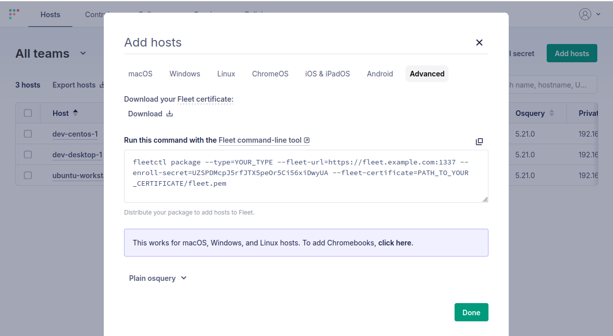
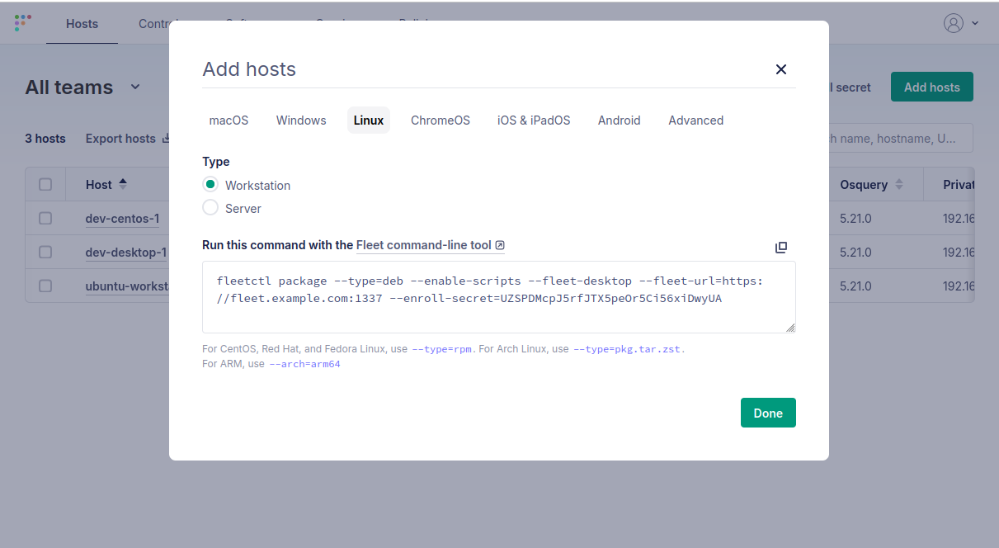
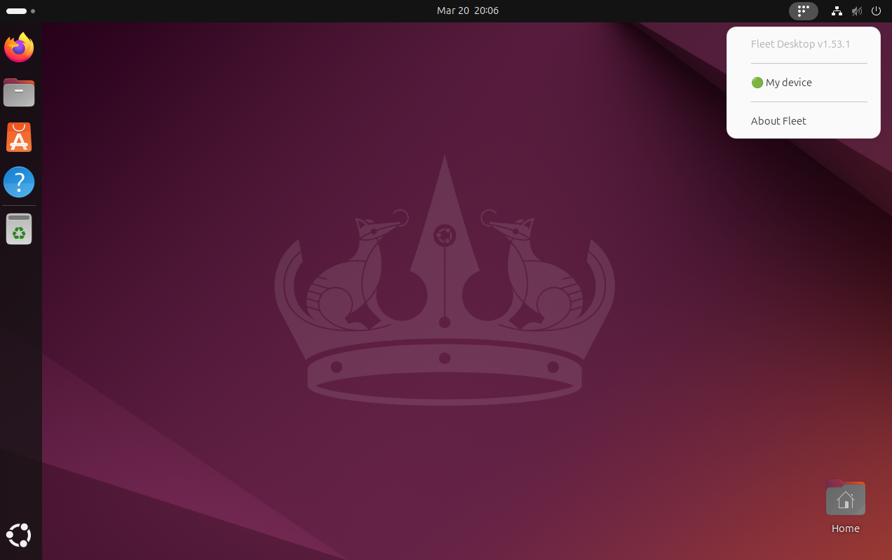
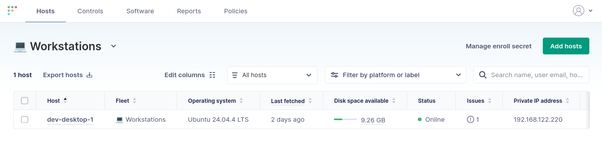
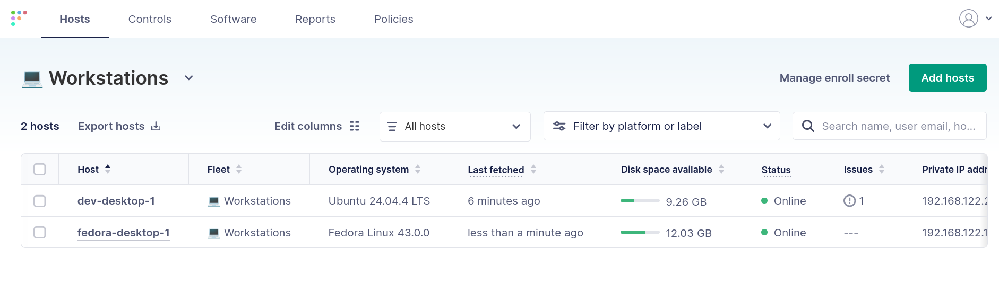
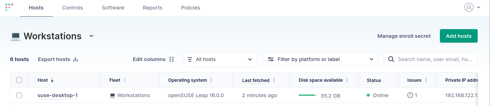

# How to enroll Linux devices for Fleet management

Fleet provides official support for Ubuntu, Debian, Fedora, CentOS, Red Hat Enterprise Linux (RHEL), Amazon Linux, and openSUSE. This support covers the most common Linux distributions that you will encounter in enterprise settings.

Enrolling hosts in Fleet management involves generating an installation package and installing it on the target system. This process doesn't involve any complicated scripts, user interaction, or messy configuration. Simply install the package and begin managing the host with Fleet's Linux-native MDM capabilities.

In this article, we will look at the end-to-end process for generating an agent installation package and installing it on a host. We will also discuss methods for automating this process across the supported Linux distributions.

## Installing the Fleet agent

Fleet makes it simple to install the Fleet agent on Linux. The steps are the same, whether you use Ubuntu, Fedora, Arch, or openSUSE:

1. Verify the prerequisites
2. Create the agent package
3. Install the agent package

We will take a detailed look at each step below.

### Step 1 - Verify the prerequisites

Your local workstation must have the `fleetctl` binary installed to generate the installation packages. `fleetctl` does not need to be installed on every Linux host you manage. It is used only to generate installation packages for your Linux clients.

Please see the [official installation instructions](https://fleetdm.com/guides/fleetctl) for complete information about installing `fleetctl` on Windows, Mac, and Linux.

The Fleet server must be reachable over TLS via its configured server address. For example, if your Fleet server is hosted at `fleet.example.com` on port `1337`, then managed hosts must be able to connect to `https://fleet.example.com:1337`. Be sure to adjust any networking, firewall, or DNS configuration necessary to enable this communication.

If your Fleet server uses a self-signed certificate or a certificate that cannot be verified using a public certificate authority in the operating system's certificate store, then you should also download the certificate to bundle with the installation package.

You can download the Fleet server's certificate by navigating to **Hosts > Add hosts > Advanced** and clicking the "Download your Fleet certificate" link:



This step is optional and may be unnecessary if your Fleet server uses a certificate signed by a public certificate authority. You can review the [following guide](https://fleetdm.com/guides/certificates-in-fleetd) for more information about how certificates are used in Fleet.

### Step 2 - Create the agent package

Fleet makes it easy to generate packages for supported distributions. These packages can be installed using the native package managers on each operating system.

First, navigate to **Hosts > Add hosts > Linux** and copy the command from the dialog box:



Next, run the command on your workstation to generate a Fleet installation package. This command should **not** be run on every single host that you want to manage. You only need to run it once to generate an installation package.

Adjust the `--type` flag to generate packages for different operating systems: `deb` for Debian-based systems, `rpm` for RedHat-based distributions, and `pkg.tar.zst` for Arch and openSUSE.

```bash
fleetctl package --type=deb --enable-scripts --fleet-desktop \
  --fleet-url=https://fleet.example.com:1337 \
  --enroll-secret=UZSPDMcpJ5rfJTX5peOr5Ci56xiDwyUA
```

If you determined in the prerequisites that you need to bundle the Fleet certificate with your installation package, add the `--fleet-certificate` flag with the path to your server's certificate:

```bash
fleetctl package --type=deb --enable-scripts --fleet-desktop \
  --fleet-url=https://fleet.example.com:1337 \
  --enroll-secret=UZSPDMcpJ5rfJTX5peOr5Ci56xiDwyUA \
  --fleet-certificate /home/fleet/Downloads/fleet.pem
```

The `fleetctl` utility will generate an installation package and save it to the local directory.

### Step 3 - Install the agent package

Once you have the installation package, install it on the workstation you want to manage. This process is largely the same for each supported distribution:

1. Copy the package to the client or host it on your organization's internal package repository.
2. Install the package using the operating system's package manager, either from the GUI or the command line.

The instructions below assume that you have manually copied the installation package to the target machine.

#### Ubuntu and Debian-based distributions

Fleet provides a Debian package format (`.deb`) installer for Ubuntu and Debian-based distributions. It can be installed through the graphical GNOME Software application or using `apt` at the command line. The installation instructions below use Ubuntu 24.04, but they are applicable to any Debian-based distribution.

To install the Fleet agent graphically, double-click on the installation package and click **Install** from the App Center's installation page.

To install the Fleet agent from the command line, use `apt` and specify the path to the package file:

```bash
sudo apt install -y ./fleet-osquery_1.53.1_amd64.deb
```

The Fleet Desktop icon will appear on the taskbar after installation completes. You can check on the status of the agent by clicking the taskbar icon and confirming that the device is green:



You can also verify the status of the Fleet agent from the command line. The Fleet agent runs as the `orbit` service under systemd. Confirm that the agent is running once the installation has completed:

```bash
systemctl status orbit
```

Finally, you can confirm that the host is reporting by navigating to the **Hosts** page on the Fleet server's dashboard:



#### Fedora and RPM-based distributions

Fleet provides a package for Fedora and RPM-based distributions in the RHEL Package Manager format (`.rpm`). It can be installed through the graphical GNOME Software application or using `dnf` at the command line.

To install the Fleet agent graphically, double-click on the installation package and click **Install** from the Software application's installation page.

To install the Fleet agent from the command line, use `dnf` and specify the path to the package file:

```bash
sudo dnf install ./fleet-osquery-1.53.1.x86_64.rpm
```

The Fleet Desktop icon will appear in the taskbar after the installation has completed. You can check on the status of the agent by clicking the taskbar icon and confirming that the device is green:


> **Note:** You may need to install the [AppIndicator Support extension](https://extensions.gnome.org/extension/615/appindicator-support/) on some versions of Fedora, RHEL, and CentOS. Otherwise, the Fleet icon will not appear in the status bar.

You can also verify the status of the Fleet agent from the command line. The Fleet agent runs as the `orbit` service under systemd. Confirm that the agent is running once the installation has completed:

```bash
systemctl status orbit
```

Finally, you can confirm that the host is reporting by navigating to the **Hosts** page on the Fleet server's dashboard:



#### openSUSE

openSUSE supports the RHEL Package Manager format (`.rpm`) for installations. The Fleet RPM package can be used to install Fleet on openSUSE hosts. It can be installed through the graphical GNOME Software application or using `zypper` at the command line.

To install the Fleet agent graphically, double-click on the installation package and click **Install** from the Software application's installation page.

To install the Fleet agent from the command line, use `zypper` and specify the path to the package file:

```bash
sudo zypper install --allow-unsigned-rpm ./fleet-osquery-1.53.1.x86_64.rpm
```

The Fleet Desktop icon will appear in the taskbar after the installation has completed. You can check on the status of the agent by clicking the taskbar icon and confirming that the device is green:


> **Note:** You may need to install the [AppIndicator Support extension](https://extensions.gnome.org/extension/615/appindicator-support/) on some versions of openSUSE. Otherwise, the Fleet icon will not appear in the status bar.

You can also verify the status of the Fleet agent from the command line. The Fleet agent runs as the `orbit` service under systemd. Confirm that the agent is running once the installation has completed:

```bash
systemctl status orbit
```

Finally, you can confirm that the host is reporting by navigating to the **Hosts** page on the Fleet server's dashboard:



## Automated provisioning

The managed host automatically provisions and onboards once the Fleet agent is installed. This process includes:

- Inventorying the host and collecting host vitals, including disk space, hardware information, operating system information, installed packages, and more.
- Adding labels to the host for inventory management.
- Evaluating policies and applying remediation actions to the host.

This enrollment process is completely hands-off. Fleet immediately begins managing your device once the agent is installed and communicating with Fleet.

## Automating the agent installation

Manually installing the Fleet agent on Linux workstations is an easy way to bring your current Linux hosts under management. However, you will likely want to automate this installation on new devices. This avoids the extra hassle of manual installation for your IT teams and end users.

The sections below discuss potential ways to automate the Fleet installation. This section is not designed to be comprehensive. Each distribution has a preferred method for automating installations. The specifics will also vary based on your preferred workstation imaging approach.

### Cloud-init and autoinstall (Ubuntu)

Ubuntu is a popular enterprise distribution. It supports two related methods for hands-off installation: autoinstall and cloud-init. Autoinstall provides a way to answer the questions posed by the interactive installer. This provides a hands-off installation experience: simply point the installer to an autoinstall configuration, and it runs automatically with the configured parameters.

Cloud-init also provides a non-interactive installation experience, but it is better designed for cloud and virtual environments. The cloud-init system handles all aspects of initial setup, from disk partitioning to SSH key management. It also runs once during the first boot, and then becomes inactive.

Most installation processes use a combination of cloud-init and autoinstall. Cloud-init can pass autoinstall configuration to the installer, and it is very flexible. This makes it a good candidate for bootstrapping the Fleet agent.

At a high level, the process involves three steps:

1. Host the Fleet agent in an internal repository.
2. Write a small script to install the Fleet agent and host it in a location that is accessible to hosts when they are imaged.
3. Create a cloud-init user data configuration that triggers an automated Ubuntu installation and uses `runcmd` to download and trigger the Fleet installation script.

Performing the Fleet installation via a cloud-init `runcmd` is a bit more robust than installing directly with autoinstall directives. If an autoinstall directive fails, then the entire installation process will fail. Performing the Fleet installation via cloud-init ensures the regular Ubuntu installation succeeds before attempting to install the Fleet agent.

There are several ways to pass autoinstall and cloud-init information to a host, and the process will vary depending on whether you are imaging systems over a network (e.g., with PXE boot) or using physical media. An easy method when using physical media is to prepare two USB drives: one with the Ubuntu installation image, and one with cloud-init data.

You then connect both USB drives to a host and boot the Ubuntu ISO. Cloud-init automatically detects the cloud-init user data, provides the autoinstall configuration to the Ubuntu installer, and triggers an automated installation.

First, you need to generate an autoinstall configuration. The easiest way to do this is to manually install an Ubuntu system and copy the autoinstall configuration from `/var/log/installer/autoinstall-user-data`.

Next, you need to modify this autoinstall configuration to include cloud-init user data. This user data includes a `runcmd` directive that downloads and runs the Fleet installation script. The example below hosts the script at `192.168.122.231:8080/install-fleet.sh`:

```yaml
autoinstall:
  version: 1
  user-data:
    runcmd:
      - wget -O /tmp/install-fleet.sh 192.168.122.231:8080/install-fleet.sh
      - bash /tmp/install-fleet.sh
  ...
```

The contents of the installation script are shown below. This script adds the GPG key and `apt` configuration for an internal repository that hosts the Fleet agent. It then triggers an installation of the agent using `apt`:

> **Warning:** The script below adds a GPG key for `apt` repository signing. Only use this in a lab environment. Never install a GPG key from the internet onto a production machine unless you understand the trust implications.

```bash
#!/bin/bash
set -euo pipefail

# Write GPG key
cat <<'EOF' | tee /etc/apt/keyrings/internal.asc >/dev/null
-----BEGIN PGP PUBLIC KEY BLOCK-----

mDMEacc+FxYJKwYBBAHaRw8BAQdArCJT6xHoMrMvMkppnjstxZIe6IA4rcyCpPL2
7URbYTe0G2ZsZWV0IDxleGFtcGxlQGV4YW1wbGUuY29tPoiTBBMWCgA7FiEERB4I
dNKX6VcbXdixeJKhTufAYAgFAmnHPhcCGwMFCwkIBwICIgIGFQoJCAsCBBYCAwEC
HgcCF4AACgkQeJKhTufAYAgJiwD/cRVjQWeg5FhKkfE2fchgNZKErLBzpEdJ8pIM
ujdP1UwA/Rk9MinAV4LbITDA7DmFgDuK6WmBddRhRTDFmJHjg24OuDgEacc+FxIK
KwYBBAGXVQEFAQEHQDChNYnYfX8topwLbzCXC7hyNWOAEbLls3hu7xudsT1FAwEI
B4h4BBgWCgAgFiEERB4IdNKX6VcbXdixeJKhTufAYAgFAmnHPhcCGwwACgkQeJKh
TufAYAjJRAEAge1zRRU1ZyfKfAMMtNtylcuNQeoT7CU0TvPkHhwJlUUBAIJdH8gj
aZVSwINy0ysq7IPtVvISG97ecfeWSg0a6lUP
=wYKF
-----END PGP PUBLIC KEY BLOCK-----
EOF

# Write APT source list
cat <<'EOF' | tee /etc/apt/sources.list.d/internal.sources >/dev/null
Types: deb
URIs: http://192.168.122.231:8080/
Suites: noble
Components: main
Signed-By: /etc/apt/keyrings/internal.asc
EOF

# Update apt
apt update

# Install Fleet
apt install -y fleet-osquery
```

This approach is just one method for automatically installing the Fleet agent when imaging a new Ubuntu workstation. Your specific approach will vary based on the tools you choose to use when imaging your workstations.

### Kickstart (RedHat, Fedora, and CentOS)

RedHat, Fedora, and CentOS support Kickstart for automating installations. Kickstart uses a text file to automatically answer installation questions and perform additional steps, such as adding packages.

The Kickstart file can be made available to the installation process through several methods. These include removable media, a local hard drive, or a network location. Kickstart's network installation is flexible and supports HTTP, HTTPS, FTP, and NFS. Many environments perform full imaging using PXE and network-based installers.

PXE-boot environments are complicated, and their configuration is beyond the scope of this article. However, the general steps for network-based installations are below:

1. Set up an [installation server](https://docs.fedoraproject.org/en-US/fedora/f36/install-guide/advanced/Network_based_Installations) to host the images, files, and Kickstart configuration.
2. Configure hosts to PXE boot and use DHCP to point them at the installation server.
3. The host boots and downloads the images and Kickstart files.
4. The installer uses the Kickstart file to perform an unattended installation.

You can install Fleet during this process in two ways:

- Host the Fleet installer in an internal repository. Add the repository to the [`repo` section](https://docs.fedoraproject.org/en-US/fedora/f36/install-guide/appendixes/Kickstart_Syntax_Reference/#sect-kickstart-commands-repo) of your Kickstart file. Add the Fleet package to the [`packages` section](https://docs.fedoraproject.org/en-US/fedora/f36/install-guide/appendixes/Kickstart_Syntax_Reference/#sect-kickstart-packages) of your Kickstart file.
- Host the Fleet installer in an internal repository or HTTP/HTTPS location. Add an installation script to the [`post` section](https://docs.fedoraproject.org/en-US/fedora/f36/install-guide/appendixes/Kickstart_Syntax_Reference/#sect-kickstart-postinstall) of your Kickstart file.

Similar to Ubuntu, using a post-installation script tends to be more robust. It will not cause the entire installation process to fail if there is an issue installing the package.

The easiest way to generate a Kickstart file is to manually install the operating system. The installer creates a Kickstart file based on your installation and places it at `/root/anaconda-ks.cfg`. You can extend this file with either of the two options above.

Below is a sample Kickstart file that uses a post-installation script to install Fleet:

```
# Generated by Anaconda 43.44
# Keyboard layouts
keyboard --vckeymap=us --xlayouts='us'
# System language
lang en_US.UTF-8

%packages
@^workstation-product-environment

%end

# System authorization information
authselect enable-feature with-fingerprint

# Run the Setup Agent on first boot
firstboot --enable

# Generated using Blivet version 3.12.1
ignoredisk --only-use=vda
autopart
# Partition clearing information
clearpart --none --initlabel

# System timezone
timezone America/New_York --utc

# Root password
rootpw --lock
user --groups=wheel --name=myuser --password=<ENCRYPTED PASSWORD> --iscrypted --gecos="myuser"

# Install Fleet by downloading the package from an HTTP server
%post --log=/root/ks-post.log
wget -O /root/fleet.rpm http://192.168.122.1:3003/fleet-osquery-1.54.0.x86_64.rpm
dnf install -y /root/fleet.rpm
rm /root/fleet.rpm
%end
```

## Wrapping up

Enrolling your hosts in Fleet is the first step in managing them. Fleet makes this easy for Linux hosts with a fully supported installer for the most popular distributions. Your hosts are fully managed and begin receiving Fleet's benefits immediately once the agent is installed.

Fleet's enrollment process can be performed manually or through your existing workstation imaging automation. The enrollment process, which involves installing a single package, can be adapted to your workflows.

Fleet makes the enrollment and installation process easy so that you can focus on what really matters: managing your hosts. In the following articles, we'll take a look at the management capabilities that Fleet brings to Linux desktops.

To learn more about Fleet or to get a demo [contact us](https://fleetdm.com/contact).


<meta name="articleTitle" value="How to enroll Linux devices for Fleet management">
<meta name="authorFullName" value="Anthony Critelli">
<meta name="authorGitHubUsername" value="acritelli">
<meta name="category" value="articles">
<meta name="publishedOn" value="2026-05-18">
<meta name="description" value="Step-by-step guide to enrolling Ubuntu, Fedora, and openSUSE hosts into Fleet, including automated provisioning with cloud-init and Kickstart.">
