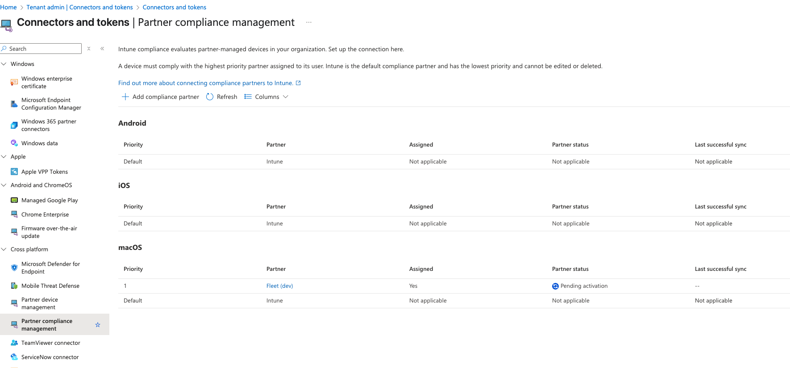
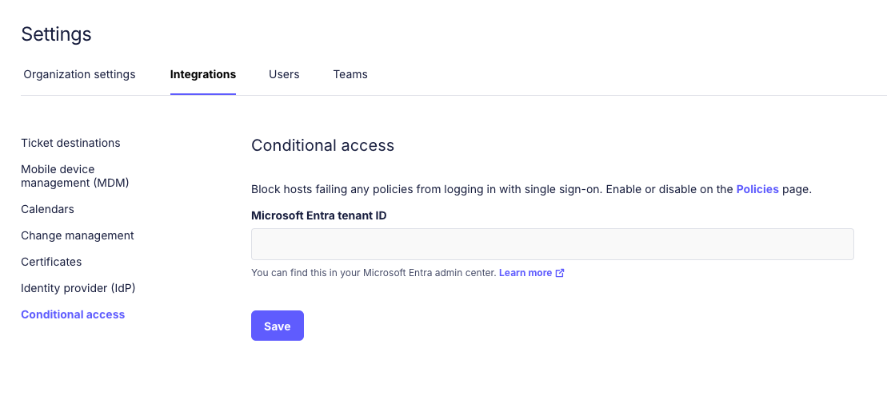
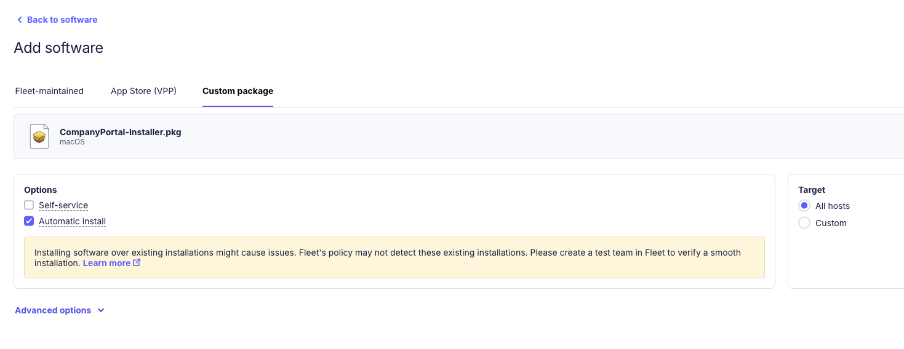
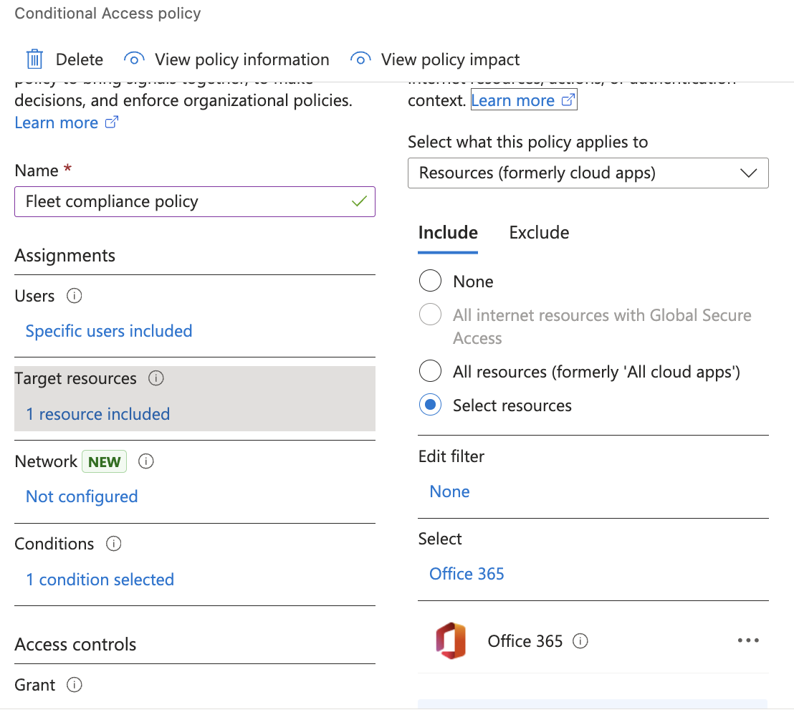
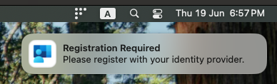
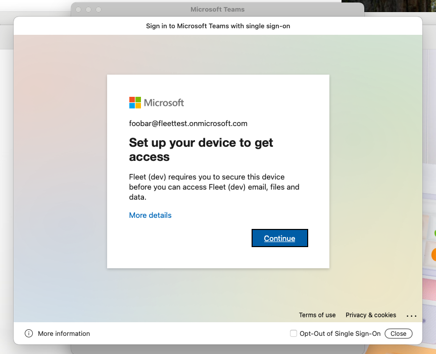
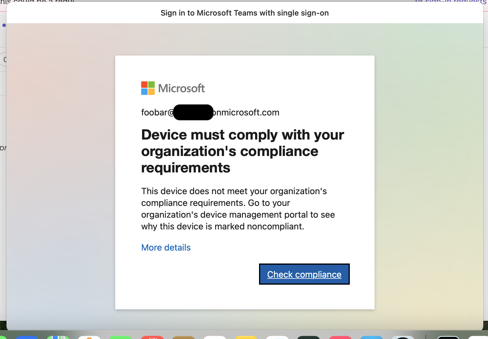

# Conditional access: Entra

With Fleet, you can integrate with Microsoft Entra ID to enforce conditional access on macOS hosts.

When a device fails a Fleet policy, Fleet can mark it as non-compliant in Entra. This allows IT and Security teams to block access to third-party apps until the issue is resolved.

[Microsoft](https://learn.microsoft.com/en-us/intune/intune-service/protect/device-compliance-partners) requires that this feature is only supported if you're using Fleet's managed cloud.

- [Step 1: Create a "Fleet conditional access" group in Entra](#step-1-create-a-fleet-conditional-access-group-in-entra)
- [Step 2: Configure Fleet in Intune](#step-2-configure-fleet-in-intune)
- [Step 3: Connect Fleet to Entra](#step-3-connect-fleet-to-entra)
- [Step 4: Deploy Company Portal and the Platform SSO configuration profile](#step-4-deploy-company-portal-and-the-platform-sso-configuration-profile)
- [Step 5: Add Fleet policies](#step-5-add-fleet-policies)
- [Step 6: Add Entra policies](#step-6-add-entra-policies)

## Step 1: Create a "Fleet conditional access" group in Entra

To enforce conditional access, end users must be a member of a group called "Fleet conditional access" in Entra. First create this group in Entra and then assign users to it.

## Step 2: Configure Fleet in Intune

Login to [Intune](https://intune.microsoft.com), and follow [this Microsoft guide](https://learn.microsoft.com/en-us/intune/intune-service/protect/device-compliance-partners#add-a-compliance-partner-to-intune) to add Fleet as compliance partner in Intune.

For **Platform**, select **macOS**.

For **Assignments** add the "Fleet conditional access" group you created to **Included groups**. Don't select **Add all users** or pick a different group. Fleet requires the "Fleet conditional access" group.

After this is done, the "Fleet partner" will be shown with a "Pending activation" status.



## Step 3: Connect Fleet to Entra

Now we need to connect and provision Fleet to operate on your Entra ID tenant (activate partner).

To connect Fleet to your Entra account you need your "Microsoft Entra tenant ID", which can be found in https://entra.microsoft.com. You can follow the steps in https://learn.microsoft.com/en-us/entra/fundamentals/how-to-find-tenant to get your tenant ID.

Once you have your tenant ID, in Fleet, head to **Settings > Integrations > Conditional access** and enter the tenant ID.



After clicking **Save** you will be redirected to https://login.microsoftonline.com to consent to the permissions for Fleet's multi-tenant application. 

After consenting you will be redirected back to Fleet (to `/settings/integrations/conditional-access`). If you don't see a green checkmark in Fleet, please verify that you have a "Fleet conditional access" [group in Entra](#step-3-connect-fleet-to-entra). If you do and you still don't see a green checkmark, please [reach out to support](https://fleetdm.com/support).


## Step 4: Deploy Company Portal and the Platform SSO configuration profile

The following steps need to be configured on the Fleet teams you want to enable Microsoft "Conditional Access".

### Automatically install Company Portal

To enroll macOS devices to Entra for Conditional Access you will need to configure Fleet to automatically install the "Company Portal" macOS application.

The Company Portal macOS application can be downloaded from https://go.microsoft.com/fwlink/?linkid=853070.

To configure automatic installation on your macOS hosts, head to **Software > Add software > Custom package**. Upload the `CompanyPortal-Installer.pkg` and check the **Automatic install** option.



You should also configure "Company Portal" as a software package to deploy during "Setup Experience" for hosts that automatically enroll (ADE).
Go to **Controls > Setup experience > Install software > Add software**, select **Company Portal** and select **Save**.

### Add "Company Portal installed" label

We will need to create a dynamic label to determine which macOS devices have "Company Portal" installed.

We will use this label to conditionally deploy a Platform SSO configuration profile (next step).

Head to **Hosts > Filter by platform or label > Add label + > Dynamic**.

- Name: `Company Portal installed`
- Description: `Company Portal is installed on the host.`
- Query:
  ```sql
  SELECT 1 FROM apps WHERE bundle_identifier = 'com.microsoft.CompanyPortalMac';
  ```
- Platform: `macOS`

### Depoloy Platform SSO configuration profile

For Entra's "Conditional Access" feature we need to deploy a Platform SSO extension for Company Portal.
The extension must be deployed via configuration profiles. For more information see https://learn.microsoft.com/en-us/intune/intune-service/configuration/platform-sso-macos#step-3---deploy-the-company-portal-app-for-macos.

Head to **Controls > OS settings > Custom settings > + Add profile**.
Set **Target > Custom > Include all** and select **Company Portal installed**.

Upload the following configuration profile:
`company-portal-single-signon-extension.mobileconfig`:
```xml
<?xml version="1.0" encoding="UTF-8"?>
<!DOCTYPE plist PUBLIC "-//Apple//DTD PLIST 1.0//EN" "http://www.apple.com/DTDs/PropertyList-1.0.dtd">
<plist version="1.0">
<dict>
    <key>PayloadContent</key>
    <array>
        <dict>
            <key>AuthenticationMethod</key>
            <string>UserSecureEnclaveKey</string>
            <key>ExtensionIdentifier</key>
            <string>com.microsoft.CompanyPortalMac.ssoextension</string>
            <key>PayloadDisplayName</key>
            <string>Company Portal single sign-On extension</string>
            <key>PayloadIdentifier</key>
            <string>com.apple.extensiblesso.DC6F30E3-2FF3-4AEA-BD5C-9ED17A3ABDD9</string>
            <key>PayloadType</key>
            <string>com.apple.extensiblesso</string>
            <key>PayloadUUID</key>
            <string>DC6F30E3-2FF3-4AEA-BD5C-9ED17A3ABDD9</string>
            <key>PayloadVersion</key>
            <integer>1</integer>
            <key>PlatformSSO</key>
            <dict>
                <key>AuthenticationMethod</key>
                <string>UserSecureEnclaveKey</string>
                <key>TokenToUserMapping</key>
                <dict>
                    <key>AccountName</key>
                    <string>preferred_username</string>
                    <key>FullName</key>
                    <string>name</string>
                </dict>
                <key>UseSharedDeviceKeys</key>
                <true/>
            </dict>
            <key>ScreenLockedBehavior</key>
            <string>DoNotHandle</string>
            <key>TeamIdentifier</key>
            <string>UBF8T346G9</string>
            <key>Type</key>
            <string>Redirect</string>
            <key>URLs</key>
            <array>
                <string>https://login.microsoftonline.com</string>
                <string>https://login.microsoft.com</string>
                <string>https://sts.windows.net</string>
                <string>https://login.partner.microsoftonline.cn</string>
                <string>https://login.chinacloudapi.cn</string>
                <string>https://login.microsoftonline.us</string>
                <string>https://login-us.microsoftonline.com</string>
            </array>
        </dict>
    </array>
    <key>PayloadDisplayName</key>
    <string>Company Portal single sign-on extension</string>
    <key>PayloadIdentifier</key>
    <string>com.fleetdm.platformsso.26CB08D2-8229-4CC2-86B6-1880A165CB4A</string>
    <key>PayloadType</key>
    <string>Configuration</string>
    <key>PayloadUUID</key>
    <string>26CB08D2-8229-4CC2-86B6-1880A165CB4A</string>
    <key>PayloadVersion</key>
    <integer>1</integer>
</dict>
</plist>
```

> `UserSecureEnclaveKey` will be mandatory starting in Q3 2025, see https://learn.microsoft.com/en-us/entra/identity-platform/apple-sso-plugin#upcoming-changes-to-device-identity-key-storage.

## Step 5: Add Fleet policies

Next, add policies in Fleet that will determine whether a device is marked as "compliant" or "not compliant" in Entra.

Head to **Policies > Select team > Automations > Conditional access**.
1. Make sure the feature is enabled for the team.
2. Select the policies you want enforce conditional access with.

## Step 6: Add Entra policies

After you add policies in Fleet, you also need to add an Entra "Conditional Access" policy to block end-users access to specific resources when Fleet reports non-compliance. Follow [this Microsoft guide](https://learn.microsoft.com/en-us/entra/identity/conditional-access/concept-conditional-access-policies) to create the policy.

As an example, you can create a policy to "block access to Office 365 on macOS devices reported as non-compliant by Fleet":


Then assign the policy to the "Fleet conditional access" group.

**Start with a pilot**, then expand gradually. Begin by adding test users—maybe your IT team or a department—to this group. As you gain confidence with the setup, expand the "Fleet conditional access" group to include more users.

**Your end goal should be to include everyone.** For the broadest protection, add all users who access your protected applications to the "Fleet conditional access" group. 

This matters because if a user isn't in the group, they'll bypass the policy entirely. 

A macOS user outside the group can access Office 365 without any Fleet enrollment or compliance checks. When all are added, any access from unmanaged macOS devices will get prompted to enroll their device with Fleet.

### Disabling "Conditional Access" on a team

If you need all your hosts on a team to be marked as "Compliant" (e.g. to unblock access to a resource) go to **Policies > Select team > Automations > Conditional access**, uncheck all policies, and select **Save**. The hosts will be marked as "Compliant" the next time they check in with policy results (within one hour, or by refetching manually).

To disable the "Conditional Access" feature on a team head to **Policies > Select team > Automations > Conditional access > Disable**.
Once disabled, hosts will not be reporting compliance status to Entra anymore.

## End user experience

### Platform SSO registration

After the Platform SSO profile is deployed to end-user devices, users will see a notification and will perform the authentication flow with Entra ID.



After following the authentication steps, the user might hit the following message if it attempts to log in to a Microsoft services/apps right away after authenticating via Platform SSO (Fleet can take up to one hour to gather the information and send it to Intune):



On that scenario, after hitting "Continue" the user will be redirected to https://fleetdm.com/microsoft-compliance-partner/enroll which will advise to click on the Fleet tray icon "My device" > "🔄 Refetch". The refetch will synchronize data to Intune and the user will be able to log in to Microsoft services/apps without entering credentials.

### Access blocked experience

When a Fleet policy configured for conditional access starts failing on a host, then the user will be logged out and blocked from logging in to Entra ID.

E.g. here's "Microsoft Teams" message on a blocked host:


And here's the error message when trying to re-login:


Clicking on "Check Compliance" redirects the user to https://fleetdm.com/microsoft-compliance-partner/remediate.
The user will be able to log in again once the failing policies are remediated.

### Disabling "Conditional Access"

If you wish to disable the "Conditional Access" feature temporarily, we recommend turning off the "Conditional Access" policies on Entra.
On Entra, go to **Protection > Conditional Access > Policies**, then select the policies and turn them off.

### End users turning off MDM in Fleet

If a user turns off MDM by going to **System Settings > Device Management and selecting **Unenroll** on Fleet's enrollment profile then Fleet will report the "MDM turned off" state to Intune and the device will be automatically marked as non-compliant on Entra (even if it's passing all Fleet policies).

## GitOps

Here's the full configuration that you can apply via GitOps.
> It is only including the necessary keys for this integration.

`default.yml`:
```yml
labels:
- description: Company Portal is installed on the host.
  label_membership_type: dynamic
  name: Company Portal installed
  platform: darwin
  query: |-
    SELECT 1 FROM apps WHERE bundle_identifier = 'com.microsoft.CompanyPortalMac'
org_settings:
  integrations:
    conditional_access_enabled: true # enables setting for "No team"
```

`teams/team-name.yml` (should be the same for `teams/no-team.yml` with the `team_settings` removed):
```yml
team_settings:
  integrations:
    conditional_access_enabled: true
controls:
  macos_settings:
    custom_settings:
    - labels_include_all:
      - Company Portal installed
      path: ../lib/team-name/profiles/company-portal-single-signon-extension.mobileconfig
policies:
- calendar_events_enabled: false
  conditional_access_enabled: true
  critical: false
  description: Example description for compliance policy 2
  name: Compliance check policy 2
  platform: darwin
  query: SELECT * FROM osquery_info WHERE start_time < 0;
  resolution: Resolution steps for this policy
- calendar_events_enabled: false
  conditional_access_enabled: false
  critical: false
  description: Policy triggers automatic install of Company Portal on each host that's
    missing this software.
  install_software:
    hash_sha256: 931db4af2fe6320a1bfb6776fae75b6f7280a947203a5a622b2cae00e8f6b6e6
      # Company Portal (CompanyPortal-Installer.pkg) version 5.2504.0
  name: '[Install software] Company Portal (pkg)'
  platform: darwin
  query: SELECT 1 FROM apps WHERE bundle_identifier = 'com.microsoft.CompanyPortalMac';
  resolution:
software:
  packages:
  - hash_sha256: 931db4af2fe6320a1bfb6776fae75b6f7280a947203a5a622b2cae00e8f6b6e6
      # Company Portal (CompanyPortal-Installer.pkg) version 5.2504.0
    install_script:
      path: ../lib/team-name/scripts/company-portal-darwin-install
    uninstall_script:
      path: ../lib/team-name/scripts/company-portal-darwin-uninstall
```

For `lib/team-name/profiles/company-portal-single-signon-extension.mobileconfig`: See [Platform SSO configuration profile](#platform-sso-configuration-profile).

<meta name="articleTitle" value="Conditional access: Entra">
<meta name="authorFullName" value="Lucas Manuel Rodriguez">
<meta name="authorGitHubUsername" value="lucasmrod">
<meta name="category" value="guides">
<meta name="publishedOn" value="2025-06-20">
<meta name="description" value="Learn how to enforce conditional access with Fleet and Microsoft Entra.">
