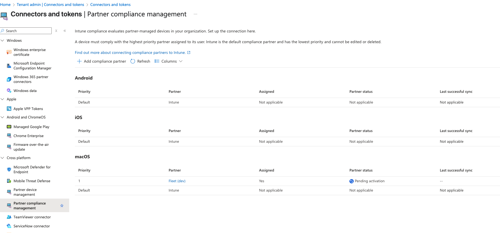
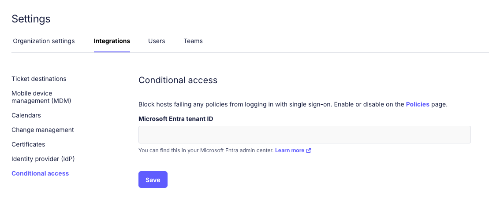
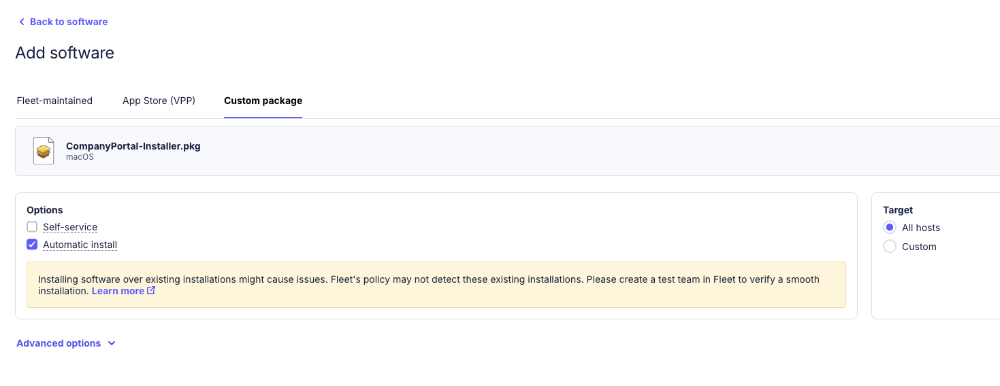
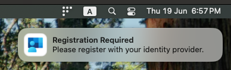
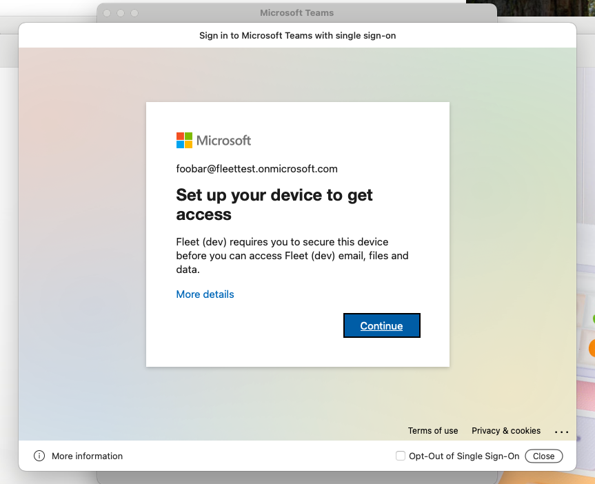

# Entra conditional access integration

Fleet v4.70.0 integrates with Entra ID to provide Microsoft "Conditional Access" for macOS.
Fleet can now connect to Microsoft Entra ID and block end users from logging into third-party apps if they're failing any Fleet policies (non-compliant).

> This feature is only available on Fleet Cloud and currently supports macOS.

For more information about this feature see https://learn.microsoft.com/en-us/intune/intune-service/protect/device-compliance-partners.

### Configure Fleet as compliance partner in Intune

The steps to configure Fleet as "Compliance partner" for macOS devices can be found here: https://learn.microsoft.com/en-us/intune/intune-service/protect/device-compliance-partners. The steps are executed in the Intune portal (https://intune.microsoft.com).

After this is done, the "Fleet partner" will be shown with a "Pending activation" status.



## Setup integration in Fleet

Now we need to connect and provision Fleet to operate on your Entra ID tenant (activate partner).

To connect Fleet to your Entra account you need your "Microsoft Entra tenant ID", which can be found in https://entra.microsoft.com. You can follow the steps in https://learn.microsoft.com/en-us/entra/fundamentals/how-to-find-tenant to get your tenant ID.

Once you have your tenant ID, go to Fleet: `Settings` > `Integrations` > `Conditional access` and enter the tenant ID.



After clicking `Save` you will be redirected to https://login.microsoftonline.com to consent to the permissions for Fleet's multi-tenant application.
After consenting you will be redirected back to Fleet (to `/settings/integrations/conditional-access`).

The next step is to enable and configure the integration on your teams.

## Configure devices in Fleet

The following steps need to be configured on the Fleet teams you want to enable Microsoft "Conditional Access".

### Automatic install software for Company Portal.app

To enroll macOS devices to Entra for Conditional Access you will need to configure Fleet to automatically install the "Company Portal" macOS application.

The Company Portal macOS application can be downloaded from https://go.microsoft.com/fwlink/?linkid=853070.

To configure automatic installation on your macOS devices you go to `Software` > `Select the team` > `Add software` > `Custom package`. Upload the `CompanyPortal-Installer.pkg` and check the `Automatic install` option.



### Label for "Company portal.app installed"

We will need to create a dynamic label to determine which macOS devices have "Company Portal" installed.
We will use this label to conditionally deploy a Platform SSO configuration profile (next step).

Go to `Hosts` > `Filter by platform or label` > `Add label +` > `Dynamic`.

- Name: `Company Portal installed`
- Description: `Company Portal is installed on the host.`
- Query:
  ```sql
  SELECT 1 FROM apps WHERE bundle_identifier = 'com.microsoft.CompanyPortalMac';
  ```
- Platform: `macOS`

### Platform SSO configuration profile

For Entra's "Conditional Access" feature we need to deploy a Platform SSO extension for Company Portal.
The extension must be deployed via configuration profiles. For more information see https://learn.microsoft.com/en-us/intune/intune-service/configuration/platform-sso-macos#step-3---deploy-the-company-portal-app-for-macos.

Go to `Controls` > `OS settings` > `Custom settings` > `+ Add profile`.
Set `Target` > `Custom` > `Include all` and select `Company Portal installed`.

Upload the following configuration profile:
`company-portal-single-signon-extension.mobileconfig`:
```xml
<?xml version="1.0" encoding="UTF-8"?>
<!DOCTYPE plist PUBLIC "-//Apple//DTD PLIST 1.0//EN" "http://www.apple.com/DTDs/PropertyList-1.0.dtd">
<plist version="1.0">
<dict>
    <key>PayloadContent</key>
    <array>
        <dict>
            <key>AuthenticationMethod</key>
            <string>UserSecureEnclaveKey</string>
            <key>ExtensionIdentifier</key>
            <string>com.microsoft.CompanyPortalMac.ssoextension</string>
            <key>PayloadDisplayName</key>
            <string>Company Portal single sign-On extension</string>
            <key>PayloadIdentifier</key>
            <string>com.apple.extensiblesso.DC6F30E3-2FF3-4AEA-BD5C-9ED17A3ABDD9</string>
            <key>PayloadType</key>
            <string>com.apple.extensiblesso</string>
            <key>PayloadUUID</key>
            <string>DC6F30E3-2FF3-4AEA-BD5C-9ED17A3ABDD9</string>
            <key>PayloadVersion</key>
            <integer>1</integer>
            <key>PlatformSSO</key>
            <dict>
                <key>AuthenticationMethod</key>
                <string>UserSecureEnclaveKey</string>
                <key>TokenToUserMapping</key>
                <dict>
                    <key>AccountName</key>
                    <string>preferred_username</string>
                    <key>FullName</key>
                    <string>name</string>
                </dict>
                <key>UseSharedDeviceKeys</key>
                <true/>
            </dict>
            <key>ScreenLockedBehavior</key>
            <string>DoNotHandle</string>
            <key>TeamIdentifier</key>
            <string>UBF8T346G9</string>
            <key>Type</key>
            <string>Redirect</string>
            <key>URLs</key>
            <array>
                <string>https://login.microsoftonline.com</string>
                <string>https://login.microsoft.com</string>
                <string>https://sts.windows.net</string>
                <string>https://login.partner.microsoftonline.cn</string>
                <string>https://login.chinacloudapi.cn</string>
                <string>https://login.microsoftonline.us</string>
                <string>https://login-us.microsoftonline.com</string>
            </array>
        </dict>
    </array>
    <key>PayloadDisplayName</key>
    <string>Company Portal single sign-on extension</string>
    <key>PayloadIdentifier</key>
    <string>com.fleetdm.platformsso.26CB08D2-8229-4CC2-86B6-1880A165CB4A</string>
    <key>PayloadType</key>
    <string>Configuration</string>
    <key>PayloadUUID</key>
    <string>26CB08D2-8229-4CC2-86B6-1880A165CB4A</string>
    <key>PayloadVersion</key>
    <integer>1</integer>
</dict>
</plist>
```

> `UserSecureEnclaveKey` will be mandatory starting in Q3 2025, see https://learn.microsoft.com/en-us/entra/identity-platform/apple-sso-plugin#upcoming-changes-to-device-identity-key-storage.

After the profile is deployed to end-user devices, users will see a notification and will perform the authentication flow with Entra ID.

## Configure Fleet policies for Conditional Access

The final step is to configure Fleet policies that will determine whether a device is marked as "compliant" or "not compliant" on Entra.

Go to `Policies` > `Select team` > `Automations` > `Conditional access`.
1. Make sure the feature is enabled for the team.
2. Check the policies you want for Conditional access.



> The user might hit the following message if it attempts to log in to a Microsoft services/apps right away after authenticating via Platform SSO (Fleet can take up to one hour to gather the information and send it to Intune):



On that scenario, after hitting "Continue" the user will be redirected to https://fleetdm.com/microsoft-compliance-partner/enroll which will advise to click on the Fleet tray icon "My device" > "🔄 Refetch". The refetch will synchronize data to Intune and the user will be able to log in to Microsoft services/apps without entering credentials.

### Disabling "Conditional Access" on a team

If you need all your hosts on a team to be marked as "Compliant" (e.g. to unblock access to a resource) go to `Policies` > `Select team` > `Automations` > `Conditional access`, uncheck all policies and hit `Save`. The hosts will be marked as "Compliant" the next time they check in with policy results (within one hour, or by refetching manually).

To disable the "Conditional Access" feature on a team go to `Policies` > `Select team` > `Automations` > `Conditional access` > `Disable`.
Once disabled, hosts will not be reporting compliance status to Entra anymore.

## GitOps

Here's the full configuration that you can apply via GitOps.
> It is only including the necessary keys for this integration.

`default.yml`:
```yml
labels:
- description: Company Portal is installed on the host.
  label_membership_type: dynamic
  name: Company Portal installed
  platform: darwin
  query: |-
    SELECT 1 FROM apps WHERE bundle_identifier = 'com.microsoft.CompanyPortalMac'
org_settings:
  integrations:
    conditional_access_enabled: true # enables setting for "No team"
```

`teams/team-name.yml` (should be the same for `teams/no-team.yml` with the `team_settings` removed):
```yml
team_settings:
  integrations:
    conditional_access_enabled: true
controls:
  macos_settings:
    custom_settings:
    - labels_include_all:
      - Company Portal installed
      path: ../lib/team-name/profiles/company-portal-single-signon-extension.mobileconfig
policies:
- calendar_events_enabled: false
  conditional_access_enabled: true
  critical: false
  description: Example description for compliance policy 2
  name: Compliance check policy 2
  platform: darwin
  query: SELECT * FROM osquery_info WHERE start_time < 0;
  resolution: Resolution steps for this policy
- calendar_events_enabled: false
  conditional_access_enabled: false
  critical: false
  description: Policy triggers automatic install of Company Portal on each host that's
    missing this software.
  install_software:
    hash_sha256: 931db4af2fe6320a1bfb6776fae75b6f7280a947203a5a622b2cae00e8f6b6e6
      # Company Portal (CompanyPortal-Installer.pkg) version 5.2504.0
  name: '[Install software] Company Portal (pkg)'
  platform: darwin
  query: SELECT 1 FROM apps WHERE bundle_identifier = 'com.microsoft.CompanyPortalMac';
  resolution:
software:
  packages:
  - hash_sha256: 931db4af2fe6320a1bfb6776fae75b6f7280a947203a5a622b2cae00e8f6b6e6
      # Company Portal (CompanyPortal-Installer.pkg) version 5.2504.0
    install_script:
      path: ../lib/team-name/scripts/company-portal-darwin-install
    uninstall_script:
      path: ../lib/team-name/scripts/company-portal-darwin-uninstall
```

For `lib/team-name/profiles/company-portal-single-signon-extension.mobileconfig`: See [Platform SSO configuration profile](#platform-sso-configuration-profile).

<meta name="articleTitle" value="Entra conditional access integration">
<meta name="authorFullName" value="Lucas Manuel Rodriguez">
<meta name="authorGitHubUsername" value="lucasmrod">
<meta name="category" value="guides">
<meta name="publishedOn" value="2025-06-20">
<meta name="description" value="Entra conditional access integration">