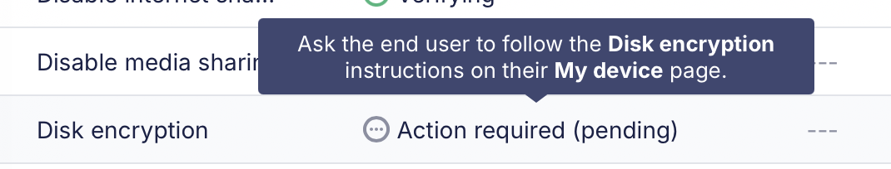

# Seamlessly Generate and Escrow FileVault Personal Recovery Keys in Fleet with EscrowBuddy

In Fleet version 4.55.0, Fleet introduced new features that handle the generation and escrowing of FileVault recovery keys. This guide explains why it’s important to have 100% coverage when it comes to escrowing FileVault keys and what the experience is like for admins and for end users.

## Why should I use Fleet to escrow FileVault Recovery Keys?
As an IT administrator, it’s crucial to know that the devices you manage are encrypted. By enforcing Apple's FileVault encryption via MDM, admins can ensure that if an end user's laptop is lost or stolen, the data will remain inaccessible to unauthorized individuals or malicious actors.

While it’s reassuring to know that your company’s data is always secure, challenges around potential data loss also arise when legitimate users inadvertently lock themselves out of their computers. This is where Fleet comes into play. Fleet’s ability to securely escrow FileVault recovery keys empowers admins to assist end users in regaining access to their devices. With a valid key, it’s quick and easy to get the end user back up and running. Without one, an end user locked out of their computer must erase it in order gain access to it.

## What’s special about EscrowBuddy?
Prior to Fleet 4.55.0, escrowing FileVault recovery keys was a manual process that required action from your end users. The escrow process had to be triggered by the end user from the My Device page in Fleet Desktop by entering their local account password for their Mac, then, Fleet would escrow the key. Often end users would not know they were supposed to do this, resulting in the FileVault recovery key not being escrowed at all. Finding out a recovery key was never escrowed when a computer is locked is a bad experience for the admin and the end user. Fleet's new integration with EscrowBuddy can prevent this.

With EscrowBuddy, the generation and escrowing of FileVault recovery keys happens automatically and transparently to the end user. This ensures 100% coverage across your Fleet-managed Macs. Fleet and EscrowBuddy ensure a valid key is always escrowed.

## How do I set up EscrowBuddy with Fleet?
To escrow FileVault recovery keys in Fleet, the only thing admins need to do is enable disk encryption on the teams for which disk encryption is required. To do this, in the Fleet UI, select your desired team and navigate to **Controls > OS settings > Disk encryption** then check the box next to **Turn on disk encryption**.

Fleet will send a configuration profile to all macOS hosts on that team to enable disk encryption and silently deploy EscrowBuddy.

When the disk encryption profile is delivered to a host, but a key is not yet escrowed, Fleet will show the profile as Action required (pending). The next time the user logs in to their Mac, EscrowBuddy generates a new recovery key on the host and Fleet will collect it.

## What’s going on behind the scenes?
Behind the scenes, EscrowBuddy runs as a [macOS authorization plugin](https://developer.apple.com/documentation/security/authorization-plug-ins). It works in conjunction with the FileVault profile that Fleet deploys to hosts to enforce disk encryption.

At the login event following deployment, EscrowBuddy generates a new recovery key, which is encrypted, wrapped in a CMS envelope, and saved at /var/db/FileVaultPRK.dat. Fleet collects this data from the host with the [vitals query](https://github.com/fleetdm/fleet/blob/main/docs/Contributing/Understanding-host-vitals.md#mdm_disk_encryption_key_file_darwin) that uses the [filevault_prk](https://fleetdm.com/tables/filevault_prk#apple) table to collect and escrow the key the next time the host is scheduled to refetch host details. 

How can I learn more about EscrowBuddy’s technical details?
Like Fleet, EscrowBuddy is an open source project, so the full source code can be inspected to learn more about what’s going on behind the scenes. Take a look at the [EscrowBuddy repo on GitHub](https://github.com/macadmins/escrow-buddy) to learn more.

<meta name="articleTitle" value="How Fleet uses EscrowBuddy to generate and collect FileVault Personal Recovery Keys">
<meta name="authorFullName" value="Dale Ribeiro">
<meta name="authorGitHubUsername" value="ddribeiro">
<meta name="category" value="guides">
<meta name="publishedOn" value="2025-03-19">
<meta name="description" value="Learn how Fleet's EscrowBuddy integration makes sure your FileVault Personal Recovery Keys are always escrowed">
