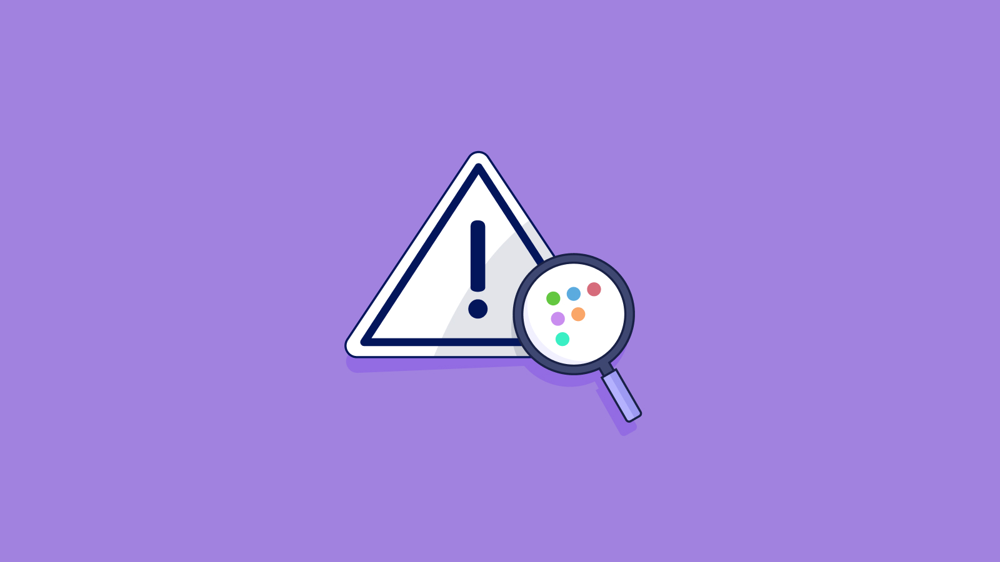

# Filtering software by vulnerability in Fleet

## Introduction

Fleet has introduced a powerful new feature that allows you to filter software by its associated vulnerabilities, helping you prioritize patches more effectively. Whether you're managing hundreds or thousands of software titles, this feature makes it easier to identify and address the most critical vulnerabilities in your environment.

This filtering capability is particularly useful in environments where patch management is critical to your security posture. By filtering software based on vulnerability severity and known exploits, you can first ensure that the most critical issues are addressed, enhancing your overall security strategy.

## Prerequisites

* Fleet version 4.56 or later
* Fleet version 4.94 or later to filter by software type
* Premium users have access to advanced filters by severity level and known exploited vulnerabilities

### Filtering software by vulnerability

1. **Navigate to the Software page**: In your Fleet dashboard, go to the **Software** tab. This will display a list of all the software detected in your environment.

2. **Filtering by vulnerability name**: You can use the search bar to filter software by its name or by a CVE vulnerability name associated with it.

3. **Open the filters**: Click **Add filters** to open the **Filters** modal. After you apply any filter, the button reads **Filtered**.

4. **Choose software types (optional)**: In **Types**, search for and select the types you want to see, such as "Chrome extension" or "VS Code extension." Selected types appear as chips above the list. Click a chip's **×** to remove it. Leave **Types** empty to include every type.

5. **Turn on "Vulnerable software"**: Toggle **Vulnerable software** on to show only software with known vulnerabilities. The known exploit and severity filters below are available only while this toggle is on.

6. **Select "Has known exploit"**: Under **CISA known exploit (KEV)**, select **Has known exploit** to show only software with vulnerabilities that have been actively exploited in the wild. This lets you prioritize them for patching.

7. **Choose a severity level**: Click **Advanced**, then select a **Severity** level, such as "Critical" or "High," or enter a minimum and maximum CVSS score. This lets you focus on the most severe vulnerabilities.

8. **Review filtered results**: Click **Apply**. The software list updates to show only the software that meets your criteria, so you can decide which software needs immediate attention in your patching strategy.

### Filtering software by vulnerability on the Host details page

In Fleet version 4.66 or later, the same vulnerability filtering functionality is available on the Host details page. To access this:

1. **Navigate to the Hosts page**: In your Fleet dashboard, go to the **Hosts** tab.

2. **Select a host**: Click on a particular host to view its details.

3. **Access the Software tab**: On the Host details page, click on the **Software** tab. This will display a list of all software detected on the host.

4. **Filter software**: Follow steps 3 through 8 from the previous section to filter software by type, severity, known exploit, and more.

On the Host details page, **Types** lists only the software types available for the host's platform. On macOS hosts, "macOS app" is selected by default, and the list shows only apps at the top level of the `/Applications` folder. Turn on **Show helpers** to include the rest. The **Show helpers** toggle appears only while "macOS app" is selected.

### Using the REST API to filter software for vulnerabilities

Fleet provides a REST API to filter software for vulnerabilities, allowing you to integrate this functionality into your automated workflows. You can use the  [REST API documentation for vulnerabilities](https://fleetdm.com/docs/rest-api/rest-api#vulnerabilities) to get started, and the [get host's software](https://fleetdm.com/docs/rest-api/rest-api#get-hosts-software) endpoint to retrieve software information for specific hosts. 

## Conclusion

The new software filtering feature in Fleet makes it easier than ever to manage vulnerabilities in your software environment. You can better protect your organization from potential threats by prioritizing patches based on severity and known exploits. Explore the API capabilities to integrate this feature into your broader security workflows.

For more tips and detailed guides, don’t forget to check out the Fleet [documentation](https://fleetdm.com/docs/get-started/why-fleet).

<meta name="articleTitle" value="Filtering software by vulnerability in Fleet">
<meta name="authorFullName" value="Tim Lee">
<meta name="authorGitHubUsername" value="mostlikelee">
<meta name="category" value="guides">
<meta name="publishedOn" value="2024-08-30">
<meta name="articleImageUrl" value="../website/assets/images/articles/discovering-geacon-using-fleet-1600x900@2x.jpg">
<meta name="description" value="Filter software by vulnerability in Fleet to prioritize critical patches and enhance your organization's security posture.">
