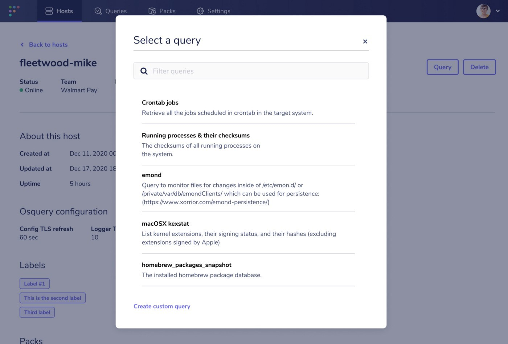

# Fleet 3.11.0 released with software inventory

Fleet 3.11.0 is now available and more powerful, with improved performance, support for software inventory, and enhancements to running common queries.

Let’s jump into the highlights:

- Improved performance
- Software inventory
- Running common queries

For the complete summary of changes and release binaries check out the [release notes](https://github.com/fleetdm/fleet/releases/tag/3.11.0) on GitHub.

## Improved performance

Fleet is utilized by organizations with up to hundreds of thousands of endpoints. As a result, we’re constantly looking for areas to improve performance. Changes introduced in Fleet 3.11.0 reduce the MySQL CPU usage by ~ 33%.

These performance improvements are the result of batching the updates of the last time a host has connected to the server. For more details on these changes, check out the [pull request](https://github.com/fleetdm/fleet/pull/633) from our Cofounder, [Zach Wasserman](https://medium.com/u/b0291119b263?source=post_page-----25d5a1efe19c--------------------------------).

## Software inventory

Keeping tabs on what software is installed on your hosts can be the first step in managing vulnerable software. We’ve exposed a list of installed software on each host’s respective Host details page.

This feature is flagged off by default for now. Enable software inventory for your Fleet by setting the environment variable `FLEET_BETA_SOFTWARE_INVENTORY=1`. For additional information on feature flags in Fleet, see the [Feature flag section](https://fleetdm.com/docs/deploying/configuration#feature-flags) of the documentation.

To see the osquery queries that power software inventory, check out Fleet’s [Standard query library](https://fleetdm.com/queries). The “Get installed macOS software,” “Get installed Linux software,” “Get installed Windows software,” and “Get installed FreeBSD software” queries are utilized depending on a host’s operating system.

## Running common queries

When investigating a specific host, it’s important to be able to quickly gather the data you want. To support this, running common queries against a specific host just got more convenient. Fleet 3.11.0 introduces the ability to select a saved query direct from a host’s respective Host details page.

Select the “Query” button to filter through a complete list of your saved queries.

---

## Ready to update?

Visit our [update guide](https://fleetdm.com/docs/using-fleet/updating-fleet) in the Fleet docs for instructions on updating to Fleet 3.11.0.

<meta name="category" value="releases">
<meta name="authorFullName" value="Noah Talerman">
<meta name="authorGitHubUsername" value="noahtalerman">
<meta name="publishedOn" value="2021-04-29">
<meta name="articleTitle" value="Fleet 3.11.0 released with software inventory">
<meta name="articleImageUrl" value="../website/assets/images/articles/fleet-3.11.0-cover-1600x900@2x.jpg">