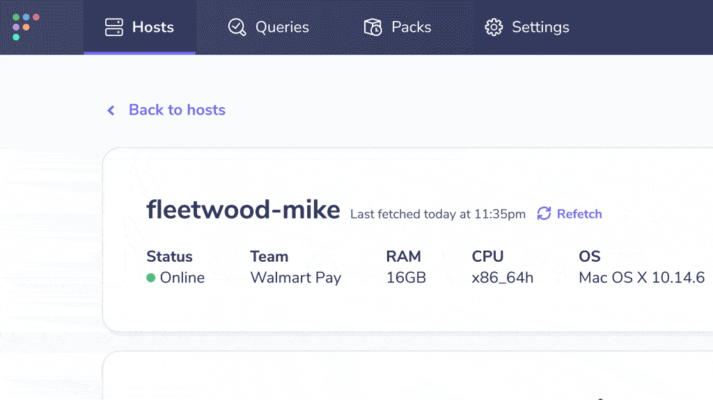

# Fleet 3.12.0

Fleet 3.12 is now available! 3.12 offers enhanced host vitals to see which queries are run on which devices, the ability to “refetch” host vitals to get authoritative answers about your devices on-demand, and several awesome contributions from the Fleet community.

For the complete summary of changes and release binaries check out the [release notes](https://github.com/fleetdm/fleet/releases/tag/3.12.0) on GitHub.

## Which queries apply to a host

Knowing which queries within a pack apply to a host is an important part of managing osquery on your endpoints. Queries collect the information that powers alerting, performance dashboards, and historical data for Incident Response scenarios, so it’s critical to know when they’re successfully configured to run against your devices.

In this version of Fleet, you can see which queries are scheduled to run against your hosts. In addition, the Fleet UI reveals the frequency with which the query is scheduled to run and the last time each query was run on the device.

## “Refetch” host vitals

When viewing host vitals in Fleet, it’s important to be confident that you’re looking at the latest information.

In this release, we are excited to add the ability to “Refetch” host vitals. Selecting the “Refetch” button on the Host details page will request fresh data from the specific host.

## Community contributions
In this release of Fleet, we’re excited to include several contributions from the community.

Thank you, Michael Samuel, for adding the ability to [copy log fields into Google Cloud Pub/Sub attributes](https://github.com/fleetdm/fleet/pull/712). This allows users to use these values for Pub/Sub’s subscriptions filters.

Thanks to Josh Brower for adding the ability to [duplicate live query results in Redis](https://github.com/fleetdm/fleet/pull/762). When `redis_duplicate_results` is set to `true`, all live query results are copied to an additional Redis Pub/Sub channel.

Thank you, Joseph Macaulay for adding the ability to [control server-side HTTP keepalive property](https://github.com/fleetdm/fleet/pull/741). Turning off keepalives has helped reduce outstanding TCP connections in some deployments.

---

## Ready to update?

Visit our [update guide](https://github.com/fleetdm/fleet/blob/master/docs/1-Using-Fleet/7-Updating-Fleet.md) for instructions on how to update.

<meta name="category" value="releases">
<meta name="authorFullName" value="Noah Talerman">
<meta name="authorGitHubUsername" value="noahtalerman">
<meta name="publishedOn" value="2021-05-20">
<meta name="articleTitle" value="Fleet 3.12.0">
<meta name="articleImageUrl" value="../website/assets/images/articles/fleet-3.12.0-cover-1600x900@2x.jpg">