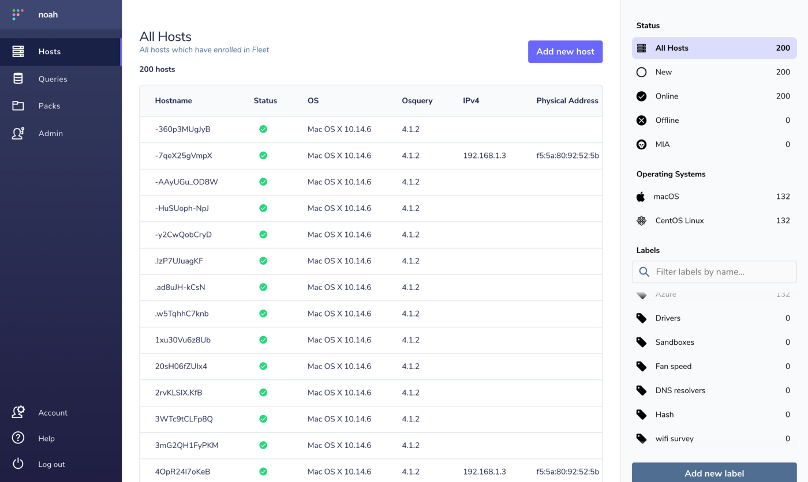
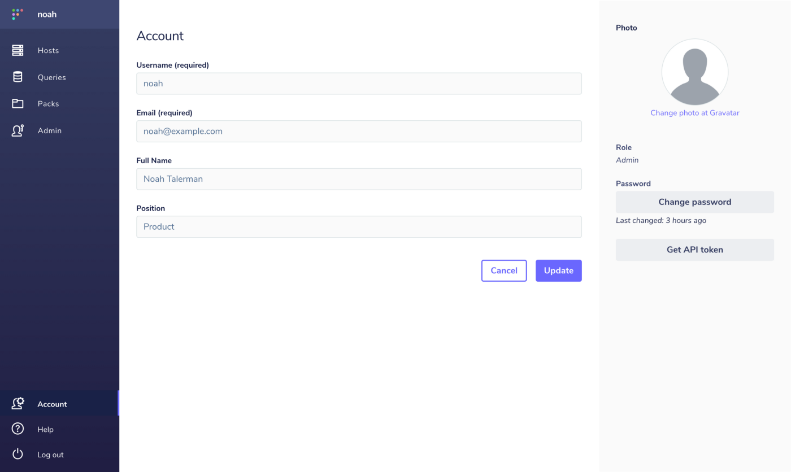
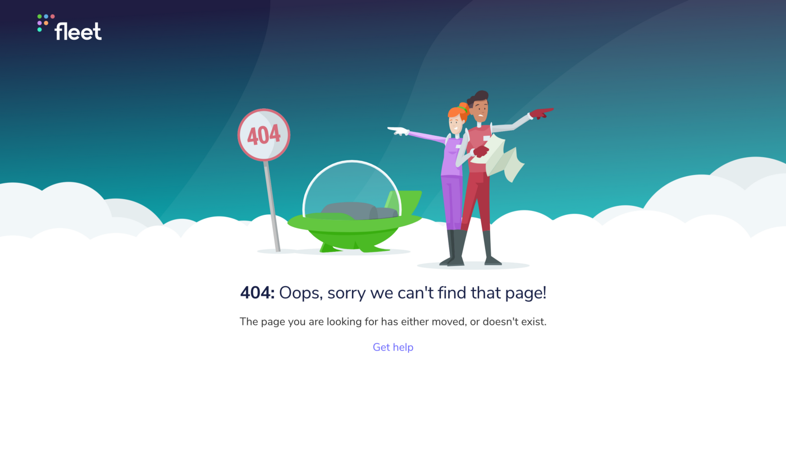

# Fleet 3.5.0

We just released Fleet 3.5.0 which adds a refreshed UI, improvements to the fleetctl preview startup experience, and more!

Let’s dig into the highlights…

- Refreshed UI
- Improvements to the fleetctl preview startup experience
- Updating to 3.5.0

For the complete summary of changes check out the [release notes](https://github.com/fleetdm/fleet/releases/tag/3.5.0) on GitHub.

## Refreshed UI

Fleet 3.5.0 includes a makeover of the user interface which includes new colors, updated fonts, fresh illustrations, and more visual goodies.

Current users will be greeted with the new Hosts page that includes a streamlined list view of your hosts along with a vertically scrollable area for custom labels.

_The Hosts page includes an updated list view. Scroll horizontally on the table to reveal more information about your enrolled devices._

In an effort to simplify the navigation we’ve brought all navigation links out in the open. Click on the Account link, which has been moved to the bottom of the navigation, to edit your account information, edit your login credentials, and view your API token.

_The new Account page showcases the updates to colors, fonts, and other styles._

If you ever find yourself lost (we hope not), you’ll be greeted by some new illustration work.

_Fleet’s explorative new 404 page._

Improvements to the `fleetctl preview` startup experience
In the prior 3.4.0 release, we introduced the fleetctl preview command which allows you to start a local test instance of the Fleet server with Docker.

In 3.5.0, we’ve added new messaging to appear while you wait for the instance to start and we’ve reduced the waiting time.

With the fleetctl preview command, a user can download and start a collection of resources useful for setting up a test environment with osquery, Fleet, and an ELK stack. Check out [github.com/fleetdm/osquery-in-a-box](https://github.com/fleetdm/osquery-in-a-box) for more details.

---

## Ready to update?

Visit our [update guide](https://fleetdm.com/docs/using-fleet/updating-fleet) in the Fleet docs for instructions on updating to Fleet 3.5.0.

<meta name="category" value="releases">
<meta name="authorFullName" value="Noah Talerman">
<meta name="authorGitHubUsername" value="noahtalerman">
<meta name="publishedOn" value="2020-12-12">
<meta name="articleTitle" value="Fleet 3.5.0">
<meta name="articleImageUrl" value="../website/assets/images/articles/fleet-3.5.0-cover-1600x900@2x.jpg">