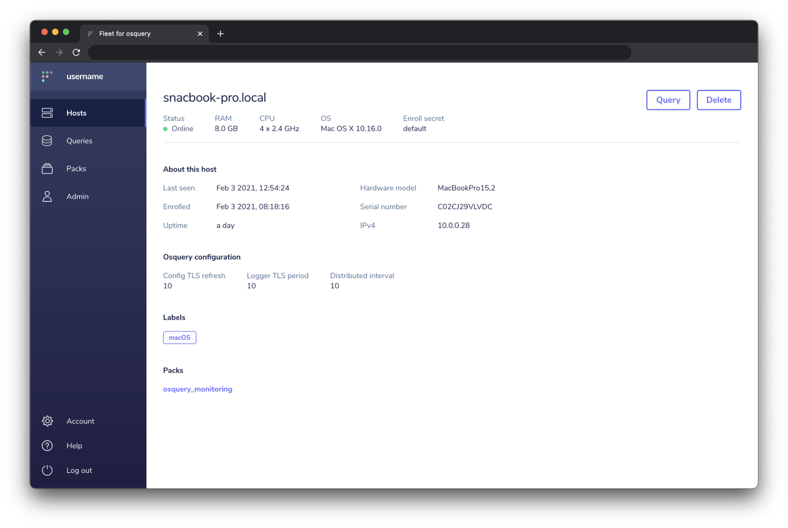
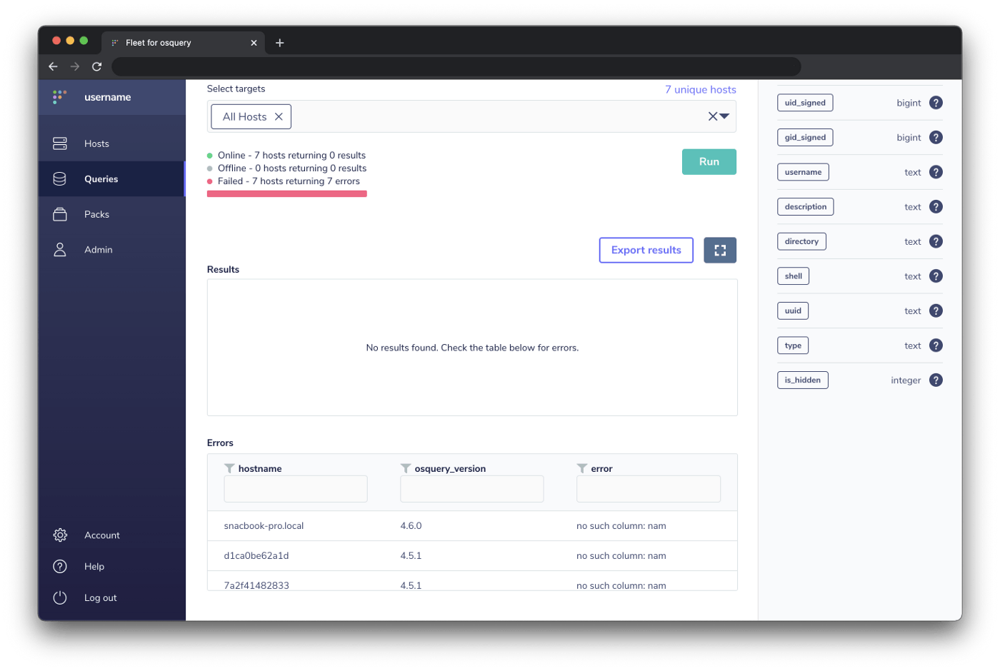

# Fleet 3.7.1

We’re psyched to announce the release of Fleet 3.7.1 which includes a new Host details page, the surfacing of live query errors, a Helm chart, support for the denylist parameter, and more!

Let’s dig into the highlights:

- Host details page
- Reveal live query errors
- A Helm chart
- Support for the denylist parameter

For the complete summary of changes check out the [release notes](https://github.com/fleetdm/fleet/releases) on GitHub.

## Host details page

Want to quickly link a collaborator to a specific machine in Fleet? The brand new Host details page allows you to do exactly this.

From the main Hosts page, click on the desired host’s `hostname` from the list of hosts to see the rich view of an individual host’s attributes.

The Host details page includes pertinent information about a specific host including hardware and software details, osquery configuration, and more.

Check out the Labels and Packs sections. Here, the new page displays and allows navigation to the query packs and labels associated with the respective host.

## Reveal live query errors

Osquery 4.4.0 introduced detailed error messages to live queries. We now reveal these errors in the Fleet UI and `fleetctl` CLI tool to better equip you during their efforts to debug hosts that fail.

_The Errors table in the Fleet UI_

When a host fails during a live query, a Fleet user is now presented with an Errors table which displays the `hostname`, `osquery_version`, and `error`.

In the Fleet UI, note that hosts with an `osquery_version` below 4.4.0 will return an error that alerts you to upgrade osquery on the respective host in order to see a more detailed message.

## A Helm chart

Kubernetes users rejoice! James Alseth’s [awesome contribution](https://github.com/fleetdm/fleet/pull/250) adds a Helm chart to Fleet. This significantly eases the deployment of Fleet to Kubernetes.

Thank you James Alseth from Yubico!

For more information on Helm check out the [Helm home page](https://helm.sh/).

## Support for `denylist` parameter

Fleet endeavors to support all osquery functionality. To that end, support for the scheduled query `denylist` parameter was added. Before using this new functionality, please take a look at [our discussion](https://github.com/fleetdm/fleet/issues/195#issuecomment-767200461) to understand the limitations.

---

## Ready to update?

Visit our [update guide](https://fleetdm.com/docs/using-fleet/updating-fleet) in the Fleet docs for instructions on updating to Fleet 3.7.1.

<meta name="category" value="releases">
<meta name="authorFullName" value="Noah Talerman">
<meta name="authorGitHubUsername" value="noahtalerman">
<meta name="publishedOn" value="2021-02-04">
<meta name="articleTitle" value="Fleet 3.7.1">
<meta name="articleImageUrl" value="../website/assets/images/articles/fleet-3.7.1-cover-1600x900@2x.jpg">