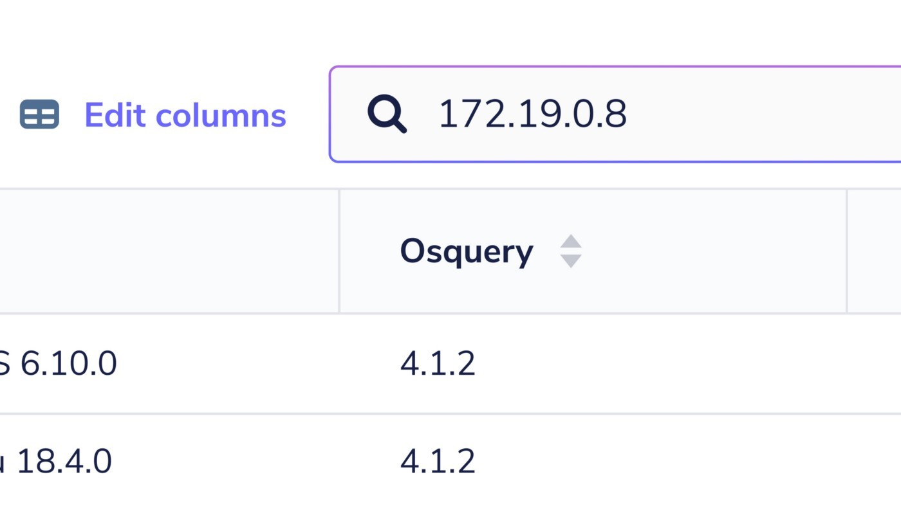
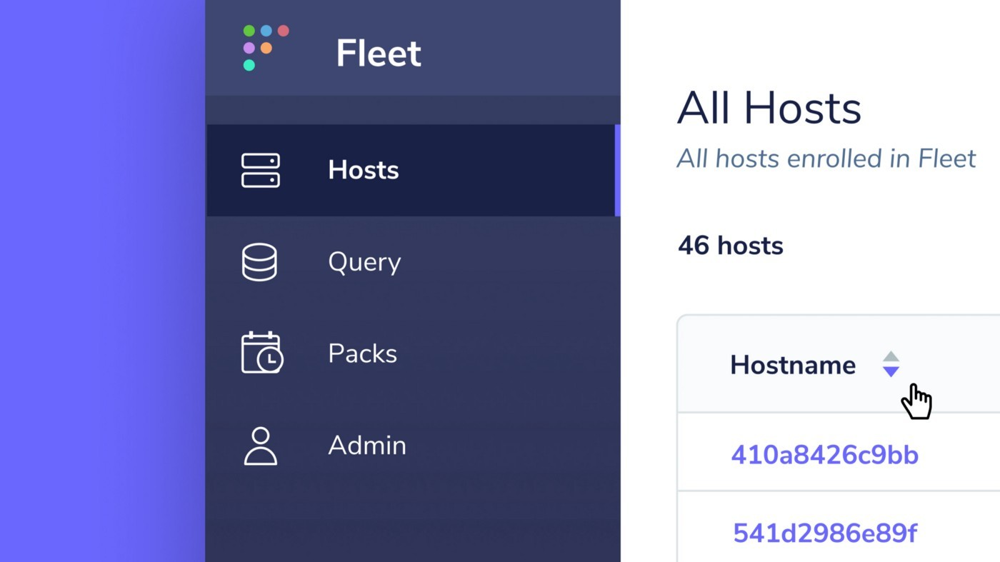

# Fleet 3.8.0

We’re excited to announce the release of Fleet 3.8.0 which includes big improvements to the navigation experience on the Hosts page, a new logging plugin for AWS Lambda, and more!

Let’s dig into the highlights:

- Improvements to the navigation experience on the Hosts page
- New logging plugin for AWS Lambda

For the complete summary of changes and release binaries check out the [release notes](https://github.com/fleetdm/fleet/releases/tag/3.8.0) on GitHub.

## Improvements to navigation experience on the Hosts page

Looking for a specific host in Fleet? Want to easily compare detailed information across a filtered view of hosts? Upgrades to the Fleet UI, which include hosts search and editable columns in the Hosts table, allow you to achieve both of these goals. Let’s check out each of the changes.

_Search for a specific host in Fleet_

You can now search for a specific host in the Fleet UI. Searchable properties include a host’s hostname, UUID, serial number, or IPv4.

This is really helpful when you want to check if a newly enrolled host has checked into Fleet or you’d like to quickly view more detailed information on a specific host.

_Edit columns and toggle their sort direction in Fleet_

Fleet 3.8.0 introduces the ability to select which columns are displayed in the Hosts table. Selecting the new “Edit columns” button will open a modal that allows you to hide and reveal specific host information.

In addition to the ability to edit columns, the Hosts table receives another upgrade: the ability to sort columns. This is helpful when you select the “Offline” filter in the sidebar and you’d like to see which of these offline hosts are running an osquery version below 4.4.0.

## New logging plugin for AWS Lambda

We’ve added a new log destination to Fleet! With the new logging plugin for AWS Lambda you can send log payloads of up to 6MB from Fleet.

Logging to Lambda offers an alternative to the 1MB limit of AWS Kinesis and Firehose logger plugins. Larger logs can be split as desired or written directly to logging destinations from Lambda.

---

## Ready to update?

Visit our [update guide](https://fleetdm.com/docs/using-fleet/updating-fleet) in the Fleet docs for instructions on updating to Fleet 3.8.0.

<meta name="category" value="releases">
<meta name="authorFullName" value="Noah Talerman">
<meta name="authorGitHubUsername" value="noahtalerman">
<meta name="publishedOn" value="2021-02-26">
<meta name="articleTitle" value="Fleet 3.8.0">
<meta name="articleImageUrl" value="../website/assets/images/articles/fleet-3.8.0-cover-1600x900@2x.jpg">