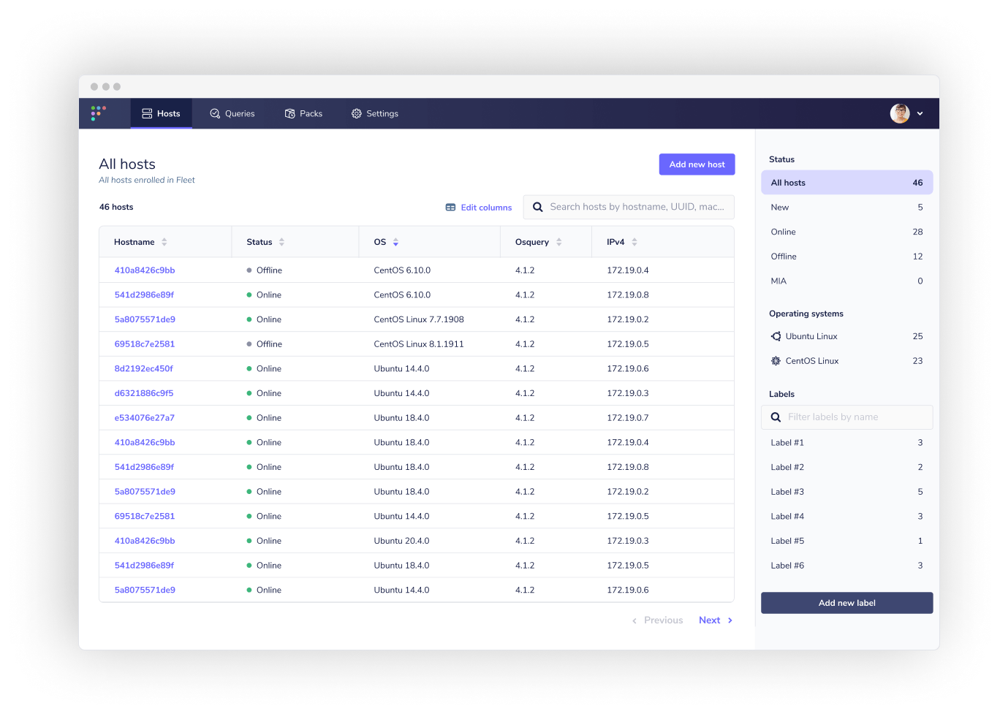
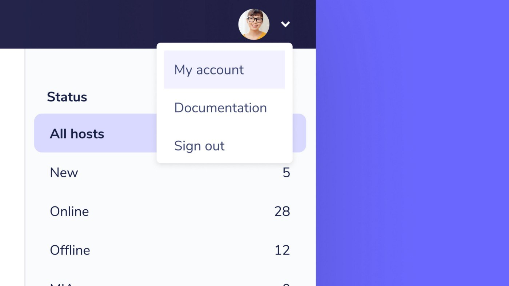

# Fleet 3.9.0

We’re psyched to announce the release of Fleet 3.9.0 which includes a configurable host identifier, fresh upgrades to the UI, and more!

Let’s dig into the highlights:

- Configurable host identifier
- Upgrades to the UI

For the complete summary of changes and release binaries check out the [release notes](https://github.com/fleetdm/fleet/releases/tag/3.9.0) on GitHub.

## Configurable host identifier

Fleet 3.9.0 focuses on stability and responding to feedback from customers and the osquery community. Recently, several Fleet users encountered a scenario in which hosts using the same identifiers would cause enrollment issues with Fleet.

To help solve this enrollment issue, we’ve introduced a configurable host identifier.

By default, Fleet’s behavior does not change (it uses the identifier configured in osquery’s `--host_identifier flag`), but for users with overlapping host UUIDs changing `--osquery_host_identifier` to `instance` on Fleet can be a helpful step without having to re-deploy osquery configuration to hosts.

## Upgrades to the UI

The Fleet UI now has some room to breathe! We’ve moved the navigation bar to the top of the window in order to provide space for the important content and controls on each page.

For example, check out the Hosts table on the Hosts page. With the new navigation bar at the top of the page, the table can extend to the left of the page and reveal more important information about your hosts.

_New Hosts page in Fleet_

To keep the new navigation focused, we’ve also moved links to the My account page, Fleet documentation, and Sign out in a drawer under the profile icon.

_Selecting the down arrow next to your avatar opens the new account drawer._

---

## Ready to update?

Visit our [update guide](https://fleetdm.com/docs/using-fleet/updating-fleet) in the Fleet docs for instructions on updating to Fleet 3.9.0.

<meta name="category" value="releases">
<meta name="authorFullName" value="Noah Talerman">
<meta name="authorGitHubUsername" value="noahtalerman">
<meta name="publishedOn" value="2021-03-10">
<meta name="articleTitle" value="Fleet 3.9.0">
<meta name="articleImageUrl" value="../website/assets/images/articles/fleet-3.9.0-cover-1600x900@2x.jpg">