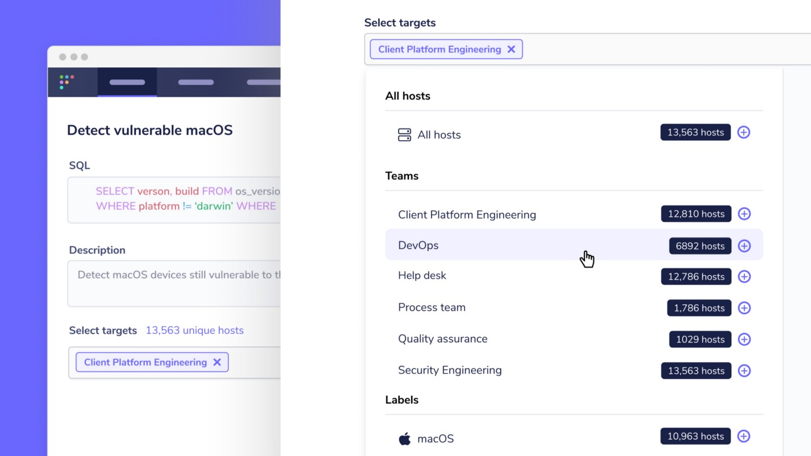
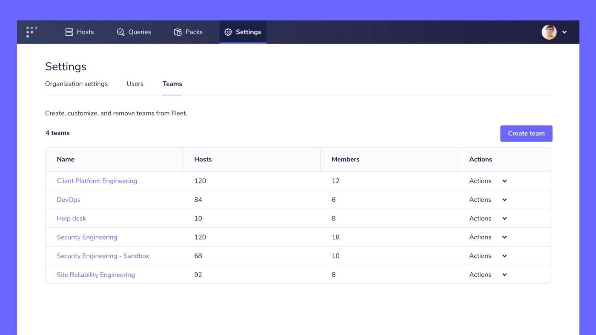

# Fleet 4.0.0 released with Role-based access control and Teams features

Fleet 4.0.0 is now available to spread the power of Fleet throughout your organization, with Teams for separating devices into exclusive groups, Role-based access control to define a user’s access to features in Fleet, and API-only users to help you create more automation pipelines.

## Spread the power of Fleet

Fleet is utilized at organizations with hundreds of thousands of devices. Our new Teams feature enables separating hosts into exclusive groups. This way, users can easily act on a consistent group of devices.

Having access to Fleet and it’s features provides you with a powerful toolset however, not all individuals in your organization need to be able to do everything that Fleet offers. Our new Role-based access control (RBAC) feature helps you define who can do what in Fleet. This way, more individuals in your organization can utilize Fleet with appropriate levels of access.

## Teams
**Available in Fleet Basic**

In Fleet 4.0.0, you can group hosts together in a team. With hosts segmented into exclusive teams, you can apply specific queries, query packs, and configuration to each team. For example, you could create teams based on actual teams within your organization, or you might want to create a team for each type of system, e.g., “Workstations,” “Workstations-sandbox”, “Servers,” etc. Once you have your teams set up you can:

- Enroll hosts to one team using team specific enroll secrets
- Apply unique configuration to each Team
- Schedule queries that target one or more Teams
- Run live queries against one or more Teams
- Grant users access to one or more Teams

Users with the Admin role can create teams at **Settings > Teams** in the Fleet UI. Check out the Fleet documentation for instructions on creating teams, enrolling devices to teams, adding users to teams, and more.

## Role-based access control (RBAC)
**Available in Fleet Core, Fleet Basic**

We’re pleased to announce the introduction of the Admin, Maintainer, and Observer users roles in Fleet! Users can now be assigned one of the three roles to restrict or expand their access to features in Fleet. This is especially useful for when an individual in your organization needs to run a specific saved query in Fleet and nothing else. For example, someone working at your help desk can be given access to Fleet to only collect information on which applications are installed on company laptops. Users with the Admin role can create and assign new users to the three new roles at Settings > Users in the Fleet UI.

## API-only users
**Available in Fleet Core, Fleet Basic**

You can now create users that can only access the Fleet API and `fleetctl` CLI tool. This allows you to generate as many automation or bot users as you like without having to think about who and which accounts can access the Fleet UI. API-only users can currently be created by adding the `--api_only` flag to the `fleetctl user create` command. Look for this ability to come to the Fleet UI in a future release of Fleet.

---

## Ready to update?

Visit our [update guide](https://github.com/fleetdm/fleet/blob/7fd439f812611229eb290baee7688638940d2762/docs/1-Using-Fleet/7-Updating-Fleet.md) for instructions on how to update.

Fleet 4.0.0 is a major release and introduces several breaking changes and database migrations. The following sections call out changes to consider when upgrading to Fleet 4.0.0:

The structure of Fleet’s `.tar.gz `and `.zip` release archives have changed slightly. Deployments that use the binary artifacts may need to update scripts or tooling. The `fleetdm/fleet` Docker container maintains the same API.

Use strictly `fleet` in Fleet’s configuration, API routes, and environment variables. Users must update all usage of `kolide` in these items (deprecated since Fleet 3.8.0).

Change your SAML SSO URI to use `fleet` instead of `kolide` . This is due to the changes to Fleet’s API routes outlined in the section above.

Change the `server_tlsprofile` configuration option to `server_tls_compatibility`. This options previously had an inconsistent key name.

Replace the use of the `api/v1/fleet/spec/osquery/options` with `api/v1/fleet/config`. In Fleet 4.0.0, “osquery options” are now called “agent options.” The new agent options are moved to the Fleet application config spec file and the `api/v1/fleet/config` API endpoint.

Enroll secrets no longer have “names” and are now either global or for a specific team. Hosts no longer store the “name” of the enroll secret that was used. Users that want to be able to segment hosts (for configuration, queries, etc.) based on the enrollment secret should use the Teams feature in Fleet Basic.

JWT encoding is no longer used for session keys. Sessions now default to expiring in 4 hours of inactivity. `auth_jwt_key` and `auth_jwt_key_file` are no longer accepted as configuration.

As of Fleet 4.0.0, Fleet Device Management Inc. periodically collects [anonymous information](https://fleetdm.com/guides/fleet-usage-statistics) about your instance. Sending usage statistics is turned off by default for users upgrading from a previous version of Fleet.

<meta name="category" value="releases">
<meta name="authorFullName" value="Noah Talerman">
<meta name="authorGitHubUsername" value="noahtalerman">
<meta name="publishedOn" value="2021-06-30">
<meta name="articleTitle" value="Fleet 4.0.0 released with Role-based access control and Teams features">
<meta name="articleImageUrl" value="../website/assets/images/articles/fleet-4.0.0-cover-1600x900@2x.jpg">