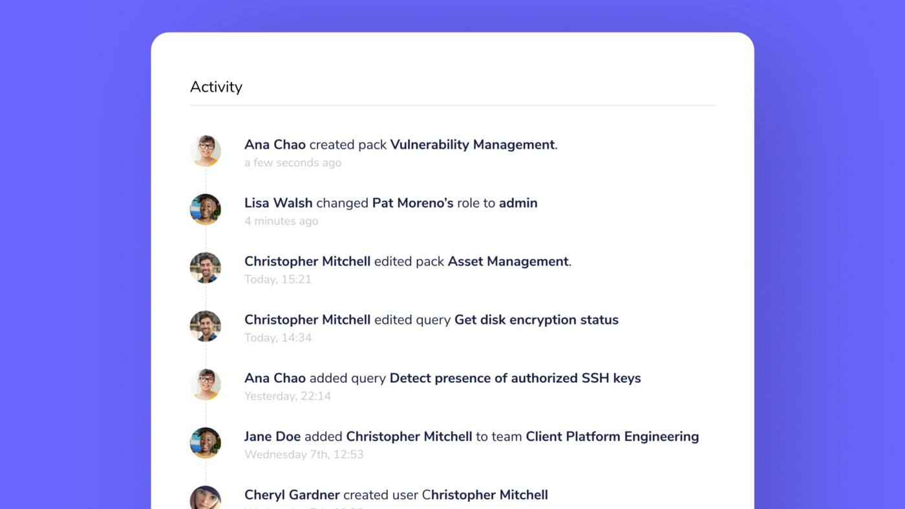

# Fleet 4.1.0 released with Schedule and Activity feed features

Fleet 4.1.0 is now available to increase the usability and maturity of your Fleet deployment with Schedule for making the ability to collect data from your devices faster and Activity feed for easily monitoring changes made to your Fleet and osquery deployment.

For the complete summary of changes and release binaries check out the [release notes](https://github.com/fleetdm/fleet/releases/tag/v4.1.0) on GitHub.

## Easier data collection for increased usability

Deciding what, and how often, data is sent to a configured log destination, is vital to our customers’ success, and we want to make it easier for new and experienced users of Fleet. Our new Schedule feature enables grabbing information from your devices without having to use or understand query packs.

## Enhanced visibility of your Fleet and osquery deployment
Changes made to your Fleet deployment have the ability to impact the data you collect from your devices as well as who has access to what information in Fleet. Our new Activity feed feature increases your ability to know what changes and when in Fleet. This way, your team can more easily identify the source of an unexpected change in the data sent to your log destination.

## Schedule
**Available in Fleet Core, Fleet Basic**

In Fleet 4.1.0, you can schedule recurring queries for your hosts. Fleet’s Schedule lets you add queries which are executed on your devices at regular intervals.

For experienced Fleet and osquery users, the ability to create new, and modify existing, query packs is still available in the Fleet UI and fleetctl command-line tool. To reach the Packs page in the Fleet, head to Schedule > Advanced.

## Activity feed
**Available in Fleet Core, Fleet Basic**

We’re excited to announce the introduction of the Activity feed in Fleet! Users can now observe when, and by whom, queries are changes, packs are created, live queries are run, and more.

This is especially useful for when an individual in your organization observes that the data sent to your configured log destination has changed in an unexpected way. For example, a query may have been changed to return different data from your devices. It turns out this specific query was included in more packs than the individual who changes the query was aware of. With information presented in the Activity feed, you’re now equipped to quickly identify what query needs to changed and what teammate needs to be filled in on which packs this query is included in.

## Manage teams with fleetctl
**Available in Fleet Basic**

If you manage Fleet using configuration files and the fleetctl command-line tool, you can now easily spread the power of osquery throughout your organization.

Fleet 4.1.0 includes a team configuration document that allows you to create teams and update their respective agent options and enroll secrets all from the command-line or your CI/CD pipeline. In addition, 4.1.0 introduces a user_roles configuration document so you can manage the level of access individuals in your organization have to Fleet.

## View users on the Host details page
**Available in Fleet Core, Fleet Basic**

It’s important to know which user accounts are present on your devices so that you can know which end-user or tool has been given access. Included in Fleet 4.1.0 is the “Users” table on the Host details page. Head to Hosts and select a specific host to view the list of usernames presented in this table.

The information displayed in the “Users” table, as well as the uid, type, and groupname is available in the Fleet REST API via the /api/v1/fleet/hosts/{id} route. If you’re curious about how this information is collected from your devices, check out the osquery query used to collect this data here in Fleet’s Standard query library.

## Create users without an invitation
**Available in Fleet Core, Fleet Basic**

Fleet 4.1.0 simplifies adding users to your Fleet. You can now create a new user by heading to Settings > Users, selecting “Create user,” and then choosing the “Create user” option. This way, you can easily spread the use of Fleet throughout your organization without having to configure a Simple Mail Transfer Protocol (SMTP) server.

For users that prefer inviting users over email can still do so by selecting “Invite user” in the “Create user” modal.

## Delete users with fleetctl
**Available in Fleet Core, Fleet Basic**

Fleet 4.1.0 introduces the fleetctl user delete command so that you can quickly remove a user from your Fleet instance via the command-line interface.

---

## Ready to update?

Visit our [update guide](https://fleetdm.com/docs/using-fleet/updating-fleet) in the Fleet docs for instructions on updating to Fleet 4.1.0.

<meta name="category" value="releases">
<meta name="authorFullName" value="Noah Talerman">
<meta name="authorGitHubUsername" value="noahtalerman">
<meta name="publishedOn" value="2021-07-27">
<meta name="articleTitle" value="Fleet 4.1.0 released with Schedule and Activity feed features">
<meta name="articleImageUrl" value="../website/assets/images/articles/fleet-4.1.0-cover-1600x900@2x.jpg">