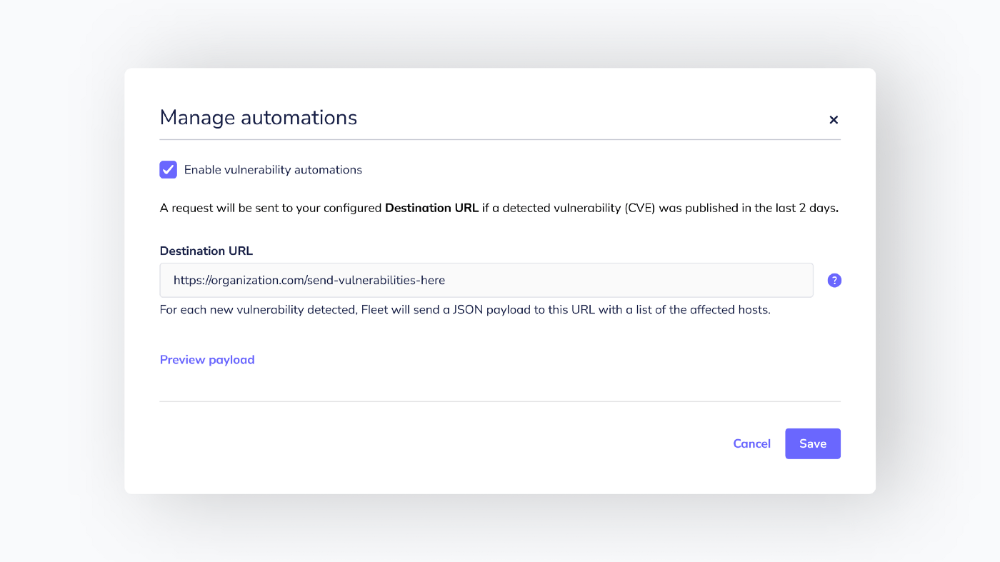

# Fleet 4.10.0 brings new features and improvements for vulnerability analysts.

We’re pleased to announce Fleet 4.10.0. Check out the full [changelog](https://github.com/fleetdm/fleet/releases/tag/fleet-v4.10.0) or continue reading to summarize what’s new.

For update instructions, see our [upgrade guide](https://fleetdm.com/docs/deploying/upgrading-fleet) in the Fleet docs.

## Feature highlights

- A brand new Software page in Fleet UI ([#3397](https://github.com/fleetdm/fleet/issues/3397)).
- Configure and send vulnerability webhook automations ([#3050](https://github.com/fleetdm/fleet/issues/3050)).
- Aggregate MDM (mobile device management) and Munki data ([#3263](https://github.com/fleetdm/fleet/issues/3263)).

### A brand new Software page in Fleet UI

As a progression from our host-specific software inventory, Fleet 4.10.0 introduces a new Software page in Fleet UI. Users can see an aggregated list of software installed throughout their entire organization or filter by individual teams as needed.

Vulnerability analysts, who manage many devices, can check for software affected by vulnerabilities (CVEs) and get the number of devices impacted — handy for tracking the status of patching efforts across their fleet.

💡 Since we’ve added the new “Software” nav item, we tidied away the Settings page under the Account dropdown to keep the navigation clear and simple.

### Configure and send vulnerability webhook automations

When vulnerability automation is enabled, users can tell Fleet to reach out when a new vulnerability (CVE) is detected and automate the process of notifying device owners or creating a ticket to track the vulnerability.

To keep signal noise to a minimum, Fleet only sends notifications for new vulnerabilities published within the last two days.

### Aggregate MDM (mobile device management) and Munki data

IT administrators can monitor the status of MDM enrollment across all devices and see the number of devices with specific Munki versions installed to track upgrade efforts.

MDM enrollment data is only available on macOS and will expand to Windows and Linux devices later.

### More improvements

- Search software by CVE.
- Filter by “Vulnerable” on the Host detail page.
- We moved Settings under the Account dropdown to keep the main nav clean and simple.
- We improved the UX of editing team names and descriptions.
- We improved the UX of editing policies and queries.
- We improved debugging tooling by adding the output of `SHOW ENGINE INNODB STATUS`.
- Users can now access a team’s enroll secret and instructions to download a team-specific osquery installer from the Host details page.
- Expanded `fleetctl`’s new simplified implementation everywhere.
- We added the ability to configure Sentry with Fleet.
- We removed the config flattening process to provide users with a more robust config object.
- Bug fixes
- We fixed UI issues with padding, placement of elements, etc.
- Teams are now reporting the correct amount of hosts assigned to them.
- We fixed up a UI bug on the logout page.
- `GET/software` is now returning the expected amount of results.

## Ready to update?

Visit our [upgrade guide](https://fleetdm.com/docs/deploying/upgrading-fleet) in the Fleet docs for instructions on updating to Fleet 4.10.0

<meta name="category" value="releases">
<meta name="authorFullName" value="Mike Thomas">
<meta name="authorGitHubUsername" value="mike-j-thomas">
<meta name="publishedOn" value="2022-02-14">
<meta name="articleTitle" value="Fleet 4.10.0 brings new features and improvements for vulnerability analysts.">
<meta name="articleImageUrl" value="../website/assets/images/articles/fleet-4.10.0-cover-1600x900@2x.jpg">