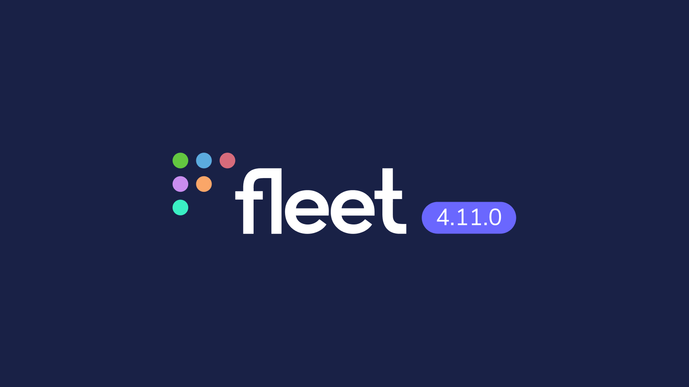
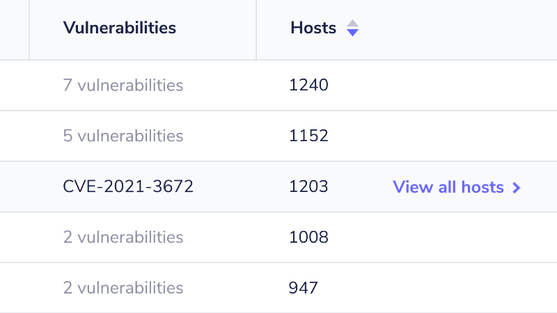
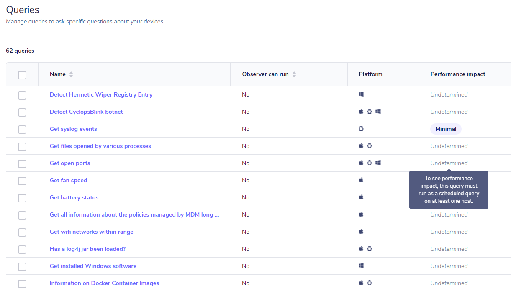

# Fleet 4.11.0 brings impact clarity, improvements to vulnerability processing, and performance updates.

We’re pleased to announce Fleet 4.11.0. Check out the full changelog or read on for a summary of what’s new.

For update instructions, see our [upgrade guide](https://fleetdm.com/docs/deploying/upgrading-fleet) in the Fleet docs.

- Improvements to vulnerability processing ([#3081](https://github.com/fleetdm/fleet/issues/3081)).
- Add ability to retrieve the configuration for a specific team with fleetctl ([#3055](https://github.com/fleetdm/fleet/issues/3055)).
- Remove expiration for API-only user tokens ([#3927](https://github.com/fleetdm/fleet/issues/3927)).
- Clarification on when performance information is displayed for scheduled queries ([#2750](https://github.com/fleetdm/fleet/issues/2750)).

## Improvements to vulnerability processing

Fleet 4.11.0 improves vulnerability processing for RPM packages to reduce the number of potential false positives reported for Linux devices. For more info about what we did and to read up on some of our research, check out [#3081](https://github.com/fleetdm/fleet/issues/3081).

## Ability to retrieve the configuration for a specific team with fleetctl

You can now retrieve the configuration for a specific team with fleetctl by using `fleetctl get teams — name <TEAM_NAME_HERE>`. This will use MatchQuery underneath and filter Teams accordingly so that you receive data for only one team.

## Create an API-only user with an API token that doesn’t expire:

API-only user tokens are now acting as long-lived API tokens. Previously, the expiration for these tokens was the same as normal users — meaning that automations and scripts were likely to need manual intervention to refresh the tokens. API-only users can be created using the command:

`fleetctl user create --api-only`

## Clarify performance impact bubble functionality

We’ve added clarification on the performance impact bubbles that appear on the “Manage Queries”, “Manage Schedule”, and “Manage Packs” pages. Tooltips now explain the performance impact; either minimal, considerable, or excessive. If performance impact is undetermined it reminds the user to run that query on one or more hosts.

## More improvements

- We’ve reduced the load that repeated SQL queries can cause on Fleet
- Fleet Premium: Added a `teams` key to the `packs` YAML document to allow adding teams as targets when using CI/CD to manage query packs
- Updated the activity feed on the Home page to include add, edit, and delete policy activities. Activity information is also available in the `GET /activities` API route
- Improved performance of the osquery query used to collect software inventory for Linux hosts
- Host status on the summary page has been improved
- Improved tooltips in Fleet UI
- Updated [Kinesis](https://fleetdm.com/docs/using-fleet/log-destinations#amazon-kinesis-data-streams) logging plugin to append newline characters to raw message bytes to properly format the Newline Delimited JSON (NDJSON) for downstream consumers
- Query packs are able to be applied to specific teams using fleetctl
- Added instructions for using plain osquery to add hosts to Fleet in the Fleet View these instructions by heading to **Hosts > Add hosts > Advanced**

## Bug fixes

- Fixed error where Orbit potentially fails to start after installing fleet-osquery.msi
- Platforms now auto-select when using policy templates
- Profile picture now displays as expected
- Fixed issue where Orbit would fail to start during updates
- Fixed bug in which uninstalling Munki from one or more hosts resulted in inaccurate Munki versions displayed on the **Home > macOS** page
- Fixed bug in which a user, with access limited to one or more teams, was able to run a live query against hosts in any team. This bug is not exposed in the Fleet UI and is limited to users of the `POST run` API route
- Fixed bug on the Software page in which the “Hosts” column was not filtered by team
- Fixed bug in the Fleet UI in which the “Select targets” search bar would not return the expected hosts
- Fixed bug in which the Fleet UI would incorrectly tag some URLs as invalid
- Operating system version for some Linux distributions now display properly
- Fixed bug in which configuring an identity provider name to a value shorter than 4 characters was not allowed

Ready to update?

Visit our [upgrade guide](https://fleetdm.com/docs/deploying/upgrading-fleet) in the Fleet docs for instructions on updating to Fleet 4.11.0.

<meta name="category" value="releases">
<meta name="authorFullName" value="Mike Thomas">
<meta name="authorGitHubUsername" value="mike-j-thomas">
<meta name="publishedOn" value="2022-03-07">
<meta name="articleTitle" value="Fleet 4.11.0 brings impact clarity, improvements to vulnerability processing, and performance updates.">
<meta name="articleImageUrl" value="../website/assets/images/articles/fleet-4.11.0-cover-1600x900@2x.jpg">