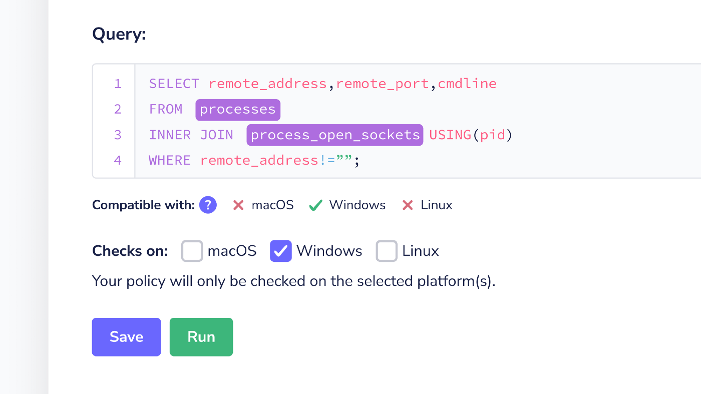
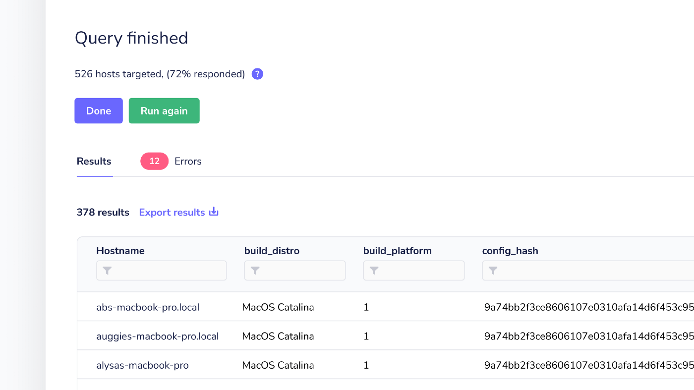

# Fleet 4.12.0 | Platform-specific policies, and improved query results

We’re pleased to announce Fleet 4.12.0. Check out the full [changelog](https://github.com/fleetdm/fleet/releases/tag/fleet-v4.12.0) or continue reading to summarize what’s new.

For update instructions, see our [upgrade guide](https://fleetdm.com/docs/deploying/upgrading-fleet) in the Fleet docs.

## Highlights

- Policies: check policies on specific platforms
- Fleet UI: help users understand which hosts are returning results

### Policies: check policies on specific platforms

Fleet admin and maintainers can specify the platform (macOS, Windows, Linux) for a specific policy. For example, a policy that checks if Dropbox is installed on all devices can now be updated to only check macOS devices. This is helpful when an organization’s security policy is different across platforms and subject to frequent change.

### Fleet UI: help users understand which hosts are returning results

We made an iterative improvement to Fleet UI’s live query console to help users running a live query to understand better which hosts are returning results and which are not.

### More new features, improvements, and bug fixes

- Turn all automations in a given list on or off
- Get instructions to download a certificate from the “Add hosts” modal. Users running Fleet with a self-signed certificate can now generate an installer that adds their hosts to Fleet.
- Global admins, change anyone’s password from /settings/users to your heart’s content.
- Improved fleetctl login --help to give clear instructions for folks using SSO to login to Fleet.
- Strange things are no longer happening when clicking menu tab items twice on Settings.
- The error tab label for live query results is now rendering correctly.
- Begone 415 error when launching with Fleet server for Kafka logging.
- Fixed up various misalignments, wonky hover states, and other styling hiccups in Fleet UI.

<meta name="category" value="releases">
<meta name="authorFullName" value="Mike Thomas">
<meta name="authorGitHubUsername" value="mike-j-thomas">
<meta name="publishedOn" value="2022-03-25">
<meta name="articleTitle" value="Fleet 4.12.0 | Platform-specific policies, and improved query results">
<meta name="articleImageUrl" value="../website/assets/images/articles/fleet-4.12.0-cover-1600x900@2x.jpg">