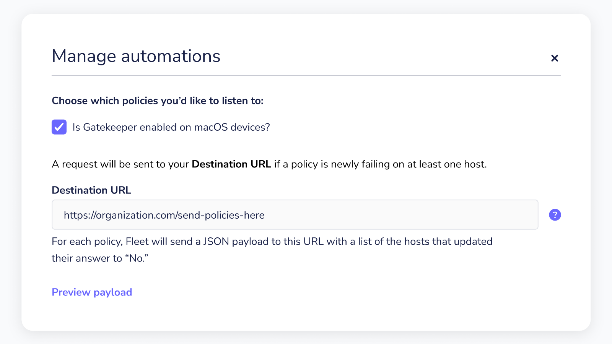
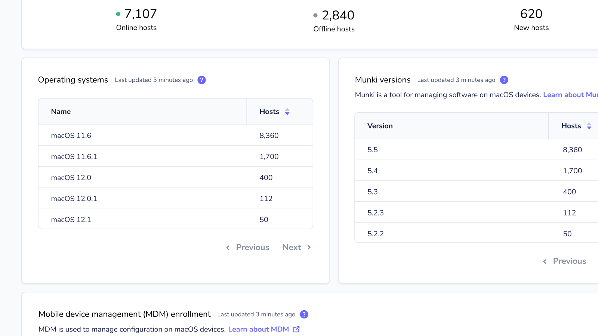

# Fleet 4.13.0 | Security fixes, policy automations for teams, and aggregated macOS versions for MacAdmins.

Fleet 4.13.0 is here. Check out the full [changelog](https://github.com/fleetdm/fleet/releases/tag/fleet-v4.13.0) or continue reading to summarize what’s new.

For update instructions, see our [upgrade guide](https://fleetdm.com/docs/deploying/upgrading-fleet) in the Fleet docs.

## Highlights
- Security fixes
- Policy automations for teams
- Aggregated macOS versions for MacAdmins

## Security fixes

Fleet 4.13.0 fixes several post-authentication authorization issues identified on Fleet 4.12.1 and older during a penetration testing engagement.

Only Fleet Premium instances that have team users in use are affected. Fleet Free does not support the teams feature and is unaffected.

More information on the impact of the issues can be found in the following security advisory: https://github.com/fleetdm/fleet/security/advisories/GHSA-pr2g-j78h-84cr

## Policy automations for teams

**Available to Fleet Premium users.**

Fleet Premium users can now tell Fleet to create separate tickets for misconfigured servers and workstations across their teams.

## Aggregated macOS versions for MacAdmins

**Available to Fleet and Fleet Premium users.**

We added an “Operating systems” card to the homepage to show the number of hosts with specific MacOS versions. MacAdmins can now quickly see if the number of hosts with the latest macOS security update is trending in the right direction.

## More new features, improvements, and bug fixes

- We added the ability to search for a specific vulnerability (CVE) in the “Software” table on the Host details page.
- We fixed a bug that caused downloading the vulnerability database to fail for certain directories.
- We corrected a couple of error messages that were misbehaving when creating Packs.
- We added a “Vulnerabilities” column to the “Software” table on the Host details page.
- We removed the “Osquery enrollment secrets” section from “Settings > Organization settings” page. Users can now more easily manage enrollment secrets from the Hosts page.
- We improved the UI on the Policies page to better indicate when policy data is yet to be collected.
- We added basic auth to the/metrics API route. Although /metrics doesn’t contain anything particularly sensitive, it’s better to be safe than sorry.
- We fixed a bug causingGET /os_versions?platform=darwin to return a 500 rather than a 200 error if no results were found.
- We improved the focus states throughout the UI to be consistent when tabbing through Fleet. Accessibility is a good thing.
- We added more human-friendly messaging in the Software card on the Home page so users can understand why items may not be showing.
- We started iterating the API and deprecating some APIs. To get started, we created an alias, latest , that will always use the latest version and deprecated /global in API routes.
- We improved the way that Fleet UI parses invalid SQL.
- We made table behavior in Fleet UI consistent for page widths down to tablet viewport sizes (768px).

---

### Ready to update?

Visit our [Update guide](https://fleetdm.com/docs/deploying/upgrading-fleet) in the Fleet docs for instructions on updating to Fleet 4.13.0.

<meta name="category" value="releases">
<meta name="authorFullName" value="Fleet">
<meta name="authorGitHubUsername" value="fleetdm">
<meta name="publishedOn" value="2022-04-19">
<meta name="articleTitle" value="Fleet 4.13.0 | Security fixes, policy automations for teams, and aggregated macOS versions for MacAdmins.">
<meta name="articleImageUrl" value="../website/assets/images/articles/fleet-4.13.0-cover-1600x900@2x.jpg">