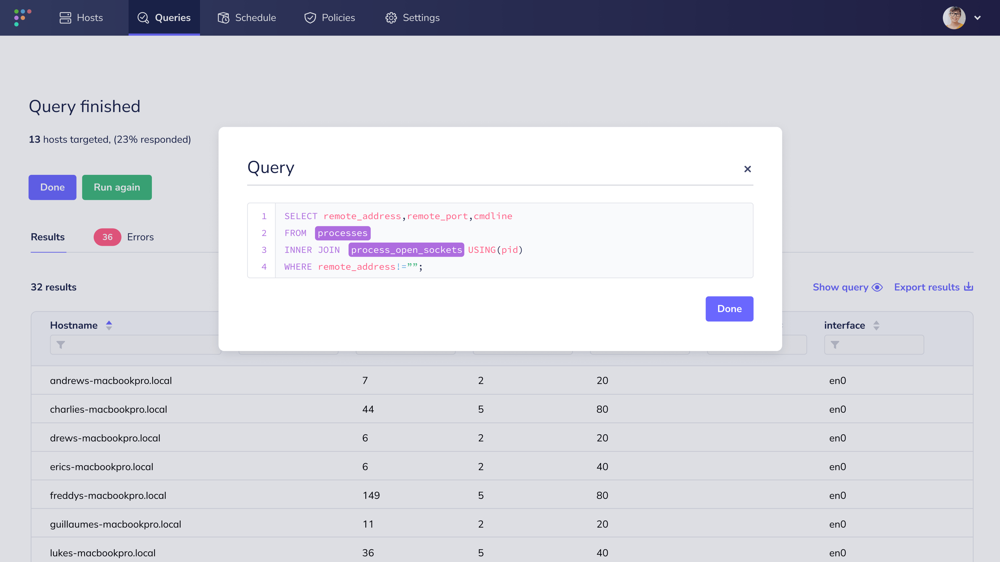
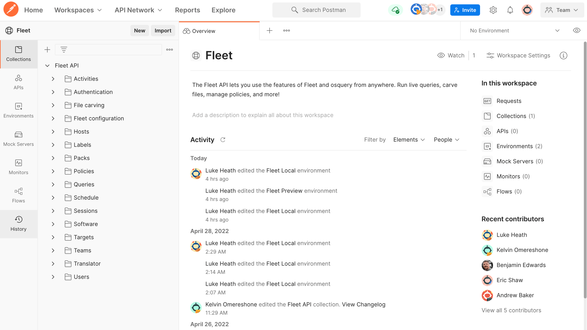

# Fleet 4.14.0 adds beta support for automatic ticket creation and improves the live query experience.

Fleet 4.14.0 has arrived. Check out the full [changelog](https://github.com/fleetdm/fleet/releases/tag/fleet-v4.14.0) or continue reading to get the highlights.

For update instructions, see our [upgrade guide](https://fleetdm.com/docs/deploying/upgrading-fleet) in the Fleet docs.

## Highlights
- Jira integration
- Improved live query experience

<!--  Note: For the sake of efficiency, in Nov 2023, Fleet decided for now to focus all API reference documentation efforts instead on the API docs located at https://fleetdm.com/docs/rest-api/rest-api. 
- Postman Collection
-->

## Jira integration
**Available in Fleet Free & Fleet Premium**

You can now configure Fleet to automatically create a Jira issue (ticket) when a new vulnerability (CVE) is
found on your hosts. No need to create tickets or spend time configuring a webhook manually.

Follow the steps below to configure Jira as a ticket destination:
1. Navigate to the right-hand side of the top bar. Select the avatar and then **Settings**.
2. Select **Integrations** and **Add integration**.
3. Enter your Jira instance's **URL**, **Username**, **API token**, and **Project key**.
4. On the top bar, select **Software** and, on the right, select **Manage automations**.
5. Select **Enable vulnerability automations** and choose **Ticket**.
6. Choose your Jira instance in **Integration** and select **Save**.

## Improved live query experience
**Available in Fleet Free & Fleet Premium**

We added a “Show query” option to the live query results view. You can now double-check the syntax you used and compare that to your results without leaving the current view.

<!-- Note: For the sake of efficiency, in Nov 2023, Fleet decided for now to focus all API reference documentation efforts instead on the API docs located at https://fleetdm.com/docs/rest-api/rest-api. 
## Postman Collection
**Available in Fleet Free & Fleet Premium**

Fleet users can easily interact with Fleet's API routes using the new Postman Collection. Build and test integrations for running live queries, carving files, managing policies, and more!
-->

## More new features, improvements, and bug fixes

In 4.14.0, we also:

- Added a `last_opened_at` property, for macOS software, to the **Host details** API route (`GET /hosts/{id}`).
- Added `osquery.min_software_last_opened_at_diff` configuration option.
- Improved the **Settings** pages in the Fleet UI.
- Improved the error messaging for `fleetctl query`.
- Improved the empty state messaging in the Fleet UI.
- Made the duration values returned by `fleetctl` more human-friendly to read.
- Added “optional” to hints for appropriate fields when creating new queries and policies in the
  Fleet UI. 
- Fixed a bug where the "Bundle identifier" tooltips displayed on **Host details > Software** did
  not render correctly.
- Fixed a bug where the Fleet UI would render empty Google Chrome profiles on the **Host
  details** page. 
- Fixed a bug where the Fleet UI would error when entering the "@" characters in the **Search
  targets** field.
- Fixed a bug affecting the “name” display for scheduled queries in the Fleet UI. 
- Fixed a bug that caused panic errors when running `fleet –debug`. 
- Fixed a deprecation warning message on `fleetctl package` for deb/rpm.

---

### Ready to update?

Visit our [Update guide](https://fleetdm.com/docs/deploying/upgrading-fleet) in the Fleet docs for instructions on updating to Fleet 4.14.0.

<meta name="category" value="releases">
<meta name="authorFullName" value="Kathy Satterlee">
<meta name="authorGitHubUsername" value="ksatter">
<meta name="publishedOn" value="2022-05-06">
<meta name="articleTitle" value="Fleet 4.14.0 adds beta support for automatic ticket creation and improves the live query experience.">
<meta name="articleImageUrl" value="../website/assets/images/articles/fleet-4.14.0-cover-1600x900@2x.jpg">
