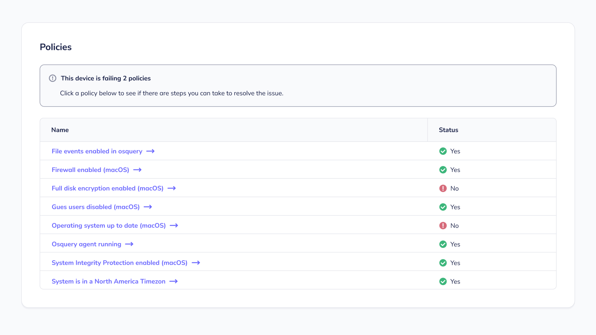

# Fleet 4.15.0 adds beta support for Self-service, Scope transparency, and brings Zendesk to the party.

Fleet 4.15.0 is here. Check out the full [changelog](https://github.com/fleetdm/fleet/releases/tag/fleet-v4.15.0) or continue reading to get the highlights.

For update instructions, see our [upgrade guide](https://fleetdm.com/docs/deploying/upgrading-fleet) in the Fleet docs.

## Highlights
- Self-service with Fleet Desktop. 
- Scope transparency with Fleet Desktop.
- Zendesk integration
- "Last used" information for macOS applications.

## Self-service with Fleet Desktop on macOS, Windows, and Linux
**Available in Fleet Premium**

Fleet Desktop is a lightweight application that allows end-users to self serve failing policies on their laptop or workstation.

With Fleet Desktop installed on a host, the end-user has access to the list of policies that apply to their laptop, and the instructions to resolve failing policies. The end-user can quickly reach this list of policies by selecting the **Fleet icon > My device** in the menu bar.

Fleet Desktop is currently in beta. Check out the remaining work to bring Fleet Desktop out of beta [here on GitHub](https://github.com/fleetdm/fleet/issues/5684).

## Scope transparency with Fleet Desktop on macOS, Windows, and Linux
**Available in Fleet Free & Fleet Premium**

Fleet Desktop also allows end-users to see what information about their laptop or workstation, is accessible to their organization.

With Fleet Desktop installed on a host, the end-user can navigate to the **Transparency** page on fleetdm.com. This page includes resources on what personal information Fleet and osquery can see. The end-user can quickly reach the Transparency page by selecting the **Fleet icon > Transparency** in the menu bar.

The end-user also has access to information about their laptop's disk space, memory, last restarted time, installed software, and more. The end-user can quickly reach this information by selecting the Fleet icon in their menu bar and selecting **My device**.

Fleet Desktop is currently in beta. Check out the remaining work to bring Fleet Desktop out of beta [here on GitHub](https://github.com/fleetdm/fleet/issues/5684).

## Zendesk integration
**Available in Fleet Free & Fleet Premium**

You can now configure Fleet to automatically create a Zendesk ticket when a new vulnerability (CVE) is
found on your hosts. Add the Zendesk Integration in the Fleet UI under **Settings** > **Integrations** and selecting **Zendesk** as your ticket destination.

The Zendesk integration is currently in beta.

## "Last used" information for MacOS applications.
**Available in Fleet Free & Fleet Premium**

We've added a **Last used** column to the **Software** tab in **Host Details** for MacOS devices. This lets you know how recently an application was accessed and is especially useful when deciding whether to continue subscriptions for paid software and when distributing licenses. 

## More new features, improvements, and bug fixes

In 4.15.0, we also:

* Improved security by increasing the minimum password length requirement for Fleet users to 12 characters.
* Added Policies tab to **Host Details** page for Fleet Premium users.
* Added `device_mapping` to host information in UI and API responses.
* Deprecated "MIA" host status in UI and API responses.
* Added CVE scores to `/software` API endpoint responses when available.
* Added license object to `GET /fleet/device/{token}` response.
* Added `all_linux_count` and `builtin_labels` to `GET /host_summary` response.
* Added the ability to select columns when exporting hosts to CSV.
* Improved the output of `fleetclt debug errors` and added the ability to print the errors to stdout via the `-stdout` flag.
* Added support for Docker Compose V2 to `fleetctl preview`.
* Added experimental option to save responses to `host_last_seen` queries to the database in batches as well as the ability to configure `enable_async_host_processing` settings for `host_last_seen`, `label_membership` and `policy_membership` independently. 
* Expanded `wifi_networks` table to include more data on macOS and fixed compatibility issues with newer MacOS releases.

---

### Ready to update?

Visit our [Update guide](https://fleetdm.com/docs/deploying/upgrading-fleet) in the Fleet docs for instructions on updating to Fleet 4.15.0.

<meta name="category" value="releases">
<meta name="authorFullName" value="Kathy Satterlee">
<meta name="authorGitHubUsername" value="ksatter">
<meta name="publishedOn" value="2022-05-30">
<meta name="articleTitle" value="Fleet 4.15.0 adds beta support for Self-service, Scope transparency, and brings Zendesk to the party.">
<meta name="articleImageUrl" value="../website/assets/images/articles/fleet-4.15.0-cover-1600x900@2x.jpg">
