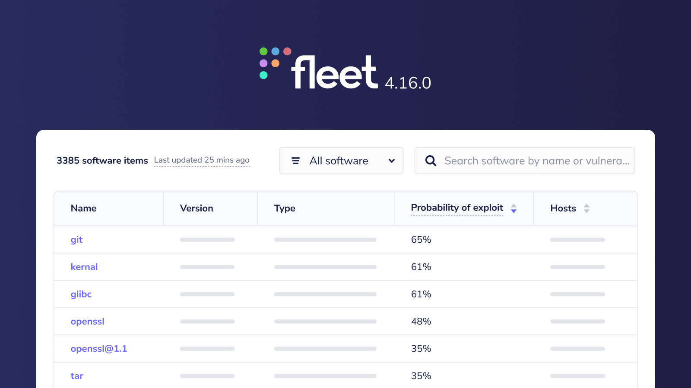

# Fleet 4.16.0 | more customization, beefed up vuln management, Jira added to integrations. 

Fleet 4.16.0 is up and running. Check out the full [changelog](https://github.com/fleetdm/fleet/releases/tag/fleet-v4.16.0) or continue reading to get the highlights.

For update instructions, see our [upgrade guide](https://fleetdm.com/docs/deploying/upgrading-fleet) in the Fleet docs.

## Highlights
- Customize your organization's "Transparency" landing page. 
- Prioritize your vulnerability management efforts.
- Automatically create Jira issues or Zendesk tickets for failing policies.
- More accurate vulnerability detection for Ubuntu hosts.

## Customize your organization's "Transparency" landing page
**Available in Fleet Premium**

Fleet Desktop gives end-users a **Transparency** landing page to see what information Fleet is able to access.

Fleet 4.16.0 adds settings for a custom **Transparency** URL. This allows you to use custom branding, as well as giving you control over what information you want to share with your end-users. 

## Prioritize your vulnerability management efforts
**Available in Fleet Premium**

We've added [EPSS probability scores](https://www.first.org/epss/), [CVSS base scores](https://nvd.nist.gov/), and [CISA's](https://www.cisa.gov/) known exploits to Fleet's vulnerability detection. This allows you to quickly categorize which threats need attention today, next week, next month, or "someday."

## Automatically create Jira issues or Zendesk tickets for failing policies.
**Available in Fleet Free & Fleet Premium**

We've expanded our integration efforts to include Policies. You can configure Fleet to automatically create a Jira issue or Zendesk ticket when one or more hosts fails a specific policy. To add policies to your integrations in the Fleet UI, go to **Policies >> Manage Automations** and select the policies you'd like to monitor and the integration to use. 

> Zendesk integration is currently in beta.

## More accurate vulnerability detection for Ubuntu hosts.
**Available in Fleet Free & Fleet Premium**

Fleet now utilizes [Open Vulnerability and Assement Language](https://access.redhat.com/solutions/4161) (OVAL) processing for Ubuntu hosts. Adding additional data sources increases the accuracy of detected vulnerabilities. 

> There are ongoing efforts to include OVAL datasources in CentOS and other Linux distributions as well. 

## More new features, improvements, and bug fixes

In 4.16.0, we also:

* Added software details page to the Fleet UI.

* Improved live query experience by saving the state of selected targets and adding count of visible results when filtering columns.

* Fixed an issue where the **Device user** page redirected to login if an expired session token was present. 

* Fixed an issue that caused a delay in availability of **My device** in Fleet Desktop.

* Added support for custom headers for requests made to `fleet` instances by the `fleetctl` command.

* Updated to an improved `users` query in every query we send to osquery.

* Fixed `no such table` errors for `mdm` and `munki_info` for vanilla osquery MacOS hosts.

* Fixed data inconsistencies in policy counts caused when a host was re-enrolled without a team or in a different one.

* Fixed a bug affecting `fleetctl debug` `archive` and `errors` commands on Windows.

* Added `/api/_version_/fleet/device/{token}/policies` to retrieve policies for a specific device. This endpoint can only be accessed with a premium license.

* Added `POST /targets/search` and `POST /targets/count` API endpoints.

* Updated `GET /software`, `GET /software/{:id}`, and `GET /software/count` endpoints to no include software that has been removed from hosts, but not cleaned up yet (orphaned).

---

### Ready to update?

Visit our [Update guide](https://fleetdm.com/docs/deploying/upgrading-fleet) in the Fleet docs for instructions on updating to Fleet 4.16.0.

<meta name="category" value="releases">
<meta name="authorFullName" value="Kathy Satterlee">
<meta name="authorGitHubUsername" value="ksatter">
<meta name="publishedOn" value="2022-06-16">
<meta name="articleTitle" value="Fleet 4.16.0 | more customization, beefed up vuln management, Jira added to integrations.">
<meta name="articleImageUrl" value="../website/assets/images/articles/fleet-4.16.0-cover-1600x900@2x.jpg">
