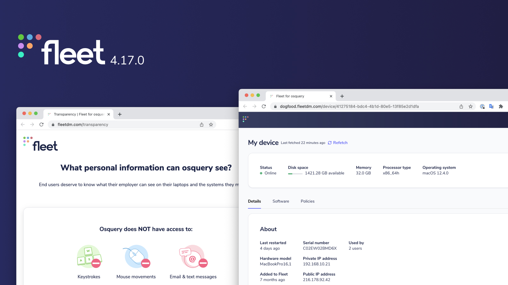
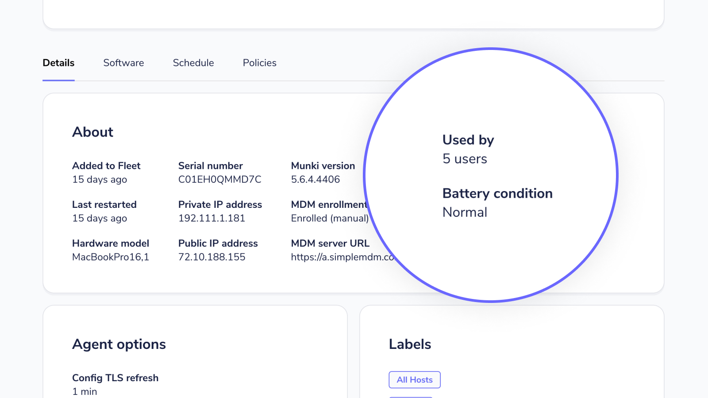

# Fleet 4.17.0 | Better osquery management, user engagement, improved host vitals.

Fleet 4.17.0 is up and running. Check out the full [changelog](https://github.com/fleetdm/fleet/releases/tag/fleet-v4.17.0) or continue reading to get the highlights.

For update instructions, see our [upgrade guide](https://fleetdm.com/docs/deploying/upgrading-fleet) in the Fleet docs.

## Highlights
- Manage osquery across your organization. 
- Engage with your users through Fleet Desktop.
- Battery condition added to **Host Details** for macOS.

## Manage osquery across your organization.
**Available in Fleet Free and Fleet Premium**

Fleet's osquery installer (Orbit) is out of beta! Orbit is a lightweight wrapper for osquery that automates the process of installing, updating and configuring osquery on all of your devices. Even if you're not using Fleet!

Future plans for the installer include adding the ability to manage `osquery` extensions and enrollment flags across your organization without needing to reinstall anything or ssh in to individual machines. A simple, one-stop shop for remotely managing `osquery`.

You can generate your installer using the [`fleetctl` CLI tool](https://fleetdm.com/docs/using-fleet/adding-hosts#osquery-installer). If you're enrolling your host to a Fleet server, the best place to find the full command with flags specific to your Fleet instance is **Hosts > Add hosts** in the Fleet UI. Once the installer has been generated, just extract the file and run it on the host!

[Read more about bringing Orbit out of beta.](https://github.com/fleetdm/fleet/issues/5454)

## Engage with your users through Fleet Desktop.
**Available in Fleet Free and Fleet Premium**

Fleet desktop is also out of beta! Show end users exactly what Fleet can see on their device, whether they have vulnerable software, and their policy scorecard. All they need to do is click on the Fleet logo in their system tray. If you're using a Zero Trust framework, Fleet Desktop will help users avoid losing access to internal tools by giving them the ability to proactively resolve vulnerabilities and stay compliant with your organization's security policies. 

Today, Fleet Desktop is a great way to empower end-users to be active participants in securing their devices. Our vision for the future is that Fleet Desktop will offer open communications channels and build trust between users and IT and Security practioners. We're also continuing to focus on adding features that will help end-users take ownership of their device's health and provide tools to help them resolve issues quickly and easily.

To include Fleet Desktop in your installer package, add the `--fleet-desktop` flag to your `fleetctl package` command. 

[Read more about bringing Fleet Desktop out of beta.](https://github.com/fleetdm/fleet/issues/5684)

## Battery condition added to Host Details for macOS.
**Available in Fleet Free & Fleet Premium**

Quickly determine whether a MacOS host's battery needs to be replaced. The physical health of your hosts is every bit as important as security and Fleet makes it easy to see how well the battery is performing. 

## More new features, improvements, and bug fixes

In 4.17.0, we also:

* Added native support for M1 Macs.

* Improved reporting of error states on the health dashboard and added separate health checks for MySQL and Redis with `/healthz?check=mysql` and `/healthz?check=redis`.

* Improved SSO login failure messaging.

* Fixed osquery tables that report incorrect platforms.

* Added `docker_container_envs` table to the osquery table schema on the **Query** page.

* Updated Fleet host detail query so that the `os_version` for Ubuntu hosts reflects the accurate patch number.

* Improved accuracy of `software_host_counts` by removing hosts from the count if any software has been uninstalled.

* Improved accuracy of the `last_restarted` date. 

* Fixed `/api/v1/fleet/hosts/identifier/{identifier}` to return the correct value for `host.status`.

* Improved logging when fleetctl encounters permissions errors.

* Added support for scanning RHEL-based and Fedora hosts for vulnerable software using OVAL definitions.

* Fixed SQL generated for operating system version policies to reduce false negatives

* Added the number of hosts enrolled by Operating System (OS) and its version to anonymous usage statistics.

* Added the weekly active users count to anonymous usage statistics.

---

### Ready to update?

Visit our [Update guide](https://fleetdm.com/docs/deploying/upgrading-fleet) in the Fleet docs for instructions on updating to Fleet 4.17.0.

<meta name="category" value="releases">
<meta name="authorFullName" value="Kathy Satterlee">
<meta name="authorGitHubUsername" value="ksatter">
<meta name="publishedOn" value="2022-07-11">
<meta name="articleTitle" value="Fleet 4.17.0 | Better osquery management, user engagement, improved host vitals.">
<meta name="articleImageUrl" value="../website/assets/images/articles/fleet-4.17.0-cover-1600x900@2x.jpg">
