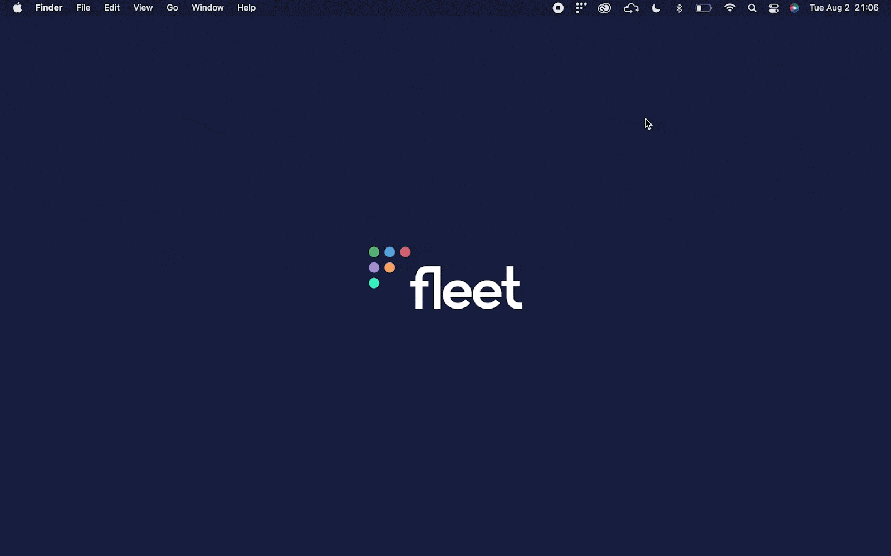

# Fleet 4.18.0 | Better security and user messaging in Fleet Desktop

Fleet 4.18.0 is up and running. Check out the full [changelog](https://github.com/fleetdm/fleet/releases/tag/fleet-v4.18.0) or continue reading to get the highlights.

For update instructions, see our [upgrade guide](https://fleetdm.com/docs/deploying/upgrading-fleet) in the Fleet docs.

## Highlights
- Enjoy improved security for Fleet Desktop.
- Show your end users a call to action in Fleet desktop for failing policies.

## Improved security for Fleet Desktop
**Available in Fleet Free and Fleet Premium**

Fleet Desktop uses a random UUID to authenticate to the Fleet server. While it's extremely unlikely to fall victim to a brute-force attack, it's always better to be safe than sorry. In order to combat that possibility, we've added rate limiting for all device authorized endpoints. 

## Show your end users a call to action in Fleet Desktop for failing policies
**Available in Fleet Free & Fleet Premium**

The main goal of Fleet Desktop is to empower end users to take charge of managing the security of their enrolled device. If a device is failing a policy check, Fleet Desktop will now show end users useful information for resolving the issue and make it easy to check if they've fixed it. 

## More new features, improvements, and bug fixes

In 4.18.0, we also:

* Improved styling for tooltips, dropdowns, copied text, checkboxes and buttons. 

* Fixed a bug present when converting a user to SSO login. 

* Fixed a bug causing the edit user modal to hang after editing one user.

* Fixed a bug in the FleetUI causing text to be truncated in tables. 

* Fixed a bug affecting software vulnerabilities count in Host Details.

* Fixed Select Targets search box and updated to reflect currently supported search values: hostname, UUID, serial number, or IPv4.

* Improved disk space reporting in Host Details. 

* Updated frequency formating for Packs to match Schedules. 

* Fixed a bug causing only one line to be exported from live query results. 

* Replaced `hosts` count with `results` count for live queries.

* Replaced "Uptime" with "Last restarted" column in Host Details.

* Removed vulnerabilities that do not correspond to a CVE in Fleet UI and API

* Added standard password requirements when users are created by an admin.

* Updated the regexp we use for detecting the major/minor version on OS platforms.

* Improved calculation of battery health based on cycle count. “Normal” corresponds to cycle count < 1000 and “Replacement recommended”
  corresponds to cycle count >= 1000.

* Fixed an issue with double quotes usage in SQL query, caused by enabling `ANSI_QUOTES` in MySQL.

### Ready to update?

Visit our [Update guide](https://fleetdm.com/docs/deploying/upgrading-fleet) in the Fleet docs for instructions on updating to Fleet 4.18.0.

<meta name="category" value="releases">
<meta name="authorFullName" value="Kathy Satterlee">
<meta name="authorGitHubUsername" value="ksatter">
<meta name="publishedOn" value="2022-08-03">
<meta name="articleTitle" value="Fleet 4.18.0 | Better security and user messaging in Fleet Desktop">
<meta name="articleImageUrl" value="../website/assets/images/articles/fleet-4.18.0-cover-1600x900@2x.jpg">
