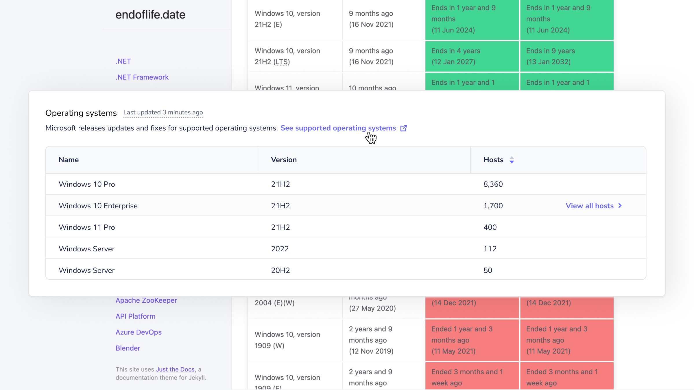

# Fleet 4.19.0 | Just-in-time (JIT) user provisioning, remaining disk space, aggregate Windows and mobile device management (MDM) data

Fleet 4.19.0 is up and running. Check out the full [changelog](https://github.com/fleetdm/fleet/releases/tag/fleet-v4.19.0) or continue reading to get the highlights.

For update instructions, see our [upgrade guide](https://fleetdm.com/docs/deploying/upgrading-fleet) in the Fleet docs.

## Highlights
- Access just-in-time (JIT) user provisioning.
- See remaining disk space for all hosts.
- Aggregate Windows and mobile device management (MDM) data.

## Just-in-time (JIT) user creation
**Available in Fleet Premium**

Just-in-time user provisioning makes it easier to spread the power of Fleet and osquery throughout your organization. 

Fleet will now automatically create a user account when a new user attempts to log in to Fleet via single sign-on (SSO). New user accounts are given the Observer role. For more information on roles and their permissions in Fleet, [check out the documentation on fleetdm.com/docs](https://fleetdm.com/docs/using-fleet/permissions).

## See remaining disk space for all hosts
**Available in Fleet Free and Fleet Premium**

Fleet 4.19.0 adds the ability to quickly see which hosts may not have enough remaining disk space to install operating system updates.

To see this in action, head to the **Home > macOS** page and hover over a row in the **Operating systems** table. Select **View all hosts** to navigate to a list of hosts with a specific operating system version installed. Finally, select the **Disk space available** column to sort hosts by least remaining disk space to most.

## Aggregate Windows and mobile device management (MDM) data
**Available in Fleet Free and Fleet Premium**

Fleet 4.19.0 adds the ability to see a list of all Windows operating system (OS) versions installed across all your hosts. 

Also, Windows operating system versions now include the display version like "21H" or "21H2." This allows you to quickly reference [endoflife.date/windows](https://endoflife.date/windows), so you can see which operating systems Microsoft no longer supports. 

 

Fleet 4.19.0 also adds the improved Windows operating system versions on the **Hosts** page and **Host details** page in the Fleet UI, as well as the `GET /hosts` and `GET /hosts/{id}` API routes.

This release also lets you view a list of all MDM solutions to which your hosts are enrolled. Head to the **Home > macOS** page in Fleet to see how your migration from one MDM solution to another is going.

## More new features, improvements, and bug fixes

In 4.19.0, we also:

* Improved performance for aggregating software inventory. Aggregate software inventory is displayed on the **Software page** in the Fleet UI.

* Added the ability to see the vendor for Windows programs in software inventory. Vendor data is available in the [`GET /software` API route](https://fleetdm.com/docs/using-fleet/rest-api#software).

* Added a message in `fleetctl` that notifies users to run `fleet prepare` instead of `fleetctl prepare` when running database migrations for Fleet.

* Improved the Fleet UI by maintaining applied host filters when a user navigates back to the Hosts page from an
individual host's **Host details** page.

* Improved the Fleet UI by adding consistent styling for **Cancel** buttons.

* Improved the **Queries**, **Schedule**, and **Policies** pages in the Fleet UI by page size to 20
  items. 

* Improved the Fleet UI by informing the user that Fleet only supports screen widths above 768px.

* Added support for asynchronous saving of the hosts' scheduled query statistics. This is an
experimental feature that should only be used if you're seeing performance issues. Documentation
for this feature can be found [here on fleetdm.com](https://fleetdm.com/docs/deploying/configuration#osquery-enable-async-host-processing).

* Fixed a bug in which the **Operating system** and **Munki versions** cards on the **Home > macOS**
page would not stack vertically at smaller screen widths.

* Fixed a bug in which multiple Fleet Desktop icons would appear on macOS computers.

* Fixed a bug that prevented Windows (`.msi`) installers from being generated on Windows machines.

### Ready to update?

Visit our [Update guide](https://fleetdm.com/docs/deploying/upgrading-fleet) in the Fleet docs for instructions on updating to Fleet 4.19.0.

<meta name="category" value="releases">
<meta name="authorFullName" value="Noah Talerman">
<meta name="authorGitHubUsername" value="noahtalerman">
<meta name="publishedOn" value="2022-08-22">
<meta name="articleTitle" value="Fleet 4.19.0 | Just-in-time (JIT) user provisioning, remaining disk space, aggregate Windows and mobile device management (MDM) data">
<meta name="articleImageUrl" value="../website/assets/images/articles/fleet-4.19.0-cover-1600x900@2x.jpg">