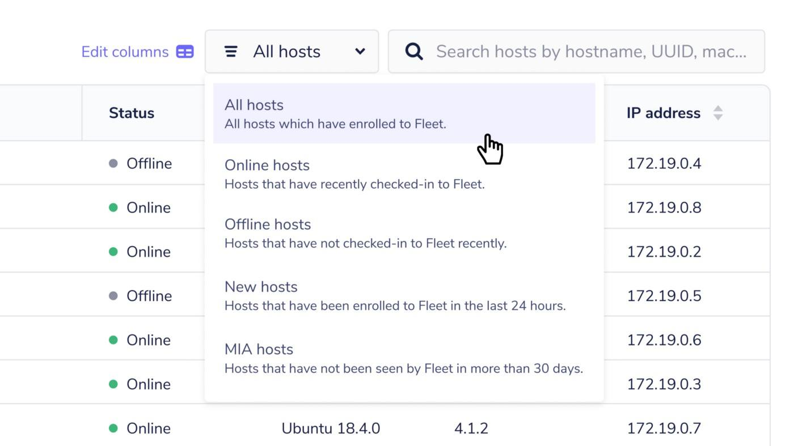

# Fleet 4.2.0

Fleet 4.2.0 is now available. Visit our [update guide](https://github.com/fleetdm/fleet/blob/7fd439f812611229eb290baee7688638940d2762/docs/1-Using-Fleet/7-Updating-Fleet.md) for instructions on how to update.

## Feature highlights

- **Team schedule** makes the ability to collect data from your devices faster.
- **Host filtering improvements** to more easily monitor the status of your Fleet and osquery deployment.

For the complete summary of all 15+ changes and release binaries [check out the release notes on GitHub](https://github.com/fleetdm/fleet/releases/tag/fleet-v4.2.0).

## Team schedule
**Available in Fleet Basic**

In the previous release of Fleet 4.1.0, we introduced the Schedule feature that lets you add queries which are executed on your devices at regular intervals without having to understand osquery packs.

Similarly, the Team Schedule allows you to schedule different queries against specific groups of hosts within a team.

A Global Schedule is also introduced alongside, so that users can run scheduled queries against all hosts enrolled in the Fleet.

## Filter hosts by team
**Available in Fleet Basic**

Fleet 4.2.0 also introduces the ability to filter your devices by team so that you can easily see which hosts belong to which team.

To check out the new team filtering, head to the Hosts page in Fleet and select the “All teams” dropdown. The ability to filter devices by team is also exposed in the Fleet API and fleetctl CLI tool. To filter devices by team, add the team_id={team_id} query parameter to the api/v1/fleet/hosts API route or add the --team "{team_name}" to the fleetctl get hosts command.

## Filter hosts simultaneously by status and by label
**Available in Fleet Core, Fleet Basic**

Included in Fleet 4.2.0 is the ability to filter your devices by status (online, offline, new, MIA,) and by label at the same time. To perform this combined filtering head to the Hosts page and select the new “All hosts” status dropdown.

---

## Ready to update?

Visit our [update guide](https://fleetdm.com/docs/using-fleet/updating-fleet) in the Fleet docs for instructions on updating to Fleet 4.2.0.

<meta name="category" value="releases">
<meta name="authorFullName" value="Noah Talerman">
<meta name="authorGitHubUsername" value="noahtalerman">
<meta name="publishedOn" value="2021-08-12">
<meta name="articleTitle" value="Fleet 4.2.0">
<meta name="articleImageUrl" value="../website/assets/images/articles/fleet-4.2.0-cover-1600x900@2x.jpg">