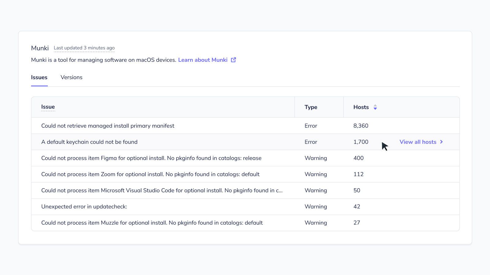
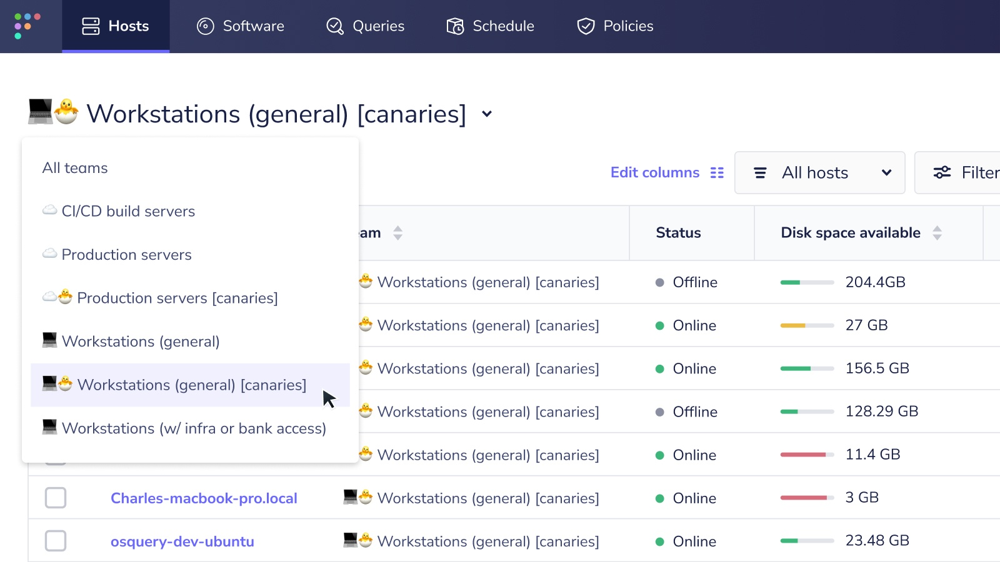

# Fleet 4.20.0 | Aggregate Munki issues, test features on canary teams, improved macOS vulnerability detection


Fleet 4.20.0 is up and running. Check out the full [changelog](https://github.com/fleetdm/fleet/releases/tag/fleet-v4.20.0) or continue reading to get the highlights.

For update instructions, see our [upgrade guide](https://fleetdm.com/docs/deploying/upgrading-fleet) in the Fleet docs.

## Highlights
- Aggregate Munki issues.
- Test features on canary teams.
- Improved macOS vulnerability detection.

## Aggregate Munki issues
**Available in Fleet Free and Fleet Premium**



Fleet 4.20.0 adds the ability to see a list of all Munki warnings and errors (issues) across all your hosts. 

To see this in action, head to the **Home > macOS** page and view the **Munki** table. Hover over a row in this table and select **View all hosts** to navigate to a list of hosts with a specific Munki issue. View all Munki issues on a specific host by selecting the host's name and then **Software** on the host's **Host details** page. Scroll down below the **Software** table to find the **Munki issues** table.

## Test features on canary teams
**Available in Fleet Premium**



You can now test features like software inventory on a subset of your hosts.

The best practice is to create a team with test (canary) hosts first and then turn on software inventory for only this team.

Here's how to turn on the software inventory feature for only your 🐣 Servers (canaries) team: 

1. Log in to Fleet with `fleetctl login`. If you use single sign-on (SSO) to log in to Fleet, check out the [documentation for logging in with SSO](https://fleetdm.com/docs/using-fleet/fleetctl-cli#logging-in-with-saml-sso-authentication).

1. Run the `fleetctl get teams --yaml --name "🐣 Servers (canaries)" > "🐣 Servers (canaries)".yaml` command. This will create a YAML file in your current working directory. You may have to log in to Fleet with `fleetctl login`.

2. Edit the file by placing a `features` section one level below the `teams` key. In the `features` section, add a `enable_software_inventory` key set to a value of `true`. An example YAML file with these changes is included below:

```yaml
---
apiVersion: v1
kind: team
spec:
  team:
    features:
      enable_software_inventory: true
```

3. Run the `fleetctl apply -f "🐣 Servers (canaries)".yaml` command. This will turn on software inventory for only your 🐣 Servers (canaries) team.  

> The best practice for modifying configuration files in Fleet is to store these files in a version control tool (e.g., GitHub) so that people at your organization can review changes before they're applied.

4. In the Fleet UI, head to the **Hosts** page, select **🐣 Servers (canaries)** in the team filter, and select a host's name. 

5. On the **Host details** page, select **Software** to see the software inventory for this host. Fleet may take several minutes to collect software inventory from your hosts. This is because Fleet has to wait for the host to respond with results.

## Improved macOS vulnerability detection
**Available in Fleet Free and Fleet Premium**

Fleet continues to enhance the accuracy of detecting vulnerable software on your hosts. 

This release includes improvements for detecting vulnerable versions of Zoom, Ruby, and Node.js on your macOS hosts.

Previous releases of Fleet did not flag some vulnerable versions of Zoom as vulnerable and incorrectly tagged some versions of Ruby and Node.js as vulnerable.

## More new features, improvements, and bug fixes

In 4.20.0, we also:

* Fleet Premium: Improved the vulnerability automations by adding vulnerability scores (EPSS probability, CVSS scores, and CISA-known exploits) to the webhook payload. Read more about vulnerability automations on [fleetdm.com/docs](https://fleetdm.com/docs/using-fleet/automations#vulnerability-automations).

* Renamed the `host_settings` section to `features` in the the [`config` YAML file](https://fleetdm.com/docs/using-fleet/configuration-files#features). But `host_settings` is still supported for backwards compatibility.

* Improved the activity feed by adding the ability to see who modified agent options and when modifications occurred. This information is available on the Home page in the Fleet UI and the [`GET /activites` API route](https://fleetdm.com/docs/using-fleet/rest-api#activities).

* Improved the [`config` YAML documentation](https://fleetdm.com/docs/using-fleet/configuration-files#organization-settings).

* Improved the **Hosts** page for smaller screen widths.

* Improved the building of osquery installers for Windows (`.msi` packages).

* Added a **Show query** button on the **Schedule** page, which adds the ability to quickly see a query's SQL.

* Improved the Fleet UI by adding loading spinners to all buttons that create or update entities in Fleet (e.g., users).

* Fixed a bug in which a user could not reach some teams in the UI via pagination if there were more than 20 teams.

* Fixed a bug in which a user could not reach some users in the UI via pagination if there were more than 20 users.

* Fixed a bug in which duplicate vulnerabilities (CVEs) sometimes appeared on **Software details** page.

* Fixed a bug in which the count in the **Issues** column (exclamation tooltip) in the **Hosts** table would sometimes not appear.

* Fixed a bug in which no error message would appear if there was an issue while setting up Fleet.

* Fixed a bug in which no error message would appear if users were creating or editing a label with a name or description that was too long.

* Fixed a big in which the example payload for usage statistics included incorrect key names.

* Fixed a bug in which the count above the **Software** table would sometimes not appear.

* Fixed a bug in which the **Add hosts** button would not be displayed when search returned 0 hosts.

* Fixed a bug in which modifying filters on the **Hosts** page would not return the user to the first page of the **Hosts** table. 


### Ready to update?

Visit our [Update guide](https://fleetdm.com/docs/deploying/upgrading-fleet) in the Fleet docs for instructions on updating to Fleet 4.20.0.

<meta name="category" value="releases">
<meta name="authorFullName" value="Noah Talerman">
<meta name="authorGitHubUsername" value="noahtalerman">
<meta name="publishedOn" value="2022-09-09">
<meta name="articleTitle" value="Fleet 4.20.0 | Aggregate Munki issues, test features on canary teams, improved macOS vulnerability detection">
<meta name="articleImageUrl" value="../website/assets/images/articles/fleet-4.20.0-800x450@2x.jpg">
