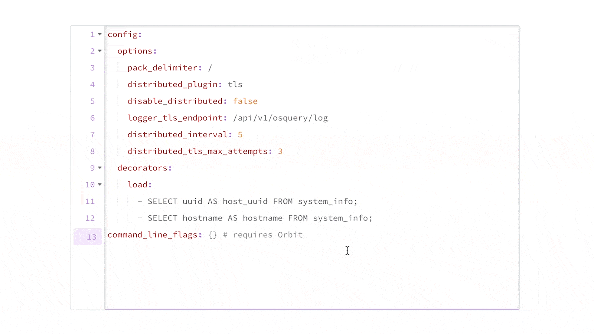

# Fleet 4.21.0 | Validate config and teams YAML documents, manage osquery flags remotely with Orbit, view team and global policy compliance

Fleet 4.21.0 is up and running. Check out the full [changelog](https://github.com/fleetdm/fleet/releases/tag/fleet-v4.21.0) or continue reading to get the highlights.

For upgrade instructions, see our [upgrade guide](https://fleetdm.com/docs/deploying/upgrading-fleet) in the Fleet docs.

## Highlights
- Validate config and teams YAML documents.
- Manage osquery flags remotely with Orbit.
- View team and global policy compliance.

## Validate config and teams YAML documents
**Available in Fleet Free and Fleet Premium**

Fleet 4.21.0 has validation for all keys and values in the config and teams [YAML documents](https://fleetdm.com/docs/using-fleet/configuration-files). Fleet now notifies you if any required keys are missing. Fleet also verifies that all values in the documents are the right type. Values under `agent_options` are based on the latest osquery.

Fleet will send you an error message if validation fails when running `fleetctl apply` with YAML documents. Fleet won’t try to set any configuration settings or send new `agent_options` to hosts if an error occurs.

You can test changes to config or teams YAML documents locally using a `fleetctl apply --dry-run` command. You’ll receive an error message if validation fails. Fleet won’t try to set configuration settings or send new `agent_options` to hosts.

You’ll also have the ability to bypass validation. Use a `--force` flag to bypass all validation checks and apply the given config.

In addition to validating required keys and the type of document values, Fleet makes sure the value is valid for the config option when possible. For example, Fleet now detects when `logger_tls_endpoint` is not a path starting with /. Applying such a path would prevent osquery from talking to the right Fleet instance.

## Manage osquery flags remotely with Orbit
**Available in Fleet Free and Fleet Premium**

Admins used to need a software orchestration tool (e.g., Chef) to deploy new osquery flags to the end user. Now, you can specify new flags in Fleet — and Orbit will restart osquery with the appropriate flags.

Orbit regularly checks flags from Fleet according to the `distributed_interval` setting. This includes seeing if hosts belong to any teams. If a host is on one or more teams, Orbit will apply the relevant team flags. Otherise, it applies the global flag set.

Fleet Premium users can specify unique flags for each team. A team's flags override all flags set at the global level. Fleet does not merge the two sets of flags.

## View team and global policy compliance
**Availaible in Fleet Premium**

Toggling between global and team policies wasn’t the easiest way to check compliance. In Fleet 4.21.0, you can see which hosts comply with team and global policies — all on the Hosts page.

You'll see how many hosts, assigned to a team, have passed or failed global policies. This allows global admins to provide team users with a view of hosts that are in and out of compliance.

## More new features, improvements, and bug fixes

* Added a '/api/v1/fleet/device/{token}/desktop' API route that returns only the number of failing policies for a specific host.
* Added support for [kubequery](https://github.com/Uptycs/kubequery).
* Added support for an `AC_TEAM_ID` environment variable when creating [signed installers for macOS hosts](https://fleetdm.com/docs/using-fleet/adding-hosts#signing-fleetd-installers).
* Made cards on the Home page clickable.
* Added es_process_file_events, password_policy, and windows_update_history to osquery tables.
* Added activity items to capture when, and by who, agent options are edited.
* Added logging to capture the user’s email upon successful login.
* Increased the size of placeholder text from extra small to small.
* Fixed an error that cleared the form when adding a new integration.
* Fixed an error generating Windows packages with the fleetctl package on non-English localizations of Windows.
* Fixed a bug that showed the small screen overlay when trying to print.
* Fixed the UI bug that caused the label filter dropdown to go under the table header.
* Fixed side panel tooltips to not be wider than side panel causing scroll bug.

### Ready to upgrade?

Visit our [Upgrade guide](https://fleetdm.com/docs/deploying/upgrading-fleet) in the Fleet docs for instructions on upgrading to Fleet 4.21.0.

<meta name="category" value="releases">
<meta name="authorFullName" value="Chris McGillicuddy">
<meta name="authorGitHubUsername" value="chris-mcgillicuddy">
<meta name="publishedOn" value="2022-10-05">
<meta name="articleTitle" value="Fleet 4.21.0 | Validate config and teams YAML documents, manage osquery flags remotely with Orbit, view team and global policy compliance">
<meta name="articleImageUrl" value="../website/assets/images/articles/fleet-4.21.0-1600x900@2x.jpeg">
