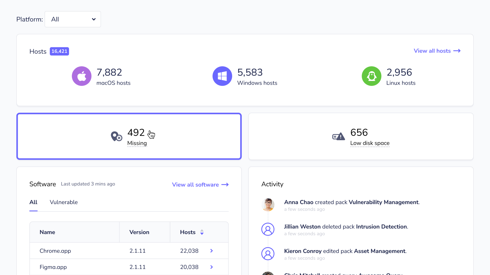
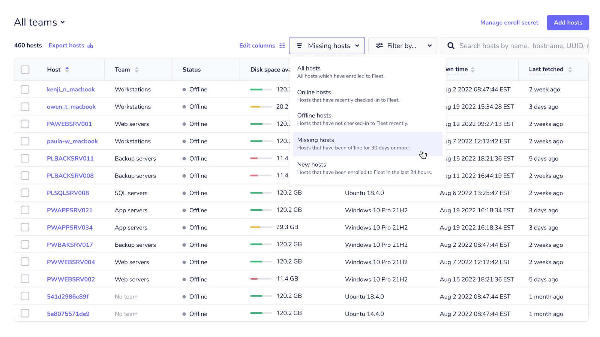
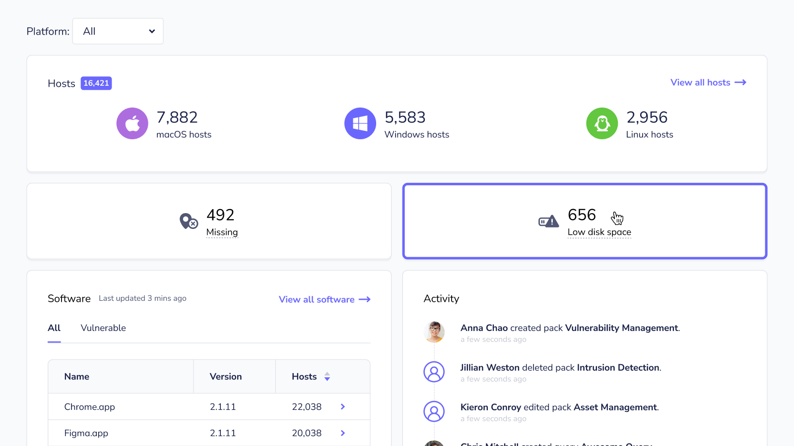
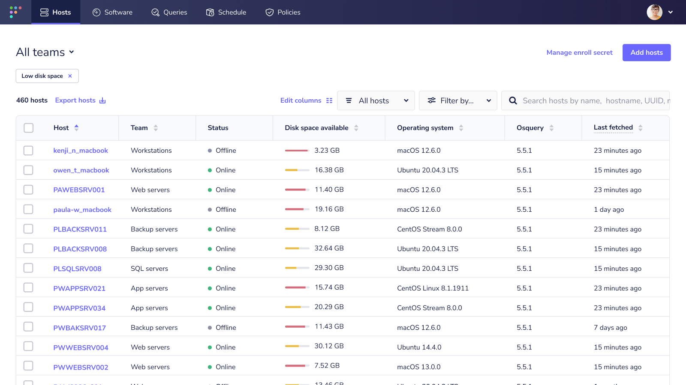
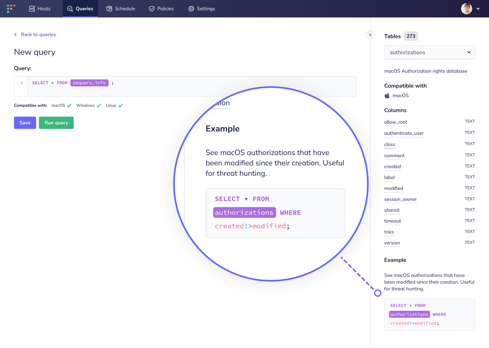

# Fleet 4.22.0 | Easier access to host information, better query console UX, and clearer display names

Fleet 4.22.0 is up and running. Check out the full [changelog](https://github.com/fleetdm/fleet/releases/tag/fleet-v4.22.0) or continue reading to get the highlights.

For upgrade instructions, see our [upgrade guide](https://fleetdm.com/docs/deploying/upgrading-fleet) in the Fleet docs.

## Highlights
- Identify missing hosts easily.
- Know which hosts have low disk space.
- Enjoy better UX in the query console.
- See clearer host display names.

## Identify missing hosts easily
**Available in Fleet Premium**

Discovering that hosts are missing can cause any admin or engineer to worry. Did someone take parental leave? Is their laptop broken? Or was their computer stolen?

Before you can answer these questions, you need to know which hosts are missing. Fleet makes your search simple. Premium users can see how many hosts have been offline for 30 days or more on the Fleet UI homepage.

Clicking the Missing card will take you to the Hosts page with the Missing filter applied — generating a list of all your missing hosts. You can also navigate to this list by pasting this URL into your browser: `fleet.organization.com/hosts/manage/?status=missing`.

This list shows you details about your missing hosts, including the name, team, and when its host vitals were last fetched.

## Know which hosts have low disk space
**Available in Fleet Premium**

Making sure hosts have the latest operating system updates is tough enough. End users have their own priorities and computer maintenance is usually low on the list. Deadlines get even tighter when IT admins find out hosts don’t have enough disk space. Fleet can help you avoid these unpleasant surprises.

On the Fleet UI homepage, Premium users can see how many hosts have less than 32 GB of disk space remaining. Clicking the Low disk space card generates a list of all these devices. You can also get to this list by pasting this URL into your browser: `fleet.organization.com/hosts/manage/?low_disk_space=32`.

This list lets you see exactly how much disk space remains on each device. It also provides identifying information about the devices, like the hostname and team. So, you can prioritize devices and contact users accordingly.

## Enjoy better UX in the query console
**Available in Fleet Free and Fleet Premium**

You can find so much data with Fleet. Take a look at our [query library](https://fleetdm.com/queries) to see what we mean. But, like any new tool, all the possibilities can seem overwhelming. First-time Fleet users will now enjoy a more welcoming experience with our updated query console panel.

Have you heard of osquery evented tables? This configuration helps you view data over time — without repeatedly refreshing queries yourself. Learn more by reading our guide on [how to use osquery evented tables](https://fleetdm.com/guides/osquery-evented-tables-overview). The Evented Table tag lets you know right away if the query you’re running is evented.

Compatible operating systems display in the same order throughout the Fleet UI, making results even easier to check at a glance.

We’ve made a couple improvements to the Columns section. Columns required in the WHERE clause are listed first with an asterisk. Otherwise, columns are listed alphabetically.

Certain tables may include a column with a unique qualification, like being required in the WHERE clause. A column could also be platform-specific (even if it’s compatible overall) or default to the root. In these instances, you’ll see bold notes at the bottom of the column tooltip.

Finally, we saved you some scrolling by wrapping SQL examples.

## See clearer host display names
**Available in Fleet Free and Fleet Premium**

We’re familiar with the pros and cons of remote work by now. (Insert joke about pajamas, pets, and/or neighbors here.) But there’s one issue in particular that Fleet now solves: confusing hostnames.

When working from home, a device’s hostname can be whatever the internet service provider (ISP) assigns to the device. For example, a hostname could be `aianas-mbp.cable.rcn.com`. That isn’t very helpful, especially if you have hundreds of similar results.

Fleet 4.22.0 no longer defaults to whatever the ISP provides. Instead, Fleet uses the computer name or the hostname for the display name. If the computer name has been set, then that will be the display name. If not, then Fleet will use the hostname.

## More new features, improvements, and bug fixes

- Added functionality to consider device tokens as expired after one hour. This change is not compatible with older versions of Fleet Desktop. We recommend to manually update Orbit and Fleet Desktop to > v1.0.0 in addition to upgrading the server if:
   - You're managing your own TUF server.
   - You have auto-updates disabled (`fleetctl package [...] --disable-updates`).
   - You have channels pinned to an older version (`fleetctl package [...] --orbit-channel 1.0.0 --desktop-channel 1.1.0`).
- Added security headers to HTML, CSV, and installer responses.
- Added validation of the `command_line_flags` object in the Agent Options section of Organization Settings and Team Settings.
- Added logic to clean up irrelevant policies for a host on re-enrollment (e.g., if a host changes its OS from linux to macOS or it changes teams).
- Added the `inherited_policies` array to the `GET /teams/{team_id}/policies` endpoint that lists the global policies inherited by the team, along with the pass/fail counts for the hosts on that team.
- Added a new UI state for when results are coming in from a live query or policy query.
- Added better team name suggestions to the Create teams modal.
- Added usage statistics for the weekly count of aggregate policy violation days. One policy violation day is counted for each policy that a host is failing, measured as of the time the count increments. The count increments once per 24-hour interval and resets each week.
- Clarified last seen time and last fetched time in the Fleet UI.
- Translated technical error messages returned by Agent options validation to be more user-friendly.
- Renamed machine serial to serial number and IPv4 properly to private IP address.
- Fleet Premium: Updated Fleet Desktop to use the `/device/{token}/desktop` API route to display the number of failing policies.
- Made host details software tables more responsive by adding links to software details.
- Fixed a bug in which a user would not be rerouted to the Home page if already logged in.
- Fixed a bug in which clicking the select all checkbox did not select all in some cases.
- Fixed a bug introduced in 4.21.0 where a Windows-specific query was being sent to non-Windows hosts, causing an error in query ingestion for `directIngestOSWindows`.
- Fixed a bug in which uninstalled software (DEB packages) appeared in Fleet.
- Fixed a bug in which a team that didn't have `config.features` settings was edited via the UI, then both `features.enable_host_users` and `features.enable_software_inventory` would be false insead of the global default.
- Fixed a bug that resulted in false negatives for vulnerable versions of Zoom, Google Chrome, Adobe Photoshop, Node.js, Visual Studio Code, Adobe Media Encoder, VirtualBox, Adobe Premiere Pro, Pip, and Firefox software.
- Fixed bug that caused duplicated vulnerabilities to be sent to third-party integrations.
- Fixed panic in `ingestKubequeryInfo` query ingestion.
- Fixed a bug in which host_count and user_count returned as `0` in the `teams/{id}` endpoint.
- Fixed a bug in which tooltips for Munki issues would be cut off at the edge of the browser window.
- Fixed a bug in which running `fleetctl apply` with the `--dry-run` flag would fail in some cases.
- Fixed a bug in which the Hosts table displayed 20 hosts per page.
- Fixed a server panic that occured when a team was edited via YAML without an `agent_options` key.

## Ready to upgrade?

Visit our [Upgrade guide](https://fleetdm.com/docs/deploying/upgrading-fleet) in the Fleet docs for instructions on updating to Fleet 4.22.0.

<meta name="category" value="releases">
<meta name="authorFullName" value="Chris McGillicuddy">
<meta name="authorGitHubUsername" value="chris-mcgillicuddy">
<meta name="publishedOn" value="2022-10-21">
<meta name="articleTitle" value="Fleet 4.22.0 | Easier access to host information, better query console UX, and clearer display names">
<meta name="articleImageUrl" value="../website/assets/images/articles/fleet-4.22.0-cover-800x450@2x.jpg">
