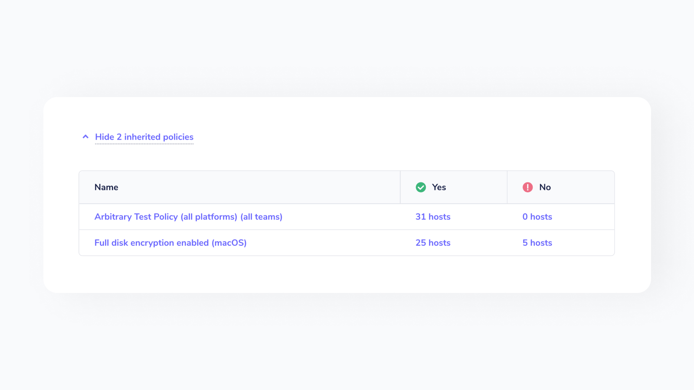
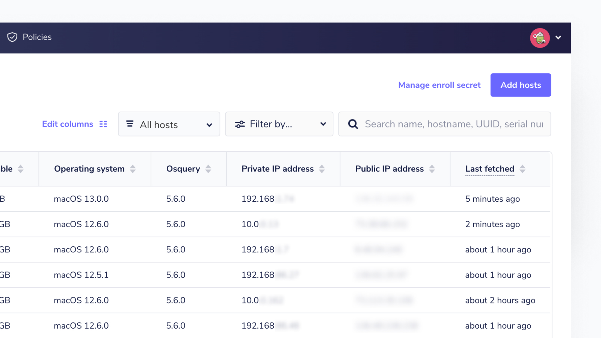
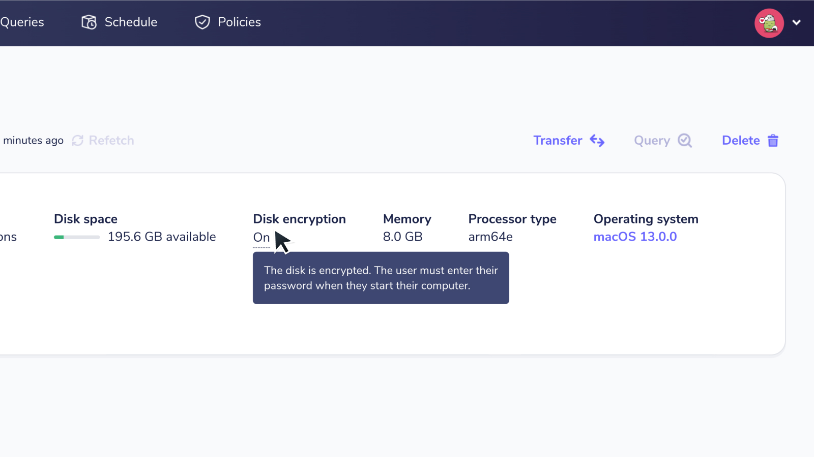
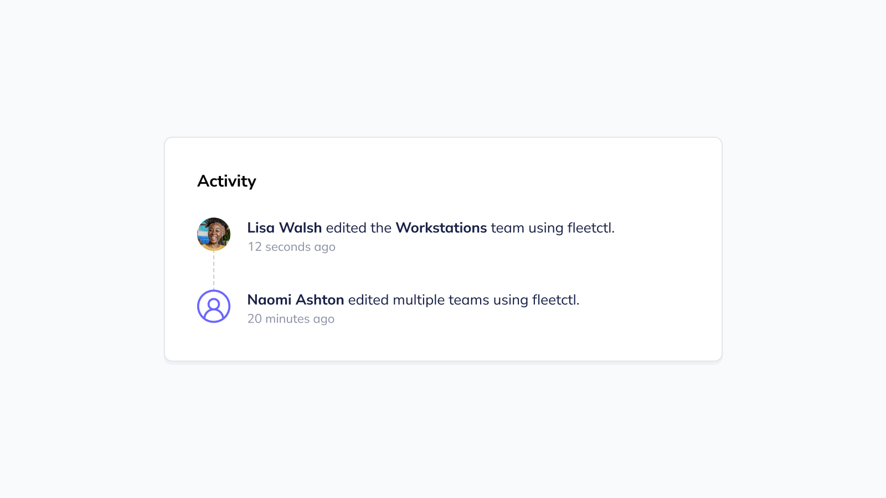

# Fleet 4.23.0 | Better insight into inherited policies, improved host vitals, and more configuration visibility

Fleet 4.23.0 is up and running. Check out the full [changelog](https://github.com/fleetdm/fleet/releases/tag/fleet-v4.23.0) or continue reading to get the highlights.

For upgrade instructions, see our [upgrade guide](https://fleetdm.com/docs/deploying/upgrading-fleet) in the Fleet docs.

## Highlights
- Know which hosts on a team comply with inherited policies.
- Separate private and public IP addresses.
- See host disk encryption status.
- See team configuration file edits.

## Know which hosts on a team comply with inherited policies
**Available in Fleet Premium**

One of the benefits of Fleet teams is that you can assign [policies](https://fleetdm.com/securing/what-are-fleet-policies) to specific groups of devices, empowering you to [refine your compliance approach](https://fleetdm.com/securing/stay-on-course-with-your-security-compliance-goals). But your organization may have policies that apply to every device — regardless of teams or departments. We call these “inherited” policies.

Fleet 4.23.0 makes it easy to see which hosts on a team comply with inherited policies. Below the team’s policies, you’ll see the option to show inherited policies. Selecting this will show all applicable inherited policies.

Like team policies, you’ll see how many hosts are passing or failing inherited policies. Clicking the host count will generate a list of devices that are passing or failing a particular policy.

## Separate private and public IP addresses
**Available in Fleet Free and Fleet Premium**

In previous releases of Fleet, the Hosts page listed the IP address for every device, but it didn’t specify whether these IP addresses were private or public. We’ve cleared up that confusion in Fleet 4.23.0 with updates to the Hosts page.

We changed the title of the “IP address” column to “Private IP address” and added a “Public IP address” column. Now, users can easily see both private and public IP addresses.

## See host disk encryption status
**Available in Fleet Free and Fleet Premium**

Fleet 4.23.0 gives you the ability to see if a host has disk encryption enabled.

We’ve added a disk encryption field to the Host details page. This field displays an “On” or “Off” status. Hovering over the disk encryption status will bring up tooltips tailored to each operating system.

For Linux hosts, disk encryption status is only displayed if disk encryption is “On.” 
This is because Fleet detects if the `/dev/dm-1` drive is encrypted. This drive is commonly used as the location for the root file system on the Ubuntu Linux distribution.

## See team configuration file edits
**Available in Fleet Premium**

Unexpected changes to your agent options are concerning to say the least. Fleet 4.23.0 will put you at ease.

The activity feed on the Dashboard page now includes edits to team configuration files. You can see who edited the configuration file and when the edits were made.

If the edits apply to a single team, you’ll see the team’s name in the activity feed. Otherwise, the notification will mention that multiple teams have been edited.

## More new features, improvements, and bug fixes

- Added option to show public IP address in Hosts table.
- Added ingestion of host orbit version from `orbit_info` osquery extension table.
- Added number of hosts enrolled by orbit version to usage statistics payload.
- Added number of hosts enrolled by osquery version to usage statistics payload.
- Added arch and Linux Mint to list of linux distros so that their data is displayed and host count includes them.
- Added instructions to override agent options using fleetctl force flag when users submit invalid agent options.
- Added support for `low_disk_space` filter for endpoint `/labels/{id}/hosts`.
- Added cleaner icons to select target pages.
- Added validation to the `teams` YAML file. Validation now checks for invalid keys.
- Added the ability to filter low disk space host by platform in the Fleet UI.
- Added vulnerability scores to Jira and Zendesk integrations for Fleet Premium users.
- Added ingestion of disk encryption status for hosts and added that flag in the response of the `GET /hosts/{id}` API endpoint.
- Improved the UI on the New query and Edit query pages.
- Improved host detail query to populate primary IP and Mac address on host.
- Improved ingress resource by replacing the template with a most recent version that enables:
   - Optional annotations. Hardcoded annotations are no longer necessary.
   - Custom paths. This was hardcoded to `/*`, but it can require an extra annotation to work with regular expressions depending on the ingress controller.
   - Specified ingressClassName. This setting was hardcoded to `gce`, but it might be different on each cluster.
- Improved database usage to prevent some deadlocks.
- Improved styling on the App settings page.
- Updated the Orbit MSI installer to include the necessary manifest file for using `windows_event_log` as a `logger_plugin`.
- Updated MDM lists and aggregated data to exclude Windows servers.
- Updated Go to 1.19.3.
- Updated styling on login and forgot password pages.
- Updated styling of tooltips and modals.
- Updated colors and icon for issues.
- Updated Dashboard page styling.
- Trying to add a host without enroll secrets directs users to manage enroll secrets.
- Information surfaced to end users includes all summary information surfaced in the Host details page.
- Fixed Host details page so the Munki card only shows for mac hosts.
- Fixed a bug where duplicate vulnerability webhook requests, Jira tickets, and Zendesk tickets were being made when scanning for vulnerabilities. This affected Ubuntu and Red Hat hosts that support OVAL vulnerability detection.
- Fixed a bug where password reset token expiration was not enforced.
- Fixed a bug in `fleetctl apply` for teams where a missing `agent_options` key in the YAML spec file would clear the existing agent options for the team. (Now, it leaves the agent options unchanged.) If the key is present but empty, then it clears the agent options.
- Fixed a bug with our CPE matching process. UTM.app was matching the wrong CPE.
- Fixed an issue where Fleet would send invalid usage stats if no hosts were enrolled.
- Fixed an Orbit MSI installer bug that prevented Orbit files from being removed during uninstallation.
- Fixed software filter when software does not have a version number.
- Fixed validation of agent options where valid options were being rejected (such as `exclude_paths`).
- Fixed styles for code editor gutter and query side panel table dropdown.

## Ready to upgrade?

Visit our [Upgrade guide](https://fleetdm.com/docs/deploying/upgrading-fleet) in the Fleet docs for instructions on updating to Fleet 4.23.0.

<meta name="category" value="releases">
<meta name="authorFullName" value="Noah Talerman">
<meta name="authorGitHubUsername" value="noahtalerman">
<meta name="publishedOn" value="2022-11-14">
<meta name="articleTitle" value="Fleet 4.23.0 | Better insight into inherited policies, improved host vitals, and more configuration visibility">
<meta name="articleImageUrl" value="../website/assets/images/articles/fleet-4.23.0-800x450@2x.jpg">
