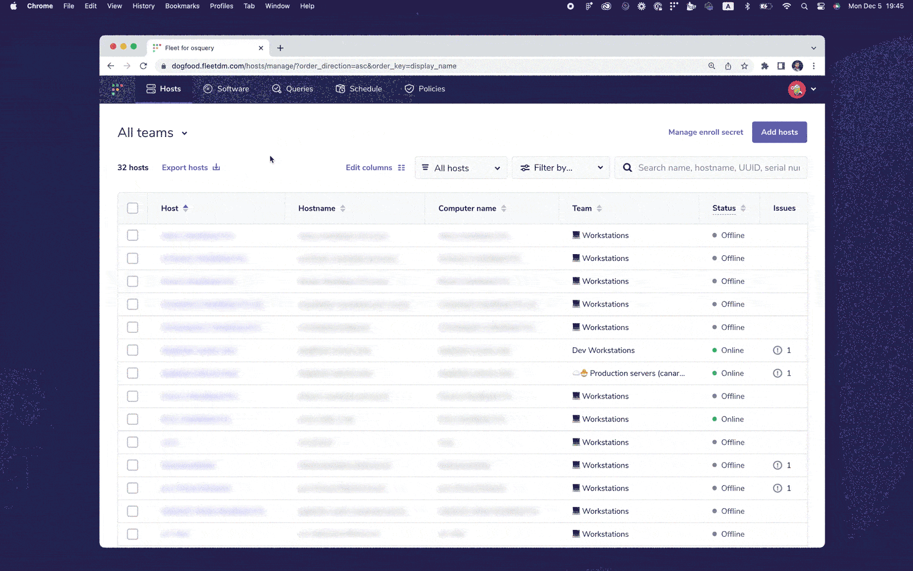

# Fleet 4.24.0 | Live query notifications and navigation improvements

Fleet 4.24.0 is up and running. Check out the full [changelog](https://github.com/fleetdm/fleet/releases/tag/fleet-v4.24.0) or continue reading to get the highlights.

For upgrade instructions, see our [upgrade guide](https://fleetdm.com/docs/deploying/upgrading-fleet) in the Fleet docs.

## Highlights
- Know who ran what query as a live query.
- Enjoy easier navigation on Host details and Dashboard pages.

## Know who ran what query as a live query
**Available in Fleet Free and Fleet Premium**

Fleet 4.24.0 gives you greater visibility into who ran live queries. These insights will help you create a richer audit trail and test the performance impact of specific queries.

You’ll see these notifications in the activity feed on the Dashboard page. Each notification includes the user’s name, how long ago the query was run, and how many hosts were queried. If the query has been saved, you’ll see the query’s name. If the query hasn’t been saved, no query name will be displayed.

You’ll also have the option to show the query. Selecting *Show query* opens the Query modal, which displays the query’s SQL.

## Enjoy easier navigation on Host details and Dashboard pages
**Available in Fleet Free and Fleet Premium**

Previous versions of Fleet made it easy to find rich data about individual endpoints. But returning from these searches wasn’t so convenient. Clicking back in your browser would take you too far back, requiring you to reselect tabs or reapply filters. We fixed that in Fleet 4.24.0.

Now, you can get back to the information that interests you on the Hosts details page without any extra clicks. Let’s say you want to leave the Software tab to view a specific application or a list of all the hosts with that app installed. After you find what you need, you can click back to return to the Software tab.

The same applies to Policies. If you view all hosts assigned to a particular policy, you can get back to the Policies tab with just a click.

We also added this functionality to the Dashboard page. You can still filter hosts with the Platform dropdown. After selecting Windows, Linux, or macOS, you can choose to view all hosts with that operating system. Clicking back from these lists will return you to the Dashboard page with the Platform filter applied.

## More new features, improvements, and bug fixes
- Added an `icloud_private_relay` table to fleetd.
- Added ability to query the `augeas` table without additional configuration.
- Added tooltips and updated dropdown choices on Hosts and Host details pages to clarify the meanings of "Status: Online" and "Status: Offline."
- Added “Void Linux” to the list of recognized distributions.
- Added clickable rows to software tables to view all hosts filtered by software.
- Added support for more OS-specific osquery command-line flags in the agent options.
- Added links to evented tables and columns that require user context in the query side panel.
- Improved performance of the Fleet server by decreasing CPU usage by 20% and memory usage by 3% on average.
- Updated osquery on our fleetd stable channel to 5.6.0. [View the osquery release notes](https://github.com/osquery/osquery/releases).
- Removed the Preview payload button from the usage statistics page, as well as its associated logic and unique styles. [See the example usage statistics payload](https://fleetdm.com/docs/using-fleet/usage-statistics#what-is-included-in-usage-statistics-in-fleet) in our documentation.
- Removed tooltips and conditional coloring in the disk space graph for Linux hosts.
- Reduced false negatives for the query used to determine encryption status on Linux systems.
- Fixed long software names from aligning centered.
- Fixed a discrepancy in the height of input labels when there’s a validation error.

## Ready to upgrade?
Visit our [Upgrade guide](https://fleetdm.com/docs/deploying/upgrading-fleet) in the Fleet docs for instructions on updating to Fleet 4.24.0.

<meta name="category" value="releases">
<meta name="authorFullName" value="Noah Talerman">
<meta name="authorGitHubUsername" value="noahtalerman">
<meta name="publishedOn" value="2022-12-06">
<meta name="articleTitle" value="Fleet 4.24.0 | Live query notifications and navigation improvements">
<meta name="articleImageUrl" value="../website/assets/images/articles/fleet-4.24.0-cover-1600x900@2x.jpg">
