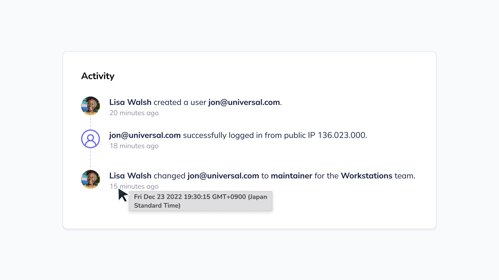

# Fleet 4.25.0 | Extra security and MDM visibility

Fleet 4.25.0 is up and running. Check out the full [changelog](https://github.com/fleetdm/fleet/releases/tag/fleet-v4.25.0) or continue reading to get the highlights.

For upgrade instructions, see our [upgrade guide](https://fleetdm.com/docs/deploying/upgrading-fleet) in the Fleet docs.

## Highlights
- Mark high-impact policies as critical.
- View login attempts and user updates.
- View MDM status of Windows workstations.

## Mark high-impact policies as critical
**Available in Fleet Premium**

In a perfect world, every computer in your fleet would pass every policy. In reality, that’s unlikely. But there are certain policies that would pose greater security risks if they fail. Fleet 4.25.0 helps you mitigate the harm these failed policies might cause.

When you’re creating or editing a policy, you now have the ability to mark it as “critical.” Devices that fail critical policies trigger a webhook, which connects to your VPN management software. This allows you to block non-compliant devices from accessing your VPN until they’ve been remediated.

## View login attempts and user updates
**Available in Fleet Free and Fleet Premium**

Fleet provides easy access to valuable data about an organization's workstations and servers. But it was hard to know who has access to Fleet and who recently logged in to see this data. We fixed that in Fleet 4.25.0.

Updates to Fleet accounts now appear in the activity feed. Notifications appear when a user has been created, deleted, or edited — such as changing their level of access. You’ll see the user’s email address and their role. Premium customers can see the user’s team as well. 

Successful login attempts also appear in the activity feed. You’ll see the email address of the account, when the attempt occurred, and the remote IP address.

By making this data easier to find, we hope you’ll have the peace of mind to give more employees access to Fleet — so you can continue to improve company workflows.

## View MDM status of Windows workstations
**Available in Fleet Free and Fleet Premium**

Enrolling computers in mobile device management (MDM) is no small task, especially if your fleet has thousands of devices on different operating systems. Fleet 4.25.0 makes it easy to monitor the progress of MDM enrollment and migration.

On the Fleet UI homepage, you’ll see a section for MDM. This now displays both Mac and Windows workstations. The Solutions tab shows how many hosts are using a particular MDM, which is determined by the MDM's server URL. The Enrollment tab shows how many hosts have been enrolled in MDM manually or automatically, as well as the number of hosts that are currently unenrolled.

You can apply MDM solutions and enrollment as filters to view lists of individual hosts. Hovering over an MDM solution or enrollment method gives you the option to view all hosts. This takes you to the Hosts page, where you’ll find vital information about specific Mac and Windows workstations.

## Fleet MDM
**MDM features are not ready for production and are currently in development. These features are disabled by default.**

Fleet is building a cross-platform MDM to give IT and security teams the visibility and openness they need. Here are the latest developments:

- Added API endpoint to generate DEP public and private keys.
- Added `fleet serve` configuration flags for Apple Push Notification service (APNs) and Simple Certificate Enrollment Protocol (SCEP) certificates and keys.
- Added `fleet serve` configuration flags for Apple Business Manager (BM).
- Added the `fleetctl get mdm_apple` command to retrieve the Apple MDM configuration information.
- Added the `fleetctl get mdm_apple_bm` command to retrieve the Apple Business Manager configuration information.
- Added `fleetctl` command to generate APNs CSR and SCEP CA certificate and key pair.
- Added `fleetctl` command to generate DEP public and private keys.

Are you interested in the Fleet MDM beta? [Schedule a call](https://calendly.com/fleetdm/demo) to save your spot.

## More new features, improvements, and bug fixes
- Added ability to log all successful logins as activity and all attempts with IP in `stderr`.
- Added `fleetctl trigger` command to trigger an ad hoc run of all jobs in a specified cron
schedule.
- Added functionality to report if a carve failed along with its error message.
- Added the `redis.username` configuration option for setups that use Redis ACLs.
- Added scroll shadows to indicate horizontal scrolling to the user in the Spiffier UI.
- Updated Windows installer to ensure that the installed osquery version gets removed before installing fleetd.
- Updated Windows installer to ensure that no files are left on the filesystem when the fleetd uninstallation process begins.
- Updated Go to 1.19.4.
- Updated deleting host flow to inform users how to prevent re-enrolling hosts.
- Improved how we’re logging failed detail queries and Windows OS version queries.
- Fixed `fleetctl query` to use custom HTTP headers if configured.
- Fixed how we’re querying and ingesting disk encryption in Linux to work around an osquery bug.
- Fixed buggy input field alignments.
- Fixed styling to multiselect.
- Fixed a bug where manually triggering a cron run that preempts a regularly scheduled run causes an unexpected shift in the start time of the next interval.
- Fixed an issue where the height of the label for some input fields changed when an error message is displayed.
- Fixed the alignment of the "copy" and "show" button icons in the Manage enroll secrets and Get API token modals.

## Ready to upgrade?
Visit our [upgrade guide](https://fleetdm.com/docs/deploying/upgrading-fleet) in the Fleet docs for instructions on updating to Fleet 4.25.0.

<meta name="category" value="releases">
<meta name="authorFullName" value="Noah Talerman">
<meta name="authorGitHubUsername" value="noahtalerman">
<meta name="publishedOn" value="2023-01-03">
<meta name="articleTitle" value="Fleet 4.25.0 | Extra security and MDM visibility">
<meta name="articleImageUrl" value="../website/assets/images/articles/fleet-4.25.0-1600x900@2x.jpg">
