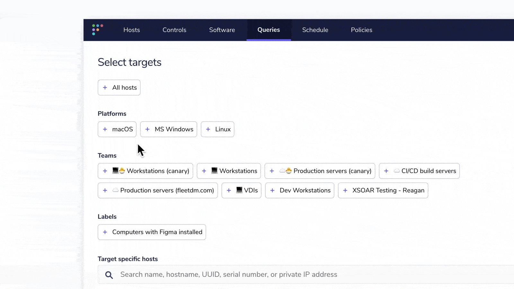

# Fleet 4.27.0 | Improved access management and improved search filters

Fleet 4.27.0 is up and running. Check out the full [changelog](https://github.com/fleetdm/fleet/releases/tag/fleet-v4.27.0) or continue reading to get the highlights.

For upgrade instructions, see our [upgrade guide](https://fleetdm.com/docs/deploying/upgrading-fleet) in the Fleet docs.

## Highlights

- See a better activity log when someone tries to log in and fails.
- More granular filtering when querying.
## Better alerts when Fleet users have failed login attempts
**Available in Fleet Free and Fleet Premium**

Fleet 4.27.0 makes it easy to see who tried to log in to Fleet and failed. Our customers have asked for this in order to get more information about what sort of login activity has happened. Better alerting will give businesses even more confidence in granting access to Fleet with ease.

In the UI an account administrator will see the following information:

If you pair this new login activity with the audit improvements from [release 4.26](https://fleetdm.com/releases/fleet-4.26.0) you can now set up an alert if multiple failed login attempts occur. 

## Better search filters on the ‘Select Targets’ screen in Fleet

**Available in Fleet Free and Fleet Premium**

Fleet is used by many companies and service providers who use it across multiple teams and organizations. In order to separate organizations and teams, they often apply labels to the workstations like “company name label.” In this instance, it was difficult to search and filter workstations by both device type and label; now they can. 

With this change, we made it possible to search and filter by device type, team, and label. Here is an example of the feature at work:

Previously, the higher-level categories of Platform, Team, and Labels operated as “OR” operators instead of the logical “AND” operator. 

_Selecting explicit host IDs will always run the query on those hosts (no matter the chosen team, labels or platforms) and selecting “All hosts” will make the query run on all hosts (no matter the chosen team, labels or platforms)._

For more information on how to run queries, check out the [documentation here.](https://fleetdm.com/docs/using-fleet/fleet-ui#run-a-query)

## A note about osquery packs

Packs are a function of osquery that provide a portable format to import /export queries in and out of platforms like Fleet. These osquery packs still exist, but have been removed from the Fleet UI. Access via API is still available for backwards compatibility.

Within Fleet we've introduced the concept of teams in Fleet premium to target specific groups of hosts, but you can also still use scheduled queries in Fleet free (works like packs) to target all your hosts.

## More new features, improvements, and bug fixes

List of MDM features

- Implemented the new Controls page and updated styling of the site-level navigation.
- Added the POST /api/v1/fleet/mdm/apple/request_csr endpoint to trigger a Certificate Signing Request to fleetdm.com and return the associated APNs private key and SCEP certificate and key.
- Added keys to the GET /config and GET /device/:token endpoints to inform if Fleet's MDM is properly configured.
- Implemented the ability for an authorized user to unenroll a host from MDM on its Host details page. The host must be enrolled in MDM and online.
- Allow admin to configure a minimum macOS version and an upgrade deadline for hosts who are enrolled in Fleet's MDM.
- Fleet Premium shows pending hosts on the dashboard and managed host page.
- Documented the Apple Push Notification service (APNs) and Apple Business Manager (ABM) setup and renewal steps.

List of other features

- Made `fleetctl get teams --yaml` output compatible with `fleetctl apply -f.`
- Added MDM enrollment status and MDM server URL to `GET /hosts` and `GET /hosts/:id` endpoint responses.
- User can hover over host UUID to see and copy full ID string.
- Added nixos to the list of platforms that are detected at Linux distributions.
- Added license expiry to the account information page for premium users.
- Removed stale time from loading team policies/policy automation, so users are provided accurate team data when toggling between teams.
- Updated to software-empty states and host details empty states.
- Changed default hosts per page from 100 to 50.
- Support CrOS as a valid platform string for customers with ChromeOS hosts.
- Clean tables at smaller screen widths.
- Added `meta` attribute to [`GET /api/v1/activities` API endpoint](https://fleetdm.com/docs/using-fleet/rest-api#activities) that includes pagination metadata. Fixed edge case
on UI for pagination buttons on activities card.
- Use stricter file permissions in `fleetctl updates add` command.
- When table only has 1 host, remove bulky tooltip overflow.
- Fixed pagination on manage host page.

## Ready to upgrade?
Visit our [upgrade guide](https://fleetdm.com/docs/deploying/upgrading-fleet) in the Fleet docs for instructions on updating to Fleet 4.27.0.

<meta name="category" value="releases">
<meta name="authorFullName" value="Noah Talerman">
<meta name="authorGitHubUsername" value="noahtalerman">
<meta name="publishedOn" value="2023-02-14">
<meta name="articleTitle" value="Fleet 4.27.0 | Improved access management and improved search filters">
<meta name="articleImageUrl" value="../website/assets/images/articles/fleet-4.27.0-1600x900@2x.png">
