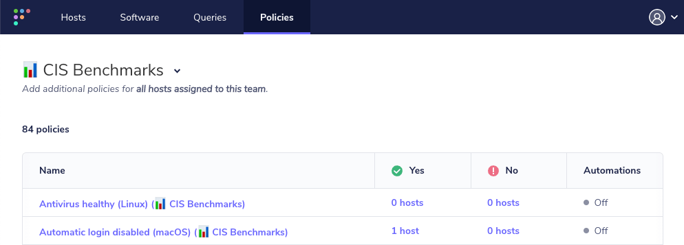

# Fleet 4.28.0 | CIS benchmarks for Ventura

Fleet 4.28.0 is up and running. Check out the full [changelog](https://github.com/fleetdm/fleet/releases/tag/fleet-v4.28.0) or continue reading to get the highlights.

For upgrade instructions, see our [upgrade guide](https://fleetdm.com/docs/deploying/upgrading-fleet) in the Fleet docs.

## Highlights

*   Center for Internet Security (CIS) benchmarks for macOS 13 Ventura
*   Reduced false negatives from MS Office products related to vulnerabilities reported in the NVD
*   Cost savings through reduced background jobs

## Center for Internet Security (CIS) benchmarks for macOS 13 Ventura

_Available in Fleet Premium and Fleet Ultimate_

    <iframe src="https://www.youtube.com/embed/_uExv-1v4jQ" title="YouTube video player" frameborder="0" allow="accelerometer; autoplay; clipboard-write; encrypted-media; gyroscope; picture-in-picture; web-share" allowfullscreen></iframe>

Fleet now includes scheduling and running a complete set of [CIS benchmark policies](https://fleetdm.com/docs/using-fleet/cis-benchmarks) as part of Premium and Ultimate. The Center for Internet Security publishes benchmark documents that describe how computers should be configured in order for them to avoid vulnerabilities addressed therein. Today, we have 100% coverage for all automatable macOS 13 Ventura CIS benchmarks.\*

CIS benchmark policies represent the consensus-based effort of cybersecurity experts globally to help you protect your systems against threats more confidently. Fleet takes 🟠 Ownership toward providing the most comprehensive set of CIS benchmark policies available. Using Fleet to apply CIS policies will assist you in quickly bringing your fleet into compliance, saving your organization time and money.

Premium and Ultimate Fleet plans have the ability to import the CIS benchmarks into your queries list, where you can schedule or edit them. Once imported, you would see something like this:

\*Some CIS Benchmarks require manual intervention.

For more information on adding CIS Benchmarks, check out the [documentation here](https://fleetdm.com/docs/using-fleet/cis-benchmarks#how-to-add-cis-benchmarks).

## Reduced false negatives from MS Office products related to vulnerabilities reported in the NVD

A false negative occurs when a policy reports there is not a vulnerability, but there actually is a vulnerability. Even if a policy reports zero vulnerabilities, that does not imply there are no vulnerabilities present. Both of these types of errors can cause problems when trying to identify vulnerabilities that need attention.

Due to limitations with the [National Vulnerability Database](https://nvd.nist.gov/) (NVD), the [Common Platform Enumeration](https://nvd.nist.gov/products/cpe) (CPE), a structured naming scheme, maps to a suite version (e.g., Microsoft Word 2019) instead of the software version number (e.g., 16.11201) provided by osquery for product vulnerabilities. To reduce false negatives, Fleet has worked to process vulnerabilities directly from the [Microsoft Security Response Center](https://www.microsoft.com/en-us/msrc/) (MSRC). Fleet now pulls vulnerability data from the MSRC for Microsoft Office products. Fleet will exclude Microsoft product vulnerabilities provided by the NVD, prioritizing vulnerabilities enumerated by the MSRC and product release notes.

The new method for collecting and establishing vulnerability profiles for Fleet provides for more accurate CVE policy creation. It reduces the chance of false negatives or the potential to miss alerting to a vulnerability. Reducing false negatives in Fleet’s policies increases your security standing, bringing you 🟢 Results through 🔵 Objectivity by prioritizing a source of truth and 🟣 Openness in our vulnerability discovery process.

Learn more about [Fleet’s vulnerability processing](https://fleetdm.com/docs/using-fleet/vulnerability-processing).

## Cost savings through reduced background jobs

    <iframe src="https://www.youtube.com/embed/7LfrZ7dqQxY" title="YouTube video player" frameborder="0" allow="accelerometer; autoplay; clipboard-write; encrypted-media; gyroscope; picture-in-picture; web-share" allowfullscreen></iframe>

Fleet is working diligently to reduce the overhead associated with running several background jobs, including [vulnerability processing](https://fleetdm.com/docs/using-fleet/vulnerability-processing). Background jobs with significant resource needs have been moved from _scheduled_ to _on-demand._ These changes help reduce resource needs and, ultimately, infrastructure costs. 

Utilizing smaller instances, reducing resource needs, and lowering your expenditure aligns with Fleet’s [values](https://fleetdm.com/handbook/company#values) of 🟠 Ownership and 🟢 Results. The changes allow you to allocate lower resources to your running Fleet servers, run an occasional job on-demand to do resource-intensive processing, and have more control over how background jobs and resources are allocated. 

For more information on enabling this functionality, check out the [documentation here](https://fleetdm.com/docs/using-fleet/vulnerability-processing#advanced-configuration).

## More new features, improvements, and bug fixes

#### List of MDM features

*   Added logic to ingest and decrypt FileVault recovery keys on macOS if Fleet's MDM is enabled.
*   Create activity feed types for the creation, update, and deletion of macOS profiles (settings) via MDM. This gives admins more visibility into profile changes.
*   Added an API endpoint to retrieve a host disk encryption key for macOS if Fleet's MDM is enabled.
*   Added UI implementation for users to upload, download, and delete macOS profiles.
*   Added API endpoints to create, delete, list, and download MDM configuration profiles.
*   Added "edited macOS profiles" activity when updating a team's (or no team's) custom macOS settings via fleetctl apply.
*   Enabled installation and auto-updates of Nudge via Orbit.
*   Added support for providing macos\_settings.custom\_settings profiles for team (with Fleet Premium) and no-team levels via fleetctl apply.

#### List of other features

*   Added --policies-team flag to fleetctl apply to easily import a group of policies into a team.
*   Remove requirement for Rosetta2 in installation of macOS packages on Apple Silicon. The binaries have been "universal" for a while now, but the installer still required Rosetta until now.
*   Added max height on org logo image to ensure consistent height of the nav bar.
*   UI default policies pre-select targeted platform(s) only.
*   Parse the Mac Office release notes and use that for doing vulnerability processing.
*   Only set public IPs on the host.public\_ip field and add documentation on how to properly configure the deployment to ingest correct public IPs from enrolled devices.
*   Added tooltip with link to UI when Public IP address cannot be determined.
*   Update to better URL validation in UI.
*   Set policy platforms using the platform checkboxes as a user would expect the options to successfully save.
*   Standardized on a default value for empty cells in the UI.
*   Added link to query table in UI source (fleetdm.com/tables/table\_name).
*   Added live query distributed interval warnings on select targets picker and live query result page.
*   Added a macOS settings indicator and modal on the host details and device user pages.
*   Added configuration parameters for the filesystem logging destination -- max\_size, max\_age, and max\_backups are now configurable rather than hardcoded values.
*   Live query/policy selecting "All hosts" is mutually exclusive from other filters.
*   Minor server changes to support Fleetd for ChromeOS (to be released soon).
*   Fixed network\_interface\_unix and network\_interface\_windows to ingest "Private IPs" only  
    (filter out "Public IPs").
*   Fixed how the Fleet MDM server URL is generated when stored for hosts enrolled in Fleet MDM.
*   Fixed a panic when loading information for a host enrolled in MDM and its is\_server field is  
    NULL.
*   Fixed bug with host count on hosts filtered by operating system version.
*   Fixed permissions warnings reported by Suspicious Package in macOS pkg installers. These warnings appeared to be purely cosmetic.
*   Fixed UI bug: Long words in activity feed wrap within the div.

## Ready to upgrade?

Visit our [upgrade guide](https://fleetdm.com/docs/deploying/upgrading-fleet) in the Fleet docs for instructions on updating to Fleet 4.28.0.

<meta name="category" value="releases">
<meta name="authorFullName" value="JD Strong">
<meta name="authorGitHubUsername" value="spokanemac">
<meta name="publishedOn" value="2023-02-28">
<meta name="articleTitle" value="Fleet 4.28.0 | CIS benchmarks for Ventura">
<meta name="articleImageUrl" value="../website/assets/images/articles/fleet-4.28.0-800x450@2x.png">
