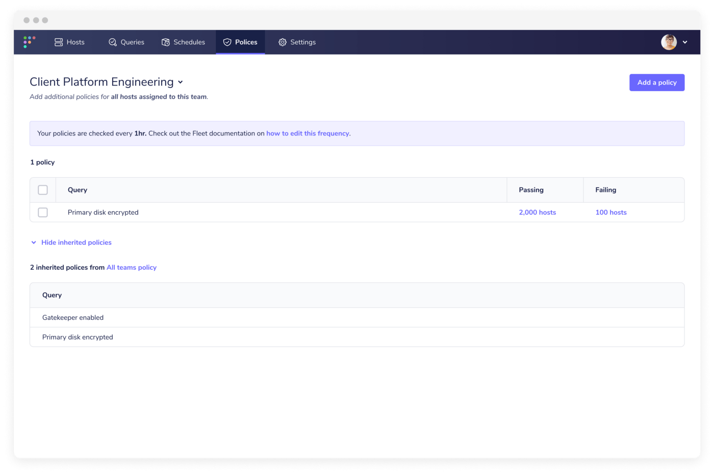
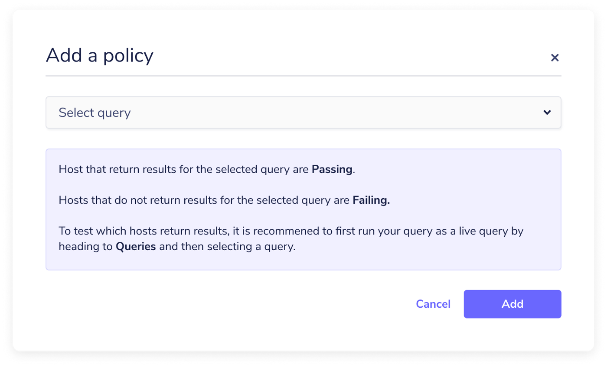
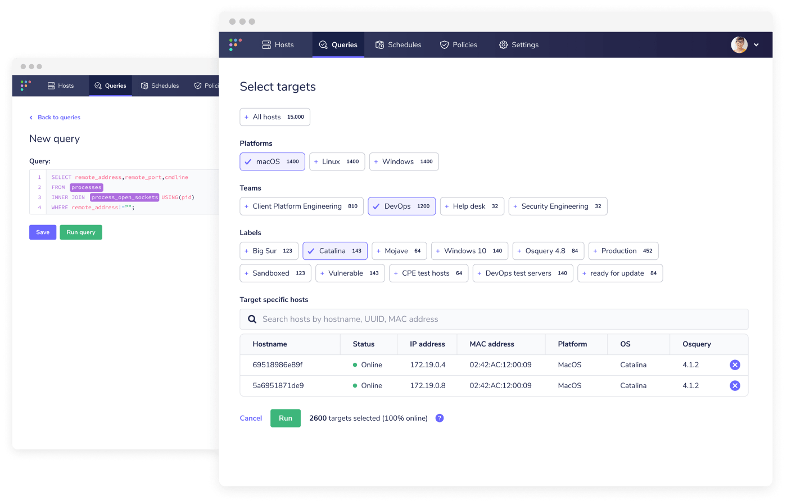

# Fleet 4.3.0

Fleet 4.3.0 is now available. Visit our [updating Fleet](https://fleetdm.com/docs/using-fleet/updating-fleet) guide for instructions on how to update.

For the complete summary of all changes and release binaries, check out the release notes on GitHub. In the meantime, read on for more info about the main features and improvements introduced in Fleet 4.3.0.

## Feature highlights

- Policies allow users to define security policies which their enrolled devices must adhere to.
- Improved query console, so users can more easily walk through the flow of crafting a query, selecting targets, running, and saving a query.
- Query performance gives users the ability to gain insight into the data-to-performance tradeoff of their queries.

## Policies
**Available in Fleet Free, and Fleet Premium**

By setting policies, users can define baseline security criteria for every device in their fleet, and update any devices that do not meet the specified requirements.

Policies can be defined globally on all plans. In this first iteration, users can create a policy in the query console, just as they would a regular query, and then select that query from the “Add a policy” modal window, over on the Policies page.

## Improved query console
**Available in Fleet Free, and Fleet Premium**

By “improved,” we mean that we have given the query console UI a complete overhaul. By redesigning the user experience to be more focused on the creation of ad-hoc queries, users can now quickly craft queries on-the-fly, and more intuitively navigate the workflow of selecting targets, running queries, and saving queries.

## Query performance
**Available in Fleet Free, and Fleet Premium**

Fleet 4.3.0’s new query performance feature gives users the ability to gain insight into how their scheduled queries may affect performance on their endpoints. This information is useful in a number of scenarios, enabling users to weigh up the data-to-performance tradeoff of their queries.

For example:

- A person at the company has a previous-generation computer, maybe not as powerful as what is currently provided, but not upgraded yet. Osquery doing extra things on this machine may cause them to notice things running slowly, battery drain, etc.
- A user is tethered to their phone on a limited data plan. Osquery sending duplicate data is wasting their data plan.
- A service is running osquery. The extra overhead from osquery causes the service to have to use larger instance sizes for their auto-scaling group. This causes the overall running cost of the service to go up.

## More improvements

- **Offline hosts webhook**, so users can know when a significant percentage of hosts have not checked into Fleet for several days.
- **fleetctl package** so users can easily hooking up a real-world device when trying Fleet.
- **Improved discoverability of team enroll secrets** in the Fleet UI, to help Team maintainers more efficiently enroll new hosts to their teams.

---

## Ready to update?

Visit our [update guide](https://fleetdm.com/docs/using-fleet/updating-fleet) in the Fleet docs for instructions on updating to Fleet 4.3.0.

<meta name="category" value="releases">
<meta name="authorFullName" value="Mike Thomas">
<meta name="authorGitHubUsername" value="mike-j-thomas">
<meta name="publishedOn" value="2021-09-07">
<meta name="articleTitle" value="Fleet 4.3.0">
<meta name="articleImageUrl" value="../website/assets/images/articles/fleet-4.3.0-cover-1600x900@2x.jpg">