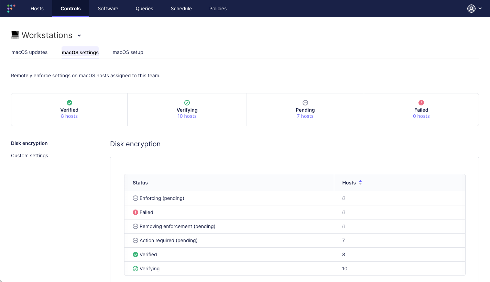

# Fleet 4.33.0 | ChromeOS support, new verified status.

Fleet 4.33.0 is live. Check out the full [changelog](https://github.com/fleetdm/fleet/releases/tag/fleet-v4.33.0) or continue reading to get the highlights.
For upgrade instructions, see our [upgrade guide](https://fleetdm.com/docs/deploying/upgrading-fleet) in the Fleet docs.

## Highlights

* Fleet adds support for ChromeOS
* Boosted compliance with 'verified' status

### Fleet adds support for ChromeOS

Fleet has leveled up! We're excited to announce expanded support for Google's ChromeOS and the new
ChromeOS Flex via our innovative Fleetd Chrome extension. Discover more about the Fleetd Chrome
extension for enterprise device
management in our [full announcement](https://fleetdm.com/announcements/fleet-adds-support-for-chrome-os).

### Boosted compliance with 'verified' status

_Available in Fleet Premium and Fleet Ultimate_

Drawing on our values of 🔴 Empathy and 🟢 Results, Fleet's latest update introduces a new "Verified" status to the macOS settings pages. This status, achieved through osquery, verifies the presence of all profiles and the enablement of disk encryption, embodying our commitment to results-driven processes and effective security measures.

In keeping with our value of 🟠 Ownership, if disk encryption is enforced, Fleet takes responsibility for securely storing the disk encryption key. This addition exemplifies our dedication to providing comprehensive, reliable solutions for our users.

The Hosts page has been enhanced in line with our value of 🟣 Openness. Users can now filter hosts
based on the "Verified" status, promoting transparency and aiding in easy management and oversight
of compliant devices. This reflects our commitment to creating user-friendly systems, reflecting the
empathy we share for our users' experience and their need for efficient, straightforward tools.

Learn more about [Fleet's "Verified"
status](https://fleetdm.com/docs/using-fleet/mdm-disk-encryption#disk-encryption-status).

## More new features, improvements, and bug fixes

* Upgraded Go version to 1.19.10.
* Added support for ChromeOS devices.
* Added instructions to inform users how to add ChromeOS hosts.
* Added ChromeOS details to the dashboard, manage hosts, and host details pages.
* Added ability for users to create policies that target ChromeOS.
* Added built-in label for ChromeOS.
* Added query to fill in `device_mapping` from ChromeOS hosts.
* Improved the performance of live query results rendering to address usability issues when querying tens of thousands of hosts.
* Reduced size of live query websocket message by removing unused host data.
* Added the `POST /fleet/mdm/apple/profiles/preassign` endpoint to store profiles to be assigned to a host for subsequent matching with an existing (or new) team.
* Added the `POST /fleet/mdm/apple/profiles/match` endpoint to match pre-assigned profiles to an existing team or create one if needed, and assign the host to that team.
* Updated `GET /mdm/apple/profiles` endpoint to return empty array instead of null if no profiles are found.
* Improved ingestion of MDM devices from ABM:
  - If a device's operation_type is `modified`, but the device doesn't exist in Fleet yet, a DEP profile will be assigned to the device and a new record will be created in Fleet.
  - If a device's operation_type is `deleted`, the device won't be prompted to migrate to Fleet if the feature has been configured.
* Added "Verified" profile status for profiles verified with osquery.
* Added "Action required" status for disk encryption profile in UI for host details and device user pages.
* Added UI for the end user authentication page for MDM macos setup.
* Added new host detail query to verify MDM profiles and updated API to include verified status.
* Added documentation in the guide for `fleetctl get mdm-commands`.
* Moved post-DEP (automatic) MDM enrollment to a worker job for increased resiliency with retries.
* Added better UI error for manual enroll MDM modal.
* Updated `GET /api/_version_/fleet/config` to now omits fields `smtp_settings` and `sso_settings` if not set.
* Added a response payload to the `POST /api/latest/fleet/spec/teams` contributor API endpoint so that it returns an object with a `team_ids_by_name` key which maps team names with their corresponding id.
* Ensure we send post-enrollment commands to MDM devices that are re-enrolling after being wiped.
* Added error message to UI when Redis disconnects during a live query session.
* Optimized query used for listing activities on the dashboard.
* Added ability for users to delete multiple pages of hosts.
* Added ability to deselect label filter on host table.
* Added support for value `null` on `FLEET_JIT_USER_ROLE_GLOBAL` and `FLEET_JIT_USER_ROLE_TEAM_*` SAML attributes. Fleet will accept and ignore such `null` attributes.
* Deprecate `enable_jit_role_sync` setting and only change role for existing users if role attributes are set in the `SAMLResponse`.
* Improved styling in sandbox mode.
* Patched a potential security issue.
* Improved icon clarity.
* Fixed issues with the MDM migration flow.
* Fixed a bug with applying team specs via `fleetctl apply` and updating a team via the `PATCH /api/latest/fleet/mdm/teams/{id}` endpoint so that the MDM updates settings (`minimum_version` and `deadline`) are not cleared if not provided in the payload.
* Fixed table formatting for the output of `fleetctl get mdm-command-results`.
* Fixed the `/api/latest/fleet/mdm/apple_bm` endpoint so that it returns 400 instead of 500 when it fails to authenticate with Apple's Business Manager API, as this indicates a Fleet configuration issue with the Apple BM certificate or token.
* Fixed a bug that would show MDM URLs for the same server as different servers if they contain query parameters.
* Fixed an issue preventing a user with the `gitops` role from applying some MDM settings via `fleetctl apply` (the `macos_setup_assistant` and `bootstrap_package` settings).
* Fixed `GET /api/v1/fleet/spec/labels/{name}` endpoint so that it now includes the label id.
* Fixed Observer/Observer+ role being able to see team secrets.
* Fixed UI bug where `inherited_page=0` was incorrectly added to some URLs.
* Fixed misaligned icons in UI.
* Fixed tab misalignment caused by new font.
* Fixed dashed line styling on multiline activities.
* Fixed a bug in the users table where users that are observer+ for all of more than one team were listed as "Various roles".
* Fixed 500 error being returned if SSO session is not found.
* Fixed issue with `chrome_extensions` virtual table not returning a path value on `fleetd-chrome`, which was breaking software ingestion.
* Fixed bug with page navigation inside 'My Device' page.
* Fixed a styling bug in the add hosts modal in sandbox mode.

## Ready to upgrade?

Visit our [Upgrade guide](https://fleetdm.com/docs/deploying/upgrading-fleet) in the Fleet docs for instructions on updating to Fleet 4.33.0.

<meta name="category" value="releases">
<meta name="authorFullName" value="JD Strong">
<meta name="authorGitHubUsername" value="spokanemac">
<meta name="publishedOn" value="2023-06-13">
<meta name="articleTitle" value="Fleet 4.33.0 | ChromeOS support, new verified status">
<meta name="articleImageUrl" value="../website/assets/images/articles/fleet-4.33.0-1600x900@2x.png">
