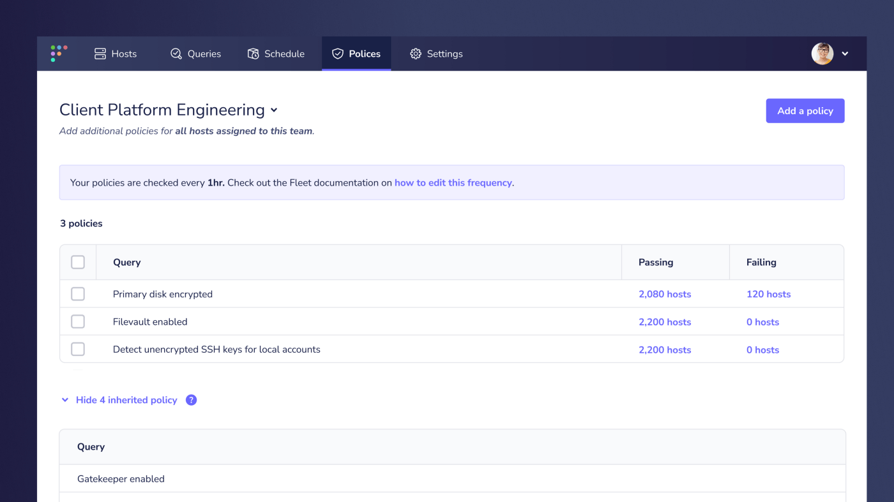
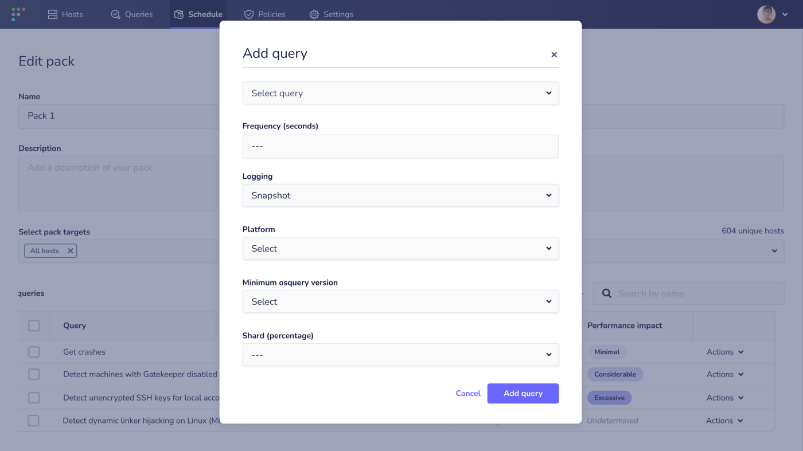

# Fleet 4.4.0 releases aggregated software inventory, team policies, and improved team scheduling

Today we are excited to announce the release of Fleet 4.4.0 which brings new and improved features for our osquery and Fleet users.

Visit our [update guide](https://fleetdm.com/docs/using-fleet/updating-fleet) in the Fleet docs for instructions on how to update.

## Feature highlights:

- See an aggregated list of all installed software, across all your devices
- Reveal the bundle ID of installed software on macOS devices
- Define team-specific rules with team policies
- Improved scheduling and management control for team maintainers
- Improved Packs UI

## See an aggregated list of all installed software, across all your devices
**Available in Fleet Free and Fleet Premium**

View an aggregated list of all software installed on your devices via `fleetctl get software` command and the `GET /api/v1/fleet/software API` route.

To turn on this feature, the software inventory feature flag must first be enabled, by setting the environment variable: `FLEET_BETA_SOFTWARE_INVENTORY=1`

Once enabled, run: `GET /api/v1/fleet/software` to retrieve an aggregated list of all software installed on your devices.

Visit the Fleet docs for more information about the [software inventory feature flag](https://fleetdm.com/docs/deploying/configuration#software-inventory) and [listing all software](https://fleetdm.com/docs/using-fleet/rest-api#software).

## Reveal the bundle ID of installed software on macOS devices
**Available in Fleet Free and Fleet Premium**

As part of a customer promise, we have further enhanced our software inventory by displaying the bundle ID of software installed on macOS devices.

A bundle ID, or bundle identifier, is a unique string that identifies an application to the system. By revealing this identifier in the software inventory, Fleet users are now able to see the exact manufacturer of software installed across their macOS devices.

## Define team-specific rules with team policies
**Available in Fleet Premium**

With the introduction of policies in our last release, users can define rules and quickly see which devices pass or fail these criteria in Fleet. As a continuation of this, Fleet 4.4.0 enhances this feature for Premium users by giving team maintainers control to define unique rules on a per-team level to help safeguard the endpoints that they own.

## Improved scheduling and management control for team maintainers
**Available in Fleet Premium**

Team maintainers can now better manage the queries that they have authored, giving them power to add, remove and edit, in order to define them as policies for their team, or add them to their team schedule.

## Improved Packs UI
**Available in Fleet Free and Fleet Premium**

The Edit pack page gets a UI enhancement to improve the user experience of adding a scheduled query to a pack.

---

## Ready to update?

Visit our [update guide](https://fleetdm.com/docs/using-fleet/updating-fleet) in the Fleet docs for instructions on updating to Fleet 4.4.0.

<meta name="category" value="releases">
<meta name="authorFullName" value="Mike Thomas">
<meta name="authorGitHubUsername" value="mike-j-thomas">
<meta name="publishedOn" value="2021-10-07">
<meta name="articleTitle" value="Fleet 4.4.0 releases aggregated software inventory, team policies, and improved team scheduling">
<meta name="articleImageUrl" value="../website/assets/images/articles/fleet-4.4.0-cover-1600x900@2x.jpg">