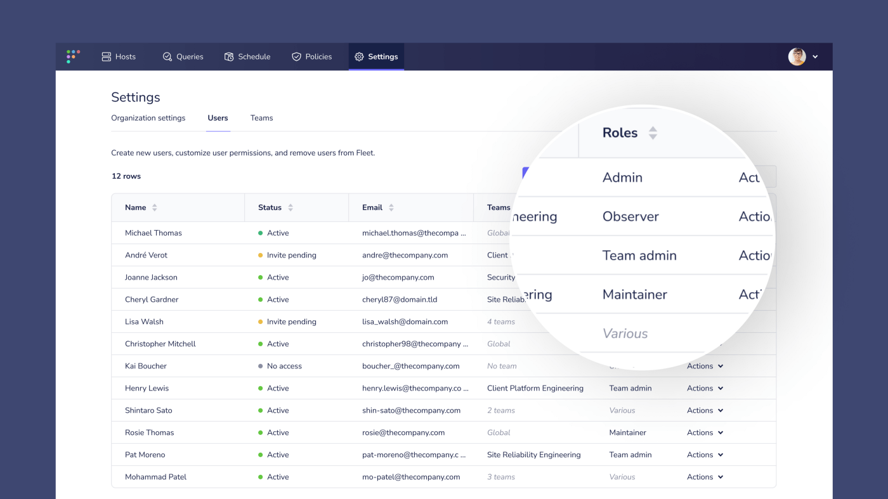
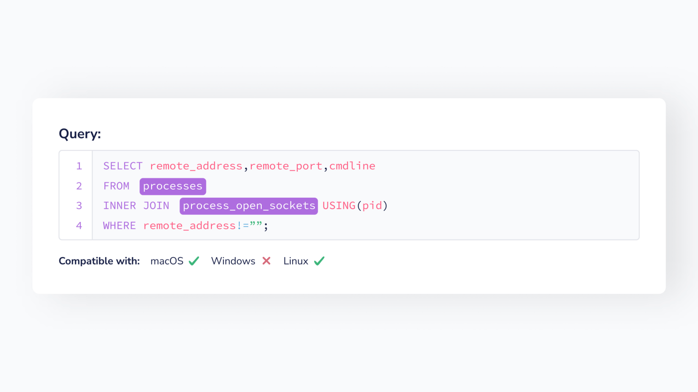
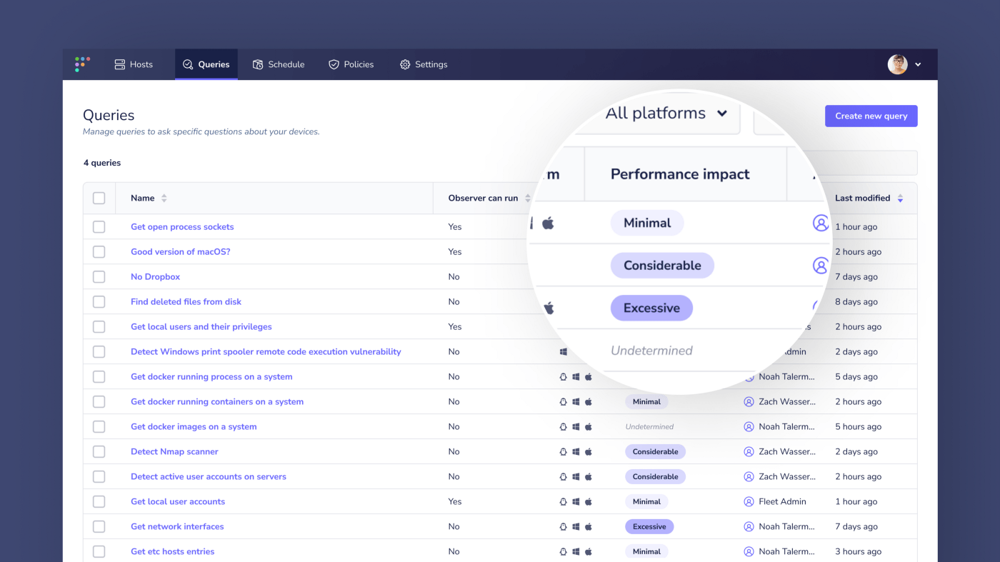
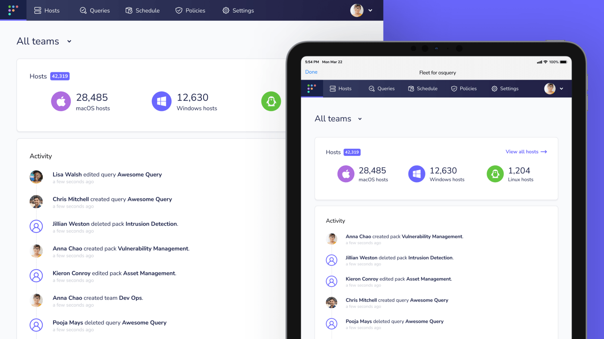
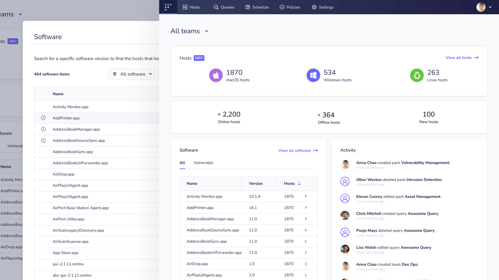

# Fleet 4.5.0 with new team admin role, live OS compatibility checking, query performance impact, and a new-look dashboard

It’s been another exciting month at Fleet, and we are proud to announce the release of Fleet 4.5.0, which brings with it new and improved features for the osquery and Fleet community.

Visit our [update guide](https://fleetdm.com/docs/using-fleet/updating-fleet) in the Fleet docs for instructions on how to update.

## Feature highlights

- New team admin role for greater control of your teams.
- Live OS compatibility checking as you create and edit queries.
- See an indication of a query’s performance impact from Fleet UI.
- First steps towards aggregated device data on the Fleet UI dashboard.

## New team admin role for greater control of your teams
**Available in Fleet Premium**

As part of a customer promise, Fleet 4.5.0 introduces a new Team admin role; allowing team admins to manage their own team members.

### Permissions of the Team admin role include:

- Browse hosts assigned to team
- Browse policies for hosts assigned to team
- Filter hosts assigned to team using policies
- Filter hosts assigned to team using labels
- Target hosts assigned to team using labels
- Browse policies for hosts assigned to team
- Run saved queries as live queries on hosts assigned to team
- Run custom queries as live queries on hosts assigned to team
- Enroll hosts to member team
- Delete hosts belonging to member team
- Create saved queries
- Edit saved queries that the user authored
- Delete queries that the user authored
- Add existing users to team
- Create users and assign to team
- Edit users assigned to team
- Remove users assigned to team
- Edit team level agent options

## Live OS compatibility checking as you create and edit queries
**Available in Fleet Free & Fleet Premium**

When creating or editing a query in Fleet (either a live query, schedule, or policy,) users can now immediately identify which operating systems their query is compatible with.

## See an indication of a query’s performance impact from Fleet UI
**Available in Fleet Free & Fleet Premium**

This new feature allows users to see an indication of the performance impact of scheduled queries across all devices. This is useful for mitigating the potential risk of disruption to end-users when running queries.

The level of performance impact is derived from [a query's `stats` object](https://fleetdm.com/docs/rest-api/rest-api#get-query), by totaling up milliseconds `stats.system_time_p50` and `stats.user_time_p50`:

+ **Minimal:** less than 2000
+ **Considerable:** 2000-3999
+ **Excessive:** 4000+

## First steps towards aggregated device data on the Fleet UI dashboard
**Available in Fleet Free & Fleet Premium**

We are pleased to introduce the new Fleet UI homepage. Like the Millennium Falcon, it may not look like much on the surface (at the moment), but under the hood, it’s our first step towards displaying aggregated device data — some of which narrowly missed the cut for this release, so we are very excited about it. We look forward to adding more and more useful data to this page in future iterations of Fleet. Oh, and it’s also the first of our pages to be optimized for tablet users.

_Aggregated data UI mockup. A preview of things to come in the near future for Fleet._

## Other notable improvements in Fleet 4.5.0

- Improvements to the Fleet documentation.
- Added support for TLS Redis connections.
- Added support for Redis reading from replicas.
- Improved the loading experience between pages.
- Added a tooltip to the search input on the Hosts table.
- Fine tuned some of the language in the activity feed to be more human readable.

## Bug fixes

- In some cases, `fleetctl` apply wasn’t being very helpful when errors occurred. We gave it a talking to, and it’s agreed to provide more helpful error messages from now on.
- Some users reported being taken to an empty white screen after creating a new query in Packs. This has now been fixed.
- Search results were reportedly misbehaving when targeting specific hosts. They are now toeing the line.
- Troublesome checkboxes when deleting hosts have been corrected.
- Logging in a newly created user now correctly asks for a password reset.
- We fixed some e2e test issues on Windows.
- There were some cases where macOS apps ingested prior to Fleet 4.3.2 had empty `bundle_indentifers`. We’ve remedied that indigestion.
- Current team in the context API was being stubborn on occasion, but is now clearing correctly between pages.
- We also corrected some minor alignment issues in the UI, made certain icons more readable, fixed up some misbehaving anchor links, and ironed out some minor user-experience issues that were troubling a few of the UI elements.

---

## Ready to update?

Visit our [update guide](https://fleetdm.com/docs/using-fleet/updating-fleet) in the Fleet docs for instructions on updating to Fleet 4.5.0.

<meta name="category" value="releases">
<meta name="authorFullName" value="Mike Thomas">
<meta name="authorGitHubUsername" value="mike-j-thomas">
<meta name="publishedOn" value="2021-11-02">
<meta name="articleTitle" value="Fleet 4.5.0 with new team admin role, live OS compatibility checking, query performance impact, and a new-look dashboard">
<meta name="articleImageUrl" value="../website/assets/images/articles/fleet-4.5.0-cover-1600x900@2x.jpg">
