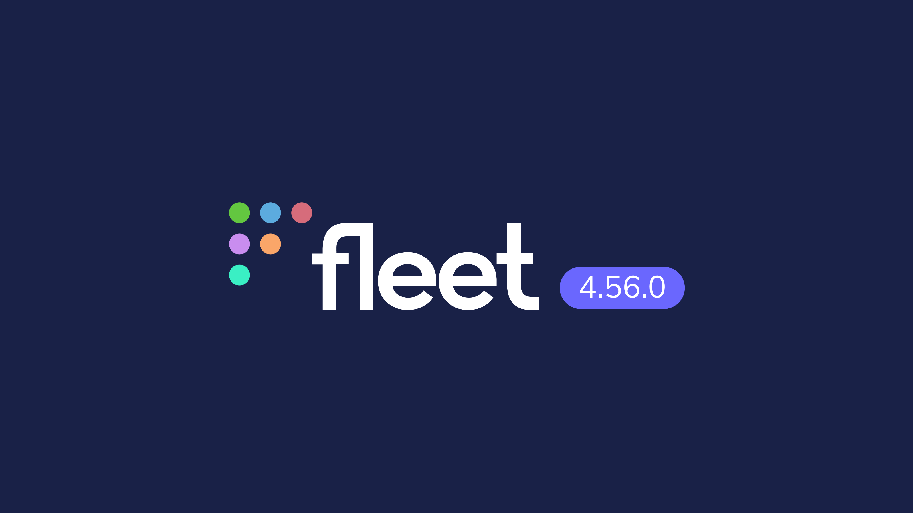

# Fleet 4.56.0 | Enhanced MDM migration, Exact CVE Search, and Self-Service VPP Apps.

Fleet 4.56.0 is live. Check out the full [changelog](https://github.com/fleetdm/fleet/releases/tag/fleet-v4.56.0) or continue reading to get the highlights.
For upgrade instructions, see our [upgrade guide](https://fleetdm.com/docs/deploying/upgrading-fleet) in the Fleet docs.

## Highlights
* Improved end-user MDM migration
* Enforce minimum OS version for MDM enrollment
* Exact match CVE search
* Software vulnerabilities severity filter
* Self-service VPP apps

### Improved end-user MDM migration

Fleet has improved the end-user MDM migration workflow on macOS by enabling the migration of hosts manually enrolled in a third-party MDM over to Fleet MDM using the Fleet Desktop application. Previously, this capability was limited to hosts enrolled through Apple's Automated Device Enrollment (ADE), but with this update, manually enrolled hosts can now be seamlessly migrated to Fleet MDM. This feature is specifically available for macOS Sonoma devices (macOS 14 or greater). It makes the migration process more flexible and accessible for organizations looking to centralize their MDM management under Fleet. This enhancement simplifies the transition to Fleet MDM for a broader range of macOS devices, ensuring that all hosts can be managed consistently and securely.

### Enforce minimum OS version for MDM enrollment

Fleet now enforces a minimum operating system (OS) requirement for macOS devices before they can be enrolled into Fleet's MDM. This feature ensures that only devices running a specified minimum macOS version can be enrolled, helping organizations maintain a consistent security and compliance baseline across their fleet. By setting a minimum OS requirement, Fleet prevents older, potentially less secure macOS versions from being managed under its MDM, thereby reducing vulnerabilities and ensuring all enrolled devices meet the organization's standards. This update enhances Fleet's ability to enforce security policies from the outset, ensuring that all devices in the fleet are up-to-date and capable of supporting the latest security and management features.

### Exact match CVE search

Fleet has enhanced its CVE (Common Vulnerabilities and Exposures) search functionality by introducing exact match searching, allowing users to quickly and accurately find specific vulnerabilities across their fleet. This improvement ensures that security teams can pinpoint the exact CVE they are investigating without sifting through irrelevant results, streamlining the vulnerability management process. Additionally, Fleet provides better context in cases where no results are found, helping users understand why a particular CVE might not be present in their environment. This update improves the overall user experience in vulnerability management, making it easier to maintain security and compliance across all managed devices.

### Software vulnerabilities severity filter

Fleet has introduced improved filtering capabilities for vulnerable software, allowing users to filter vulnerabilities by severity level. This enhancement enables security teams to prioritize their response efforts by focusing on the most critical vulnerabilities, ensuring that the highest-risk issues are promptly addressed. By providing a straightforward and efficient way to filter vulnerable software based on severity, Fleet helps organizations streamline their vulnerability management processes, reducing the risk of security incidents. This update aligns with Fleet's commitment to providing powerful tools that enhance the efficiency and effectiveness of security operations across all managed devices.

### Self-Service Apple App Store apps

Fleet enables organizations to assign and install Apple App Store apps purchased through the Volume Purchase Program (VPP) directly via Self-Service using Fleet Desktop. This new feature allows IT administrators to make VPP-purchased apps available to end users seamlessly and flexibly. By integrating VPP app distribution into the Fleet Desktop Self-Service portal, organizations can streamline the deployment of essential software across their macOS devices, ensuring that users have easy access to the tools they need while maintaining control over software distribution. This update enhances the overall user experience and operational efficiency, empowering end users to install approved applications with minimal IT intervention.

## Changes

**NOTE:** Beginning with Fleet v4.55.0, Fleet no longer supports MySQL 5.7 because it has reached [end of life](https://mattermost.com/blog/mysql-5-7-reached-eol-upgrade-to-mysql-8-x-today/#:~:text=In%20October%202023%2C%20MySQL%205.7,to%20upgrade%20to%20MySQL%208.). The minimum version supported is MySQL 8.0.

### Endpoint Operations

## Ready to upgrade?

Visit our [Upgrade guide](https://fleetdm.com/docs/deploying/upgrading-fleet) in the Fleet docs for instructions on updating to Fleet 4.56.0.

<meta name="category" value="releases">
<meta name="authorFullName" value="JD Strong">
<meta name="authorGitHubUsername" value="spokanemac">
<meta name="publishedOn" value="2024-08-30">
<meta name="articleTitle" value="Fleet 4.56.0 | Enhanced MDM migration, Exact CVE Search, and Self-Service VPP Apps.">
<meta name="articleImageUrl" value="../website/assets/images/articles/fleet-4.56.0-1600x900@2x.png">
