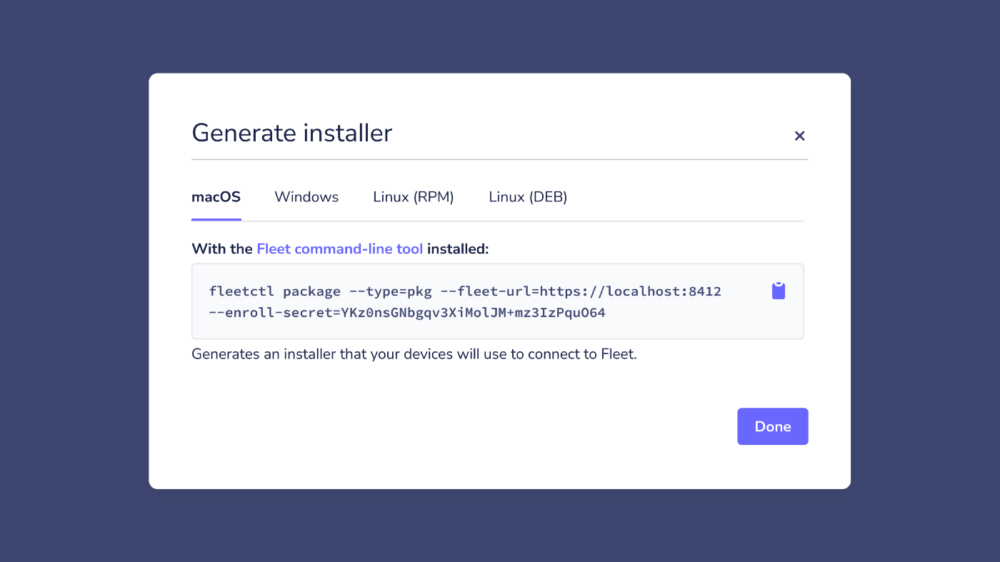

# Fleet 4.6.0 with osquery installer, enroll secret management, and improved host vitals

Today we are excited to announce the release of Fleet 4.6.0 which brings some improvements to software/vulnerabilities, policies, and performance.

Visit our [update guide](https://fleetdm.com/docs/using-fleet/updating-fleet) in the Fleet docs for instructions on how to update.

Check out the full [changelog](https://github.com/fleetdm/fleet/releases/tag/fleet-v4.6.0) on GitHub, or read on for a summary of what’s new in Fleet 4.6.0 🚀

## Feature highlights:

- Generate an osquery installer for macOS, Linux, or Windows
- Manage enroll secrets in the Fleet UI
- View scheduled queries on specific hosts via the host details page
- System users’ “login shell” is now visible from the host details page

### Generate an osquery installer for macOS, Linux, or Windows

**Available in Fleet Free & Fleet Premium**

Fleet 4.6.0 introduces instructions in the Fleet UI for generating an osquery installer package for macOS, Linux, or Windows. The Fleet osquery installer is an osquery runtime and auto-updater, that extends osquery; makes it easy to deploy, manage configurations, and stay up to date.

The Fleet osquery installer is our recommended agent for Fleet, but it can be used with or without Fleet as a (near) drop-in replacement for osquery, and vice-versa.

### Manage enroll secrets in the Fleet UI

**Available in Fleet Free & Fleet Premium**

The ability to manage enroll secrets is a helpful addition for team maintainers who need to manage enrollment keys across their teams, or for users who may need to rotate enroll secrets according to their company’s security policy.

Users can now create a new enroll secret in the Fleet UI, generate a new osquery installer with the new secret, distribute it to their hosts, and remove the old enrollment key.

### View scheduled queries on specific hosts via the host details page

**Available in Fleet Free & Fleet Premium**

Users can now see all of their queries scheduled to run on a specific host from the host details page, so they can be confident that the correct data will be sent to their log destination.

### System users’ login shell information is now available from the Fleet UI’s host details page.

**Available in Fleet Free & Fleet Premium**

Login shell information is now visible from the system users section of the host details page. The user section can now be filtered to see only those who have logged into the host.

---

## More improvements

- Fleet Premium: Ability to move pending invited users between teams. ([#1838](https://github.com/fleetdm/fleet/issues/1838))
- Add aggregate software and team filter to the “Home” page. ([#2049](https://github.com/fleetdm/fleet/issues/2049))
- Software inventory is now turned on by default in new deployments. ([#2088](https://github.com/fleetdm/fleet/issues/2088))
- Host status webhook is now compatible with Slack. ([#2434](https://github.com/fleetdm/fleet/issues/2434))
- Added more human-readable output messages — notably after successful generation of an installer package. ([#2737](https://github.com/fleetdm/fleet/issues/2737))
- Newly created query packs now appear immediately in the Packs section of the Host Details page, albeit in a pending “Not yet been run” state.
- Online/offline host counts are now summarized on the “Home” page. ([#1995](https://github.com/fleetdm/fleet/issues/1995))
- Updated the language for communicating policies so that users can clearly understand that Fleet policies are “Yes,” and “No” questions. ([#2593](https://github.com/fleetdm/fleet/issues/2593))
- Updated the empty states on the Policies and Schedule pages to better communicate valuable use cases of each.
- Improved the UI messaging for the query platform compatibility checks. ([#2757](https://github.com/fleetdm/fleet/issues/2757))
- Improved the locking time for accounts with high host counts. ([#2776](https://github.com/fleetdm/fleet/issues/2776))

## Bug fixes

- There was an issue in the software inventory where software with long names were forcing the bundle ID tooltip not to show. We’ve fixed this.
- Team Admins can now remove themselves from a team and be redirected to the Dashboard as expected.
- We fixed up some instances where the “Name” column was too thin on the query table.
- There was a bug that is now no more, where the team policy filter was redirecting to the wrong page when canceled.
- Fleet Free is free, but there were a handful of erroneous 402 payment-required errors cropping up where they shouldn’t have been. This has now been resolved.
- Multiselect checkboxes were doing some funky renderings when managing queries, but they’re back in check now (a little Dad joke, there.)
- We fixed an issue where `POST api/v1/fleet/targets` was returning a 422 error for Team Admins.
- We also fixed a bunch of misbehaving UI elements that are now rendering correctly/doing what they are supposed to be doing.
- And lastly, we resolved some styling issues where certain layouts weren’t behaving at 1024px breakpoints.

---

## Ready to update?

Visit our [update guide](https://fleetdm.com/docs/using-fleet/updating-fleet) in the Fleet docs for instructions on how to update to Fleet 4.6.0.

<meta name="category" value="releases">
<meta name="authorFullName" value="Mike Thomas">
<meta name="authorGitHubUsername" value="mike-j-thomas">
<meta name="publishedOn" value="2021-11-19">
<meta name="articleTitle" value="Fleet 4.6.0 with osquery installer, enroll secret management, and improved host vitals">
<meta name="articleImageUrl" value="../website/assets/images/articles/fleet-4.6.0-cover-1600x900@2x.jpg">