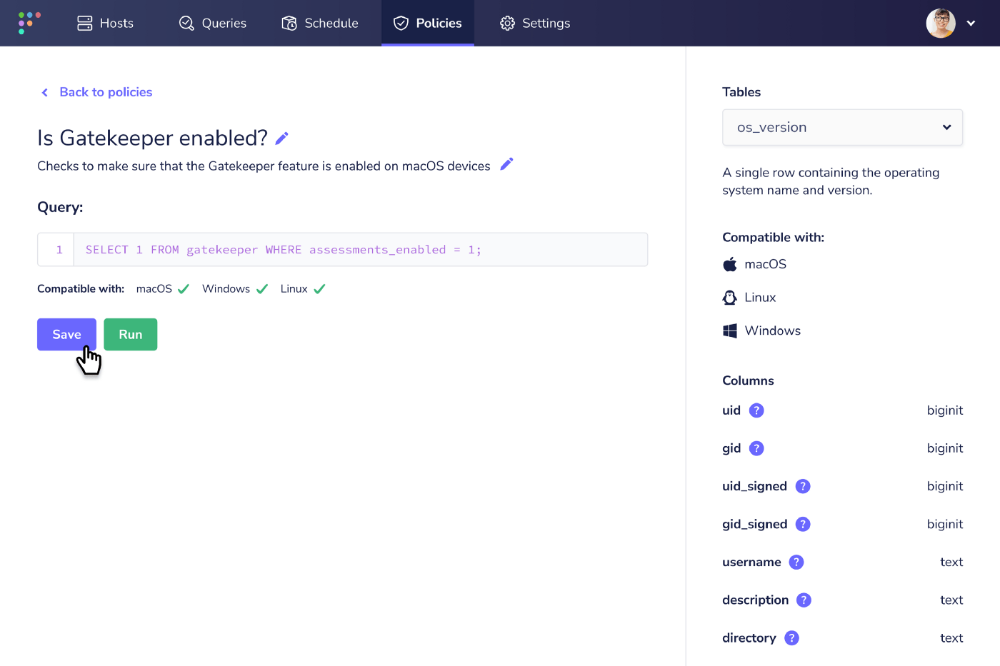
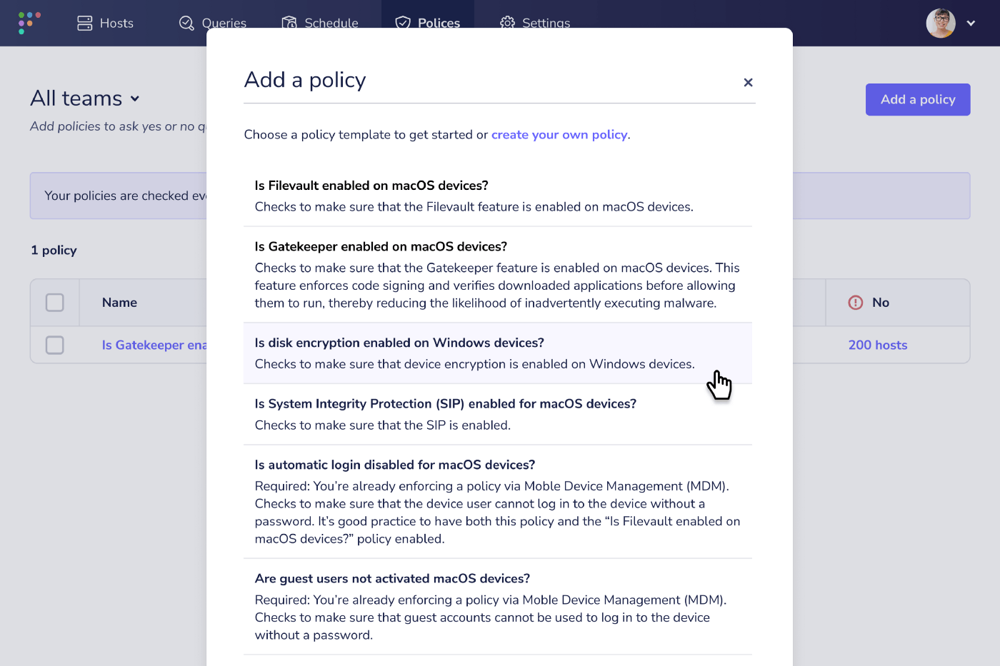

# Does Fleet 4.7.0 bring more power to your osquery compliance policies? Yes.

   <iframe src="https://www.youtube.com/embed/HxBQvlV14Lc?si=VLYS7QxPuP3TLbjG" frameborder="0" allowfullscreen></iframe>

We’ve been working hard this month to improve how policies are handled within Fleet and continue towards our goal of making the power of osquery more easily accessible to our less-technical users — we hear you, knowing what you want to ask your devices is one thing, but creating effective queries with SQL can sometimes = 🤯

So let’s see what’s included in Fleet 4.7.0. As always, visit our [update guide](https://fleetdm.com/docs/using-fleet/updating-fleet) for instructions about how to update.

## Feature highlights:

- Organize and create policies independently of general queries.
- Choose from a library of standard policy templates in Fleet UI.
- See example OS-specific policies from the Host Details page.

### Organize and create policies independently of general queries

**Available in Fleet Free & Fleet Premium**

An effective policy query typically returns a “yes” or “no” answer. As part of our goals to improve the user experience and simplicity of policies within Fleet, we decided to separate policies to be distinct “yes” or “no” questions with names, descriptions, and proprietary queries that are no longer associated with general queries.

### Choose from a library of standard policy templates in Fleet UI

**Available in Fleet Free & Fleet Premium**

Continuing our steps to reduce the barrier of entry to Fleet for our less-technical users, we introduce the first iteration of our standard policy templates that allow users to choose from a library of pre-made policies. Of course, those handy with osquery and SQL can still create custom policies to their heart’s content.

### See example OS-specific policies from the Host Details page

**Available in Fleet Free & Fleet Premium**

Users can now add policies to a device directly from the Host Details page and see an example policy that provides insight into how to construct an effective custom policy for the currently viewed device.

---

## More improvements

We added the ability to run live queries on new and existing policies [#2713](https://github.com/fleetdm/fleet/issues/2713).

We cut out the noise on the “Users” table, on host details, to only summarize users who are NOT members of a group and filter out special/built-in accounts [#2488](https://github.com/fleetdm/fleet/issues/2488)

We added the ability to specify a resolution for hosts that fail a policy [#2227](https://github.com/fleetdm/fleet/issues/2227).

We have turned on vulnerability detection and software inventory by default [#2099](https://github.com/fleetdm/fleet/issues/2099).

We added the ability to see a preview of scheduled query data (logs) in Fleet UI [#2858](https://github.com/fleetdm/fleet/issues/2858).

We have improved the error logs by preempting as many usual questions as possible to help resolve errors faster [#2027](https://github.com/fleetdm/fleet/issues/2027).

We improved the user experience when upgrading Fleet versions by surfacing issues with migrations in a cleaner way [#2368](https://github.com/fleetdm/fleet/issues/2368), [#2463](https://github.com/fleetdm/fleet/issues/2463).

We added a software items counter to the “Software” modal, so users can now determine the number of vulnerable software items that Fleet has detected [#2935](https://github.com/fleetdm/fleet/issues/2935), [#3011](https://github.com/fleetdm/fleet/issues/3011).

We did some housekeeping and removed the now redundant host_expiry event from MySQL [#3184](https://github.com/fleetdm/fleet/issues/3184).

## Ba! Hum-Bugs 👾

We resolved a bug where the software inventory was not displaying for Debian hosts. [#3211](https://github.com/fleetdm/fleet/issues/3211)

We resolved a bug on the live query page that duplicated hosts in the “target specific hosts” field when the browser focus changed [#3064](https://github.com/fleetdm/fleet/issues/3064).

A user reported a 500 error when opening the host details page while using MySQL 8. We’ve fixed this in Fleet 4.7.0. [#3214](https://github.com/fleetdm/fleet/issues/3214).

We fixed another pesky 500 error reported by a user trying to save a team name from the team edit menu [#3031](https://github.com/fleetdm/fleet/issues/3031).

While talking about errors, we improved their visibility in places and added more human-friendly messaging in Fleet 4.7.0. [#3119](https://github.com/fleetdm/fleet/issues/3119).

We fixed up some issues related to permissions where various user roles saw UI elements that they shouldn’t have [#3351](https://github.com/fleetdm/fleet/issues/3351). [#3136](https://github.com/fleetdm/fleet/issues/3136).

Likewise, we fixed up some issues related to permissions where various user roles were NOT seeing UI elements that they should have [#3193](https://github.com/fleetdm/fleet/issues/3193), [#3061](https://github.com/fleetdm/fleet/issues/3061).

We corrected some misbehaving UI elements. [#2996](https://github.com/fleetdm/fleet/issues/2996), [#3150](https://github.com/fleetdm/fleet/issues/3150), [#3154](https://github.com/fleetdm/fleet/issues/3154), [#3282](https://github.com/fleetdm/fleet/issues/3282), [#3292](https://github.com/fleetdm/fleet/issues/3292),[ #3294](https://github.com/fleetdm/fleet/issues/3294), [#3295](https://github.com/fleetdm/fleet/issues/3295), [#3296](https://github.com/fleetdm/fleet/issues/3296), [#3303](https://github.com/fleetdm/fleet/issues/3303), [#3333](https://github.com/fleetdm/fleet/issues/3333).

And we fixed some bugs that were affecting the overall user experience of Fleet UI. [#2958](https://github.com/fleetdm/fleet/issues/2958), [#3003](https://github.com/fleetdm/fleet/issues/3003), [#3118](https://github.com/fleetdm/fleet/issues/3118), [#3157](https://github.com/fleetdm/fleet/issues/3157), [#3196](https://github.com/fleetdm/fleet/issues/3196), [#3197](https://github.com/fleetdm/fleet/issues/3197), [#3237](https://github.com/fleetdm/fleet/issues/3237).

---

## Ready to update?

Visit our [update guide](https://fleetdm.com/docs/using-fleet/updating-fleet) in the Fleet docs for instructions on updating to Fleet 4.7.0.

<meta name="category" value="releases">
<meta name="authorFullName" value="Mike Thomas">
<meta name="authorGitHubUsername" value="mike-j-thomas">
<meta name="publishedOn" value="2021-12-14">
<meta name="articleTitle" value="Does Fleet 4.7.0 bring more power to your osquery compliance policies? Yes.">
<meta name="articleImageUrl" value="../website/assets/images/articles/fleet-4.7.0-cover-1600x900@2x.jpg">
