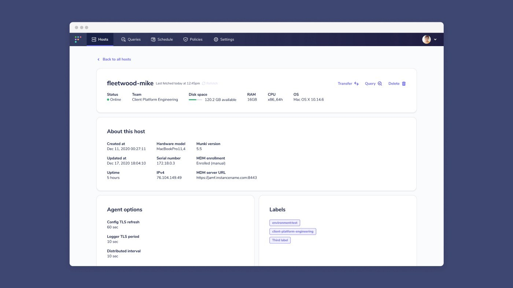

# Looking for policy automations, Google Chrome profile search, and Munki details from your hosts? Upgrade to Fleet 4.8.0

Thank you for all the hard work of our contributors and Fleet team members. Before the year closes, we’re excited to bring yet another update with Fleet 4.8.0!

At Fleet, we aim to help users maintain control of their environments and gain the valuable information necessary to start 2022 in confidence. We’re kicking off the new year with policy automations, enhanced searchability, and a multitude of additional features, bug fixes, and improvements:

As always, you can see what’s included in Fleet 4.8.0. Take a look at our [update guide](https://fleetdm.com/docs/using-fleet/updating-fleet) for instructions about how to update.

## Feature highlights:

The primary features included in Fleet 4.8.0 are the following:

- Specify a webhook URL to send automated policy alerts.
- Munki and mobile device management (MDM) data is now available on the host details page
- Search hosts by Google Chrome profiles

### Specify a webhook URL to send automated policy alerts.

Fleet adds the ability to automate failing host policies with Fleet 4.8.0.
Webhooks are now called “automations” and users can specify a webhook URL to send policy alerts. These alerts include all hosts that answered “No” to a policy so that a user can easily create a support ticket and resolve each host. The webhook request supplies the user with each hosts’ hostname and host details link.

### Munki and mobile device management (MDM) data is now available on the host details page

Users now have the ability to see what Munki version is installed for a macOS host. Additionally, host details also include the MDM enrollment status and MDM server URL for a macOS host. This feature requires the MacAdmins osquery extension which comes conveniently bundled with Fleet’s osquery installers by default.

### Search hosts by Google Chrome profiles

You can now find a user’s workstation by searching for their Google profile in the Fleet UI. This works as long as the user is logged into Google Chrome with their work email. Searching hosts by Google Chrome profiles also requires the [MacAdmins osquery extension](https://github.com/macadmins/osquery-extension).

## Bug fixes:

We fixed an unnecessary warning about data migrations [#3371](https://github.com/fleetdm/fleet/issues/3371).

We resolved an issue where opening the homepage software modal makes a request for all software [#3485](https://github.com/fleetdm/fleet/issues/3485).

Where the generate installer screen may be returning an `undefined` certificate, we’ve provided a fix [#3374](https://github.com/fleetdm/fleet/issues/3374).

We’ve ensured that observers can no longer run a policy by refreshing policy details [#3364](https://github.com/fleetdm/fleet/issues/3364).

We have verified and solved an issue where hosts searches were not behaving as expected [#3461](https://github.com/fleetdm/fleet/issues/3461).

When Using fleetctl preview, the live query result filtering now works as expected [#3201](https://github.com/fleetdm/fleet/issues/3201).

Very specific edge case: “Surprise” loading state when going back from “Online hosts” to “All hosts” in filter dropdown on /hosts/manage [#3290](https://github.com/fleetdm/fleet/issues/3290).

We fixed a couple of issues involving loading states [#3297](https://github.com/fleetdm/fleet/issues/3297), [#3306](https://github.com/fleetdm/fleet/issues/3306), [#3299](https://github.com/fleetdm/fleet/issues/3299), [#3298](https://github.com/fleetdm/fleet/issues/3298).

Corrections have been made to multiple UI elements, and their behaviors [#3407](https://github.com/fleetdm/fleet/issues/3407), [#3321](https://github.com/fleetdm/fleet/issues/3321), [#3326](https://github.com/fleetdm/fleet/issues/3326), [#3349](https://github.com/fleetdm/fleet/issues/3349), [#3433](https://github.com/fleetdm/fleet/issues/3433), [#3062](https://github.com/fleetdm/fleet/issues/3062), [#3265](https://github.com/fleetdm/fleet/issues/3265), [#3365](https://github.com/fleetdm/fleet/issues/3365).

## Ready to update?

Visit our [upgrade guide](https://fleetdm.com/docs/using-fleet/updating-fleet) in the Fleet docs for instructions on updating to Fleet 4.8.0.

<meta name="category" value="releases">
<meta name="authorFullName" value="Drew Baker">
<meta name="authorGitHubUsername" value="Drew-P-drawers">
<meta name="publishedOn" value="2021-12-31">
<meta name="articleTitle" value="Looking for policy automations, Google Chrome profile search, and Munki details from your hosts? Upgrade to Fleet 4.8.0">
<meta name="articleImageUrl" value="../website/assets/images/articles/fleet-4.8.0-cover-1600x900@2x.jpg">
