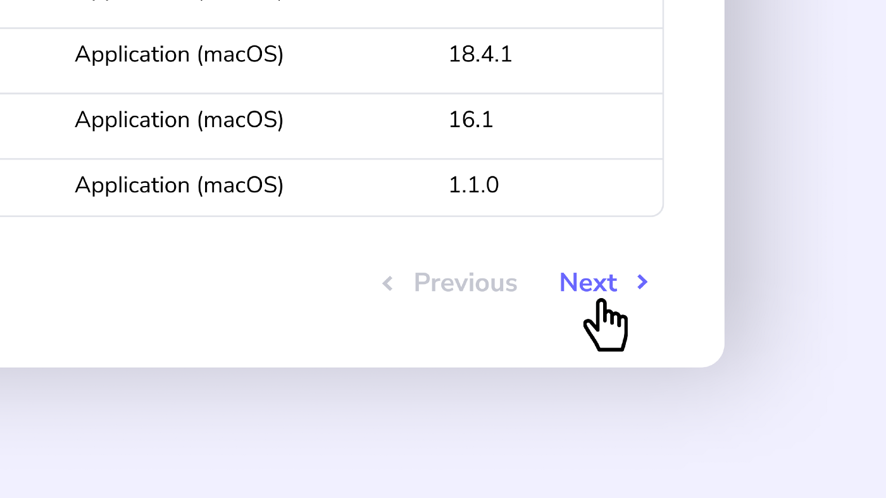
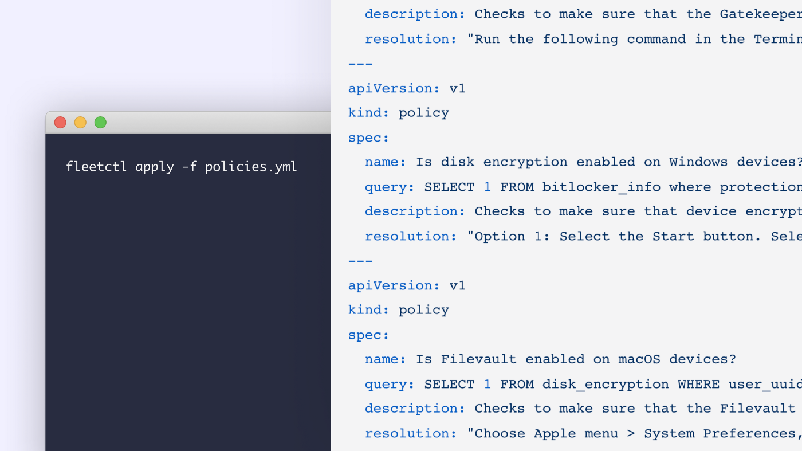

# Fleet 4.9.0 brings performance updates, paginated live query results, and policy YAML doc support.

Happy new year. We’re pleased to announce our first release of 2022 and to start the year off on the right foot, we went big with under-the-hood performance improvements in Fleet 4.9.0. Check out the full [changelog](https://github.com/fleetdm/fleet/releases/tag/fleet-v4.9.0) or read on for a summary of what’s new.

For update instructions, see our [upgrade guide](https://fleetdm.com/docs/using-fleet/updating-fleet) in the Fleet docs.

## Feature highlights

- We made many performance improvements, including improvements to loading states and latency in the UI and performance improvements of the MySQL database.
- Paginated live query results so the Fleet UI can handle 1,000+ results.
- We added support for applying a policy YAML document.

### Paginated live query results

Users can now navigate through thousands of results from live queries with ease. It’s a small but valuable UI change.

### Added support for a policy YAML document

We added support for applying a policy YAML document so users can take advantage of GitOps for their organization’s policies.

The `policy` YAML document allows users to specify the `name`, `query`, `description` , and `resolution` for each policy. Users can then run `fleetctl apply` to add these policies to Fleet.

### Performance improvements

As mentioned above, performance improvements were a theme for this release. As part of that we:

- Refactored async host processing to avoid Redis SCAN keys.
- Identified Datastore APIs that load unnecessary data for osquery hosts.
- Audited DB relationships and removed as many cleanups as possible.
- Removed Badger DB in Orbit, which was unused and sometimes troublesome for Windows users.
- Made sure that unit tests passed with the MySQL:8 docker image and added a new GitHub action to test with MySQL:8 on each PR.
- Made osquery logs pluggable for Windows users. We added a configuration option for writing logs to a file and ensured appropriate log rotation for any logs written directly to the filesystem.
- Made some improvements to determine the [jitter](https://www.youtube.com/watch?v=pIgZ7gMze7A) per host.
- Improved the frontend handling of non-JSON error responses.
- Evaluated and corrected all page-level components for unnecessary state reassertions.
- Improved the loading state of the Manage policies page to better handle load tests with a high volume of hosts.
- Improved empty state messaging on the Hosts page.
- Went pixel peeping and improved paddings, spacings, and alignments of various elements throughout Fleet UI.
- Improved consistency throughout the frontend codebase.
- Fleet UI now detects the correct compatibility for the “Detect active processes with Log4j running” query.
- Browser extensions are working as expected in software inventory.
- Requesting a query or policy ID that does not exist now returns the expected 404 response rather than a 500 error.
- Starting a Linux container in `fleetctl preview` now builds successfully when running `fleetctl.exe preview — orbit-channel edge`.
- Team Observers will be pleased to know that they will no longer receive a 403 response when retrieving a list of global policies.
- Live query result filtering in `fleetctl preview` is now working as expected.
- A user reported that `numLabels` in the anonymous usage statistics were not reporting correctly for them — this is fixed now.
- We fixed an issue where some Fleet UI pages made multiple requests to the same endpoints on page load.

## Ready to update?

Visit our [upgrade guide](https://fleetdm.com/docs/using-fleet/updating-fleet) in the Fleet docs for instructions on updating to Fleet 4.9.0.

<meta name="category" value="releases">
<meta name="authorFullName" value="Mike Thomas">
<meta name="authorGitHubUsername" value="mike-j-thomas">
<meta name="publishedOn" value="2022-01-24">
<meta name="articleTitle" value="Fleet 4.9.0 brings performance updates, paginated live query results, and policy YAML doc support.">
<meta name="articleImageUrl" value="../website/assets/images/articles/fleet-4.9.0-cover-1600x900@2x.jpg">