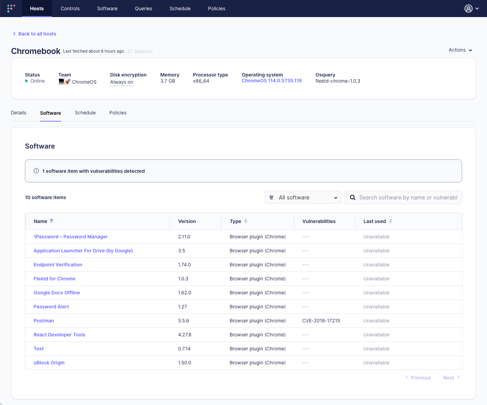

# Fleet enhances device management with ChromeOS support 

With every release, we strive to deliver on Fleet's promise to enable real-time insights and GitOps-driven management across all your devices. Today, we are thrilled to announce that we've expanded Fleet's support to include Google's ChromeOS. This new addition aligns with Fleet's lightweight, open-core, cross-platform ethos and reaffirms our commitment to support all major operating systems, including Mac, Windows, Linux, and now ChromeOS.

## Unleashing the fleetd Chrome extension

Fleet's new offering comes in the form of the [Fleetd Chrome extension](https://fleetdm.com/docs/using-fleet/chromeos). This powerful tool is a substitute for osquery on ChromeOS, offering a specialized approach to device management for this unique operating system. To get started, install the Fleetd Chrome extension on your ChromeOS devices and embark on a journey of enhanced real-time device management.

## See it in Action

## Important feature note: scheduled queries

As we launch this new integration, it is important to note that scheduled queries are not currently available for ChromeOS. This feature may be missed by some users, but we are confident that the additional functionality offered by the Fleetd Chrome extension will prove invaluable for ChromeOS device management.

## Enterprise policy for full access

To ensure you gain full access to your host's data, it's crucial that the Fleetd Chrome extension is force-installed by enterprise policy. This approach ensures that IT administrators can comprehensively manage and analyze data across all devices, and it reaffirms Fleet's commitment to robust IT security by maintaining stringent access controls.

We understand that the path to perfection involves continual refinement. We plan to add more tables in future updates to increase the depth and breadth of data you can access from ChromeOS devices. Your feedback will be instrumental in these updates, and we look forward to hearing your suggestions and requirements.

## Why ChromeBooks, ChromeOS, and ChromeOS Flex?

We’ve been listening to customers' comments, and many have asked for better insight into their Chromebooks. Chromebooks offer a unique edge for businesses given their exceptional security, low cost, ease of use, cloud-based nature, and easy manageability. Chromebooks' affinity for increased productivity, improved collaboration, and reduced IT costs makes them a compelling choice for businesses. And even when Chromebooks aren’t available ChromeOS Flex allows businesses to install ChromeOS on any old x64 machine allowing you to modernize devices you already own. With the Fleetd Chrome extension, managing these devices becomes even easier and more streamlined, empowering IT administrators to harness the full potential of ChromeOS.

## Mac, Windows, and ChromeOS. What’s next?

With this expanded support for ChromeOS, Fleet has once again demonstrated its commitment to broadening device management capabilities and adapting to the evolving needs of IT security and administration. We urge all ChromeOS users to try the new Fleetd Chrome extension with Fleet and experience a novel way of managing devices. 

We'd like to extend our gratitude to Fleet's dedicated community and users who inspire us to continually push the boundaries of what's possible in device management. As we continue to explore new frontiers, we look forward to your continued support and feedback. Stay tuned for more exciting updates from the world of Fleet!

<meta name="category" value="announcements">
<meta name="authorGitHubUsername" value="spokanemac">
<meta name="authorFullName" value="JD Strong">
<meta name="publishedOn" value="2023-06-13">
<meta name="articleTitle" value="Fleet enhances device management with ChromeOS support">
<meta name="articleImageUrl" value="../website/assets/images/articles/fleet-adds-support-for-chrome-os-1600x900@2x.png">
<meta name="description" value="We're thrilled to announce that Fleet has expanded support to include ChromeOS and ChromeOS Flex!">