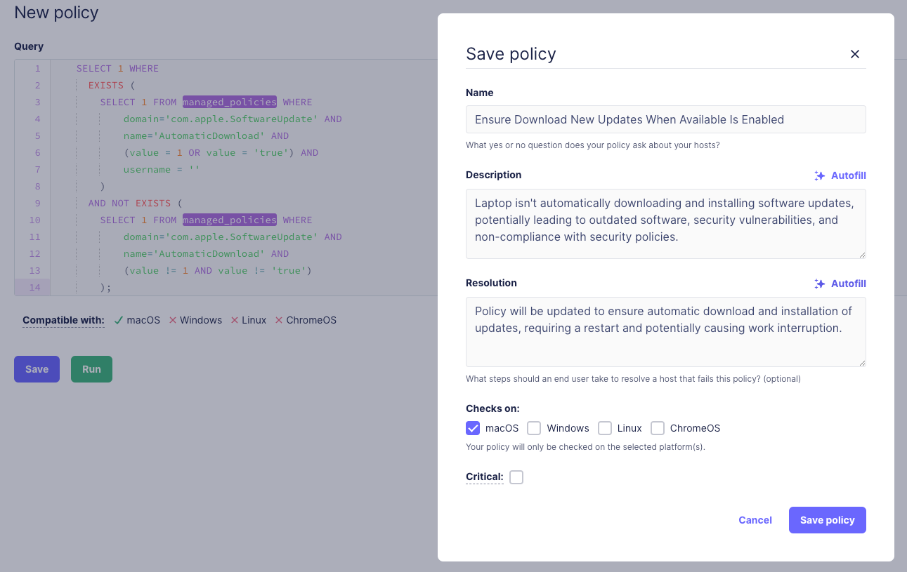

# Fleet’s AI-assisted policy descriptions and resolutions

## Embracing clarity and efficiency with AI

Clarity and efficiency are not just goals but necessities for maintaining robust security standards. Fleet understands this imperative, and we are changing the way IT and security admins enforce and communicate compliance policies. With our latest AI-assisted features, Fleet is not just automating policy management but transforming it into an intuitive, interactive process that enhances understanding and compliance across all user levels.

By leveraging advanced AI technologies, Fleet enables users to easily monitor and ensure compliance through clear, accessible policy descriptions and actionable resolutions. This feature ensures that every device adheres to security standards with minimal user intervention and maximum transparency. Whether you're managing a small team or an enterprise-scale network, our AI tools are designed to simplify your workflows and secure your systems effectively.

## Overview of the Policies feature

Fleet allows its users to monitor and ensure compliance through policies. Policies allow users to leverage their osquery results to evaluate whether devices meet security standards and best practices with distinct yes or no responses. These policies regularly assess devices by monitoring compliance goals, identifying vulnerabilities or misconfigurations, and pinpointing out-of-policy user activity. 

## AI-assisted policy descriptions and resolutions

At Fleet, we understand that transparency isn’t just a buzzword—it's a crucial part of your daily operations. That's why we're excited to introduce a new level of support for IT and security admins: AI-assisted policy descriptions and resolutions. Imagine you’re setting up a new policy. Instead of starting from scratch, our AI steps in to draft a clear, concise user-facing policy description and a straightforward resolution path by analyzing even the most complex SQL. It’s like having an expert by your side, ensuring you communicate effectively with every user about what needs to be done and why. And if something doesn’t sound quite right? You have full control to tweak the policy language, ensuring every word aligns with your specific needs and context.

_Using the AI autofill feature to create a new policy in Fleet. May 2024._

## Built with the end user in mind

Imagine this: one of your devices triggers a policy. Instead of a flood of technical jargon that leaves you scratching your head, what you get is a clear, concise explanation—'Here's what's wrong, and here’s how we fix it.' It’s like having a knowledgeable friend guide you through fixing a complex gadget.

How does this help admins when a device is failing a policy? An end user can view a policy’s description and resolution two ways: using Fleet Desktop or during an automated maintenance window scheduled in their calendar. We ensured our AI-assisted policy descriptions and resolutions are readable by the end user.

First, using [Fleet Desktop](https://fleetdm.com/docs/using-fleet/fleet-desktop) an end user can see their scheduled policies and read more details on their description and resolution. 

_The end-user view of a policy’s description and resolution using Fleet Desktop. May 2024._

Also, the end user can read about a policy during an [automated maintenance window scheduled in their calendar](https://fleetdm.com/announcements/fleet-in-your-calendar-introducing-maintenance-windows). With this Premium feature, a Fleet admin can schedule calendar automations on individual policies to set updates and maintenance windows for managed devices that are not compliant with a policy. When a policy fails with calendar automations enabled, a Google calendar event will be set for the end user of the failing device. A Fleet admin can preview the description and resolution populated in the event as answers to “Why it matters” and “What we’ll do,” respectively. We ensured our AI-generated text answers those two important questions.

_A preview of a failing policy’s calendar event uses a description and resolution written with AI assistance. May 2024._

## Fleet’s future uses of AI

Fleet's journey with AI is just beginning. Imagine a day when AI doesn't just help you write policies but also anticipates security needs, suggesting custom queries and solutions before issues arise. We’re exploring exciting possibilities, such as AI analysis of SQL to create scheduled queries and SQL-based labels. Beyond that, we're looking at how AI can delve into MDM profiles, scripts, and other code-based configurations, offering insights and remediations tailored to your environment.

We're looking forward to bringing you these potential advancements. Do you have an idea of what you’d like to see next? We’re all ears—your [feedback](https://fleetdm.com/support) shapes our roadmap.

<meta name="articleTitle" value="Fleet’s AI-assisted policy descriptions and resolutions">
<meta name="authorFullName" value="Rachel Perkins">
<meta name="authorGitHubUsername" value="rachelelysia">
<meta name="category" value="guides">
<meta name="publishedOn" value="2024-05-20">
<meta name="articleImageUrl" value="../website/assets/images/articles/fleet-ai-assisted-policy-descriptions-and-resolutions-1600x900@2x.png">
<meta name="description" value="AI guides our way, Policies clear, secure paths, Compliance shines bright.">
