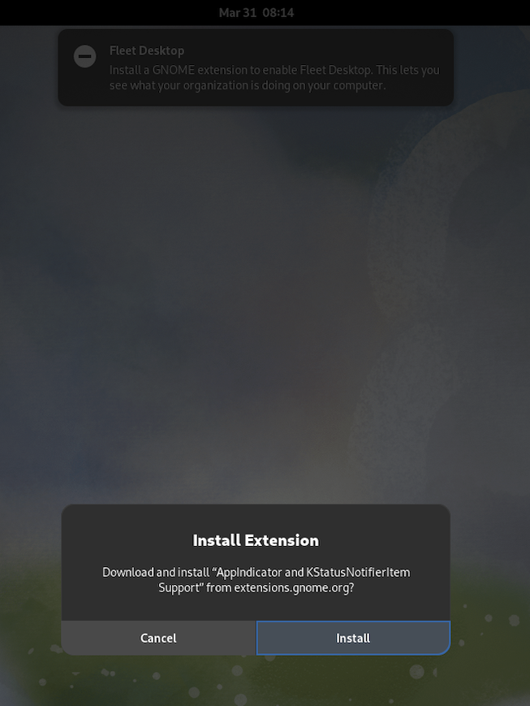
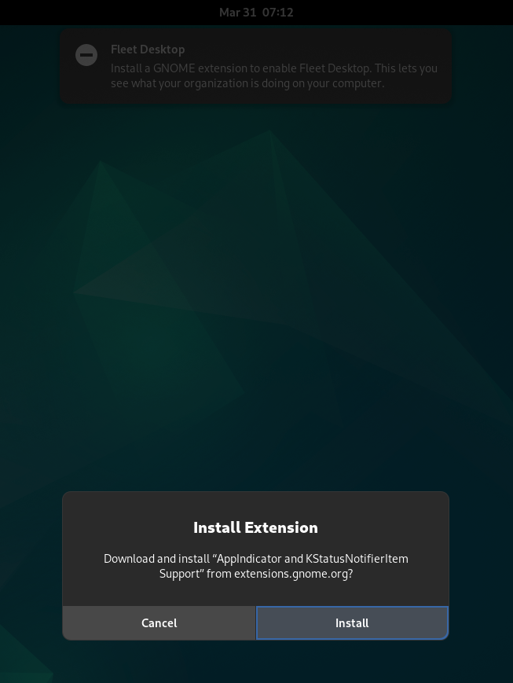

# Enabling Fleet Desktop on Fedora and Debian

[Fleet Desktop](https://fleetdm.com/guides/fleet-desktop) is a menu bar icon available on macOS, Windows, and Linux that gives your end users visibility into the security posture of their machine.

Fedora and Debian do not support tray icons by default and rely on the [appindicator-support](https://extensions.gnome.org/extension/615/appindicator-support/) GNOME extension for enabling tray icons. GNOME extensions prompt the end user to accept the installation.

This article aims to explain how admins can enable Fleet Desktop on such Linux distributions by using policy queries paired with script execution.

## Policy and script execution

The policy query defined in [check-fleet-desktop-extension-fedora-debian.yml](https://github.com/fleetdm/fleet/blob/main/it-and-security/lib/linux/policies/check-fleet-desktop-extension-fedora-debian.yml) (from our Dogfood environment) checks if the extension needed for Fleet Desktop is installed and enabled on Fedora and Debian hosts.
> NOTE: fleetd 1.41.0 is required (the policy query relies on a table added to that version).

Starting in version v4.58.0, Fleet supports running scripts to remediate failing policies (see the [Automatically run scripts](./policy-automation-run-script.md) article for more information). Admins can therefore configure Fleet to run [install-fleet-desktop-required-extension.sh](https://github.com/fleetdm/fleet/blob/main/it-and-security/lib/linux/scripts/install-fleet-desktop-required-extension.sh) on devices where the policy detects the extension is missing ([check-fleet-desktop-extension-fedora-debian.yml](https://github.com/fleetdm/fleet/blob/main/it-and-security/lib/linux/policies/check-fleet-desktop-extension-fedora-debian.yml) contains both the policy and remediation script).

### End-user experience

Following are screenshots of the end-user experience when Fleet runs the script to install the extension (GNOME requires a prompt for installation of extensions for security purposes).

  
   

> If the end-user hits `Cancel` instead of `Install` then the extension won't be installed and the policy will continue to fail on the host. Fleet only deploys the script on the first failure of the policy, so the end-user won't be prompted again and again, just once. Admins can still run the script on such hosts manually.

### Tray icon

After the extension is installed your users will see the Fleet icon on their menu bar:

  
   

<meta name="authorGitHubUsername" value="lucasmrod">
<meta name="authorFullName" value="Lucas Rodriguez">
<meta name="publishedOn" value="2025-04-01">
<meta name="articleTitle" value="Enabling Fleet Desktop on Fedora and Debian">
<meta name="category" value="guides">
