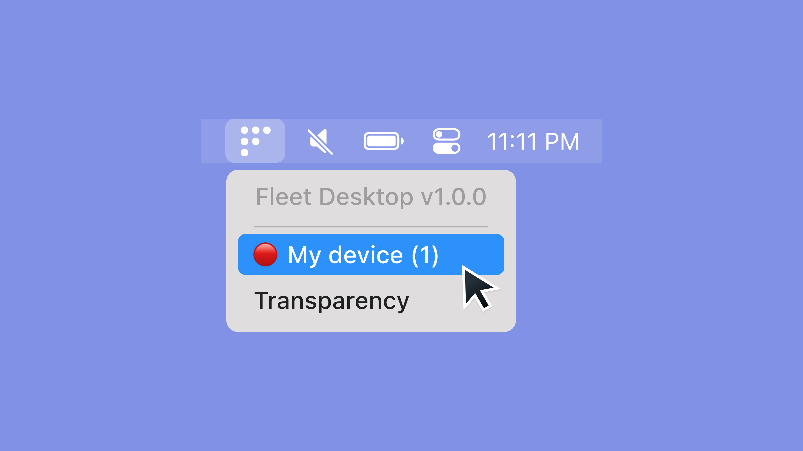

# Fleet Desktop says “Hello, world!”

We are thrilled to announce that Fleet Desktop is out of Beta! Over the past few months, we’ve dogfooded Fleet Desktop internally and validated its usability and scalability. It is now ready for production deployment across your host fleet.

## What is Fleet Desktop?

Fleet Desktop is a menubar icon available on macOS, Windows, and Linux. At its core, Fleet Desktop gives your end users visibility into the security posture of their machine. This unlocks two key benefits:

### Self remediation

When Fleet finds a host is out of compliance with one or more policies configured in Fleet, Fleet Desktop will display the red error icon and list the number of failing policies, as seen in the screenshot above.

When users click on “My device,” they will be shown which policies are failing and steps for resolving the policy failures.

By exposing this information, your end users are informed and empowered to self-remediate security issues without requiring time and attention from your IT or security team.

	<iframe class="video" style="position: absolute; top: 0; left: 0; width: 100%; height: 100%; border: 0;" src="https://www.youtube.com/embed/hik4YnCLU58" allowfullscreen></iframe>

### Scope transparency

A frequent question from end users is a half-joking half-concerned, “so you can see everything I do, right?” With our scope transparency feature, we clear up that ambiguity and tension between end users and IT teams.

When a Fleet Desktop user clicks “Transparency,” they will be taken to [https://fleetdm.com/transparency](https://fleetdm.com/transparency). 
This page explains what Fleet and osquery can and cannot see on their computers. We also link to an article on dos and don’ts for a work computer. 
Fleet Premium users can point this link to an internal resource to customize the content for their organization’s situation.

## Deploying Fleet Desktop
To install Fleet Desktop on your end users' machines, you will need to [generate a new osquery insaller](https://fleetdm.com/docs/using-fleet/adding-hosts#fleet-desktop) and run it on end users’ machines.

Once installed, Fleet Desktop’s versioning is thereafter managed by our agent manager, Orbit.

## Wrapping up
Over the past few months, we’ve been dogfooding Fleet Desktop internally. We think your end users will appreciate the information about the security posture of their device and feel empowered 
to self-remediate any outstanding security issues. Your IT and security team will appreciate the results.

<meta name="category" value="announcements">
<meta name="authorGitHubUsername" value="zhumo">
<meta name="authorFullName" value="Mo Zhu">
<meta name="publishedOn" value="2022-08-02">
<meta name="articleTitle" value="Fleet Desktop says “Hello, world!”">
<meta name="articleImageUrl" value="../website/assets/images/articles/fleet-desktop-says-hello-world-cover-1600x900@2x.jpg">
