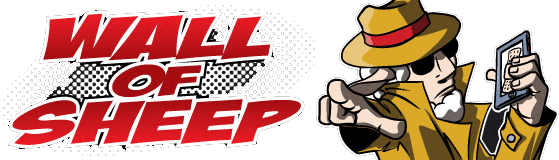

# Fleet takes on Vegas: Exploring cybersecurity's future at Black Hat, B-Sides, and DEF CON 31 

Fleet is participating in Black Hat, Security B-Sides, and DEF CON 31 this year in Las Vegas, with representation by two of our key team members: Marcos Oviedo and Zach Wasserman.

Marcos, a Senior Software Engineer at Fleet, will join Zach, Fleet's Co-founder, to present a discussion at Black Hat on "Windows Agentless C2: (Ab)using the MDM Client Stack." The talk will explore the potential of an agentless Command and Control (C2) system using the Mobile Device Management (MDM) client stack in Windows. This new approach aims to sidestep the traditional challenges associated with agent-based C2 systems, including detection, persistence, and maintenance.

Zach will also deliver a talk at Security B-Sides Las Vegas titled "Open Source GitOps for Detection Engineering." The discussion will introduce an open-source GitOps framework for managing detection rules and policies. By utilizing Git as a source of truth, this framework can provide a more effective and transparent method for managing detection infrastructures.

Finally, Fleet will sponsor a _whimsical_ Workshop at the "Wall of Sheep" Packet-Hacking Village during DEF CON. The workshop will take participants through the use of Fleet and osquery to do deep inspections of machines. It aims to educate participants on how to spot vulnerabilities, find active processes, discover environmental variables, and inspect user activity and installed software remotely. Also, anyone who successfully finds all of our easter eggs will win a very nice piece of swag ♥️. 

### Black Hat USA 2023: Windows Agentless C2

During the renowned [Black Hat USA 2023 conference](https://www.blackhat.com/us-23/), August 5-10, 2023, Marcos and Zach will share their expertise in a thought-provoking presentation titled "[Windows Agentless C2: (Ab)using the MDM Client Stack](https://www.blackhat.com/us-23/briefings/schedule/#windows-agentless-c-abusing-the-mdm-client-stack-32549)" on Wednesday, August 9, 2023 at 1:30 pm.

The focus of their presentation will be a new approach to Command and Control (C2) systems, a critical component of advanced cyber-attacks. Traditional C2 systems rely on an "agent" on the compromised machine to communicate with the attacker's server. While effective, these agent-based systems are often detected by modern protection and detection solutions, require complex mechanisms to ensure persistence and necessitate continuous updates to bypass advanced security measures.

Marcos and Zach will introduce a novel concept: an agentless C2 system. The idea leverages the MDM client stack within the Windows operating system, eliminating the need for a separate agent on the target machine. Their presentation will include an exploration of Windows MDM technology and the protocols used by the MDM server. Additionally, they will provide a proof-of-concept demonstration of an agentless C2 system and discuss how security professionals can detect and protect against such an attack.

By sharing this approach, they aim to provide a valuable resource for offensive security researchers, who can consider this method in their work, and defensive security practitioners, who can use this knowledge to safeguard their environments.

### Security B-Sides: Open Source GitOps for Detection Engineering

Zach Wasserman will also be providing a talk on Wednesday, August 9, 2023, at 11:30 am at the [Security B-Sides conference](https://bsideslv.org/) held August 8-9, 2023. The topic, "[Open Source GitOps for Detection Engineering](https://bsideslv.org/talks#WHWYJD)," is an important one, as it addresses the challenges faced by security teams in managing their detection rules and policies.

GitOps is a method of managing infrastructure and applications through configuration files kept in Git, a version-control system. This technique allows version control of entire detection infrastructures, including rules, alerts, and remediation workflows.

In his talk, Zach will introduce an open-source GitOps framework. This framework provides several advantages for detection engineering. It facilitates collaboration among security teams and helps manage detection infrastructure more effectively. It ensures transparency and auditability by tracking changes to the detection infrastructure over time. Furthermore, it enables automated deployment of detection rules and policies, reducing the risk of human error and speeding up response times.

Zach will also provide live demonstrations and configuration samples. These will show how to implement the GitOps framework with tools like osquery, Fleet, and Matano. Through this presentation, attendees can expect to gain a better understanding of how to apply GitOps principles to their detection engineering efforts.

### DEF CON 31: Fleet's Wall of Sheep workshop

DEF CON 31, one of the most renowned hacking conferences in the world, is August 10-13, 2023. Fleet is excited to sponsor a workshop at the "Wall of Sheep" Packet-Hacking Village.

Fleet's workshop is designed to provide a hands-on experience for attendees who want to enhance their knowledge of machine queries and vulnerabilities. Participants will adopt the role of Jules Morse, the Workshop's protagonist, and delve into the intricacies of machine analysis.

Specifically, participants will learn how to use Fleet and osquery, two powerful tools that provide insights into the status and activities of remote machines. They'll also learn how to identify and handle vulnerabilities, how to trace active processes on machines by user, how to uncover environmental variables on remote machines, how to inspect user activity remotely, and how to review installed software remotely.

These skills will be particularly beneficial for attendees who work in cybersecurity or information technology, offering practical techniques to understand, manage, and secure their machine environment effectively. This knowledge is not only applicable in detecting and responding to security threats but also useful for routine IT operations and troubleshooting.

The workshop is an opportunity to learn and practice these skills in a controlled and supportive environment. Attendees can expect to leave the Workshop with an increased understanding of Fleet and osquery and the confidence to apply their new skills in their professional environment.

## Fleet’s commitment to cybersecurity

Fleet's participation in these events underpins our commitment to the continuous advancement of the cybersecurity field and the security community at large. By showcasing novel concepts, techniques, and open-source tools, we strive to make a substantive impact on both the broader cybersecurity industry and the specific professionals we interact with.

Fleet is committed to staying on the leading edge of cybersecurity trends and advancements. We will continue to provide open-source tools, engage with the wider cybersecurity community, and contribute to the collective effort to secure our digital world. See you in Vegas!

<meta name="category" value="announcements">
<meta name="authorGitHubUsername" value="spokanemac">
<meta name="authorFullName" value="JD Strong">
<meta name="publishedOn" value="2023-08-02">
<meta name="articleTitle" value="Fleet takes on Vegas: Exploring cybersecurity's future at Black Hat, B-Sides, and DEF CON 31">
<meta name="articleImageUrl" value="../website/assets/images/articles/fleet-in-vegas-2023@2x.jpg">
<meta name="description" value="Explore cybersecurity's cutting edge with Fleet at three top-tier conferences - Black Hat, Security B-Sides, and DEF CON.">
