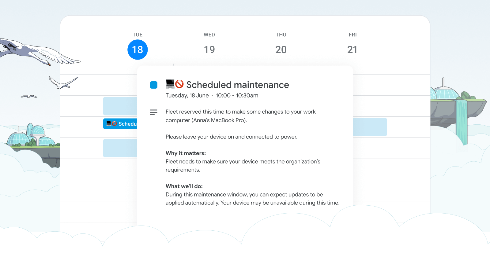

# Fleet in your calendar: introducing maintenance windows 

> Unlike other Fleet features which take advantage of declarative device management (DDM), the approach described in this article still uses traditional MDM commands.  (More to come.)

Fleet is excited to announce the release of "maintenance windows", a new feature in Fleet v4.48 that helps coordinate necessary actions with your users at times that disrupt them the least. Now, just like any good colleague, when Fleet needs some of your time, it puts it on your calendar. This approach avoids interrupting your users' key activities or important meetings, whether in the office, on the road, or working remotely.

	<iframe src="https://www.youtube.com/embed/nhufmzGUeNk?si=hZFMob6WR0bc3Y_A" title="YouTube video player" frameborder="0" allow="accelerometer; autoplay; clipboard-write; encrypted-media; gyroscope; picture-in-picture" allowfullscreen></iframe>

_Maintenance windows_ is designed to enhance your workday by scheduling necessary actions when they are least likely to interrupt important tasks. By analyzing your users' calendars, Fleet identifies optimal times for these actions—times when their devices are not in use. This could be during a lunch break, before the start of the workday, or during other low-activity periods, ensuring that your users' focus on critical tasks remains uninterrupted.

Fleet provides AI-generated explanations directly in the calendar events, detailing why the actions are necessary and what changes to expect. This level of transparency helps demystify the process, providing clarity and fostering trust between administrators and end-users.

## _Maintenance windows_ include:

* **Personalized scheduling:** Actions are timed based on individual calendar events, so interventions happen when they are least intrusive.
* **Rescheduling flexibility:** If a scheduled maintenance window becomes impractical for any reason, users have the option to manually move it to a more suitable time. We suggest rescheduling within one week to ensure timely completion of necessary actions.
* **Enhanced coordination:** With auto-scheduled maintenance windows, you can coordinate remote actions or request user actions at times that work best for them, improving the overall experience and compliance.

_Maintenance windows_ is a direct response to common challenges faced in workplace productivity, particularly unplanned disruptions from necessary IT actions. Whether you need to run a remote action or require users to take specific steps, maintenance windows help coordinate these activities at optimal times. Fleet aims to support smoother, more efficient work environments by incorporating user feedback and addressing these long-standing issues.

We are excited for you to experience the benefits of _Maintenance windows_. We look forward to supporting your organization in achieving a balance between strong security practices and high productivity.

<meta name="category" value="announcements">
<meta name="authorFullName" value="JD Strong">
<meta name="authorGitHubUsername" value="spokanemac">
<meta name="publishedOn" value="2025-05-14">
<meta name="articleTitle" value="Fleet in your calendar: introducing maintenance windows">
<meta name="articleImageUrl" value="../website/assets/images/articles/fleet-in-your-calendar-introducing-maintenance-windows-cover-900x450@2x.png">
<meta name="description" value="Like any good colleague, when Fleet needs some of your users' time, it puts it on their calendar.">
