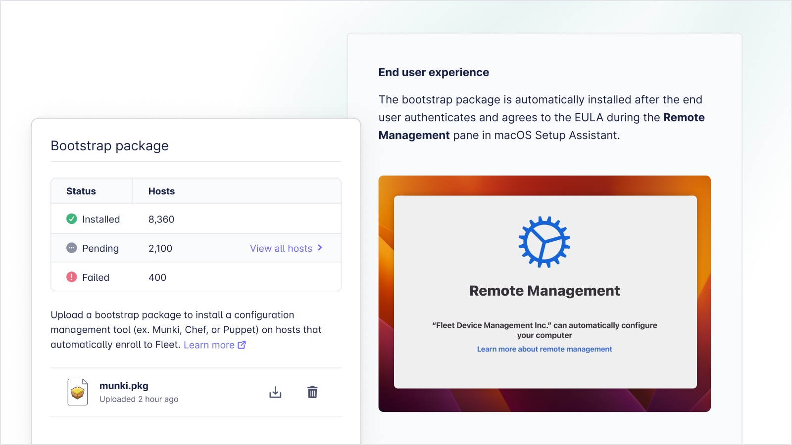

We couldn’t be more excited to announce that as of today, Fleet has enabled MDM features in the latest release of Fleet as a public beta broadly available to everyone. As organizations increasingly rely on multiple devices running on different platforms, managing them all can be a daunting task. This is where mobile device management (MDM) comes in, providing centralized management and control of all devices from a single interface. We are excited to announce that Fleet is now an MDM. Fleet is the first cross-platform GitOps-enabled MDM solution that works seamlessly across macOS, Windows, and Linux powered by osquery. With comprehensive security and monitoring capabilities, Fleet makes device management simple, efficient, and secure. In this blog post, we'll explore the benefits and key features of Fleet and how it compares to other MDM solutions.

## Is there really a need for another MDM?
 
Before we set out to create Fleet, we sat down with leaders from some of the biggest and most innovative companies on the planet. Companies like GitLab, Atlassian, Uber, and Facebook. Across the board, they told us about their need to build a more customizable MDM solution for their ever-expanding organization. They needed:
- More control over how profiles got changed
- More visibility cross-functionally from Security to IT teams
- Less ramp time for new team members to onboard to the tooling
- Better APIs for building custom workflows and dashboards

Unfortunately, the only options out there were legacy MDMs like Intune and Jamf. Those MDMs require extensive training and are complicated to tweak or automate. Open-source MDM options were too bare-bones and unsupported. We heard from many Admins that osquery would be a great backbone to an MDM, so we set out to build it. We know that MDM is complicated, so we dedicated the last 3 years to perfecting the underlying platform of Fleet before turning on the necessary features of MDM. Fleet has run across millions of business-critical hardware and has now become integral to how organizations monitor servers and computers. We are thrilled to open Fleet up to the public now and let even more organizations harness the power of a programmable open-source MDM.  
## Osquery and MDM?

Device management is no longer enough. Today’s organizations need their technology to be secure online, offline, and powered off in their carry bag. Zero-day threats affect organizations everywhere and need to resolve quickly and as transparently as possible.

Imagine a world where a software application has a zero-day threat to your organization. You create an osquery policy to discover in real-time which computers are affected. From your query, you trigger remediation through your chosen configuration manager, and within the hour, your organization is once again secure. 

System administrators experience this scenario of having a gut feeling that their computers are at risk quite often but lack the tools to immediately verify that gut feeling. With Fleet Device Management, the power of osquery to investigate your computers in real-time is at your fingertips. A query combined with your GitOps workflow allows you to resolve issues quickly and with minimal impact on your organization.

The MDM framework is a foundation for managing endpoints. The marriage of MDM, osquery, and your favorite configuration management tool: Puppet, Chef, Saltstack, or Munki, work seamlessly to help you remediate all of your compliance policies in Fleet.

## What is MDM?

Mobile device management, or MDM, is a framework. A set of APIs (Application Programmer Interfaces) that allow Fleet to communicate in a secure fashion with computer endpoints to configure them with profiles. Profiles, essentially XML payloads, can be used to enforce encryption of the computer storage (solid-state drive), configure VPN settings, and enforce other settings important to your organization. API commands enable authentication through an identity provider (IDP) and remotely lock or wipe a device.

Organizations can deploy configuration profiles, settings, and policies aligned with their organization's requirements using MDM, and in the instance of Fleet, they can verify the MDMs actions in real-time with osquery. From ensuring storage is encrypted to installing the latest operating system update, Fleet ensures your organization's data and computers are secure worldwide. If a computer is lost, remote locking and optionally wiping is a click away.

## GitOps workflow

Fleet brings the GitOps workflow to your organization’s configuration profiles with a full API and scriptable command line interface (CLI). GitOps is a modern approach to Continuous Deployment (CD) that uses Git as the single source of truth for declarative infrastructure and application configurations and MDM configuration profiles.

## Programmability and automation make for a better user experience

Fleet’s GitOps-first workflow helps reduce the operating costs of the IT department and ensures only the right people are pushing changes organization-wide. At the heart of Fleet is osquery, empowering your engineering, security, and IT teams with the ability to manage, monitor, and identify threats on your computers. Save time by scheduling queries such as a routine vulnerability scan, sending data to your log destination automatically, and kicking off automation for alerting, escalation, and remediation, allowing tasks to become repeatable and reducing rework. Our API and CLI provide the flexibility to program Fleet as you see fit.

Fleet’s automated device enrollment integrates with leading configuration management platforms, including Chef, Munki, and Puppet, allowing for efficiency in your management workflows. From disk encryption with recovery key escrow to configuration profiles for any variety of computer settings, Fleet allows for complete curation of the new device onboarding experience.

IT and security teams will rejoice with Fleet’s integrated OS update reminders. Save time by allowing Fleet to remind and encourage users to upgrade their computers to remain compliant with the organization’s requirements. Setup is an simple as setting a minimum OS version and deadline in Fleet. As the deadline approaches, the reminders become more persistent, encouraging users to update. If a user is past the deadline, Fleet shows a window to update, and the user cannot close the window until they update.

## Transparency: user-first model

Fleet believes in transparency. Not only should users know what is being monitored on their computers, but they should also be able to see how. How they are monitored is visible to everyone because Fleet software and osquery are open-source. Fleet software does not have access to keystrokes, mouse movements, email and text messages, webcams, microphones, and screen content. Fleet software can see user accounts, computer health and performance, installed software, running processes, security configurations, connected hardware, location, and contents of files.

## In summary

Fleet is a cross-platform mobile device management (MDM) solution that uses osquery to provide centralized management and control of all devices from a single interface. With comprehensive security and monitoring capabilities, Fleet makes device management simple, efficient, and secure. Fleet provides a GitOps workflow that helps reduce the operating costs of the IT department, and its automated device enrollment integrates with leading configuration management platforms, allowing for efficiency in management workflows. Fleet’s transparent approach to monitoring ensures users are aware of what is being monitored on their computers. Compared to other MDM solutions, Fleet provides real-time security and monitoring capabilities that help organizations remediate compliance policies quickly and with minimal impact. Overall, Fleet offers a comprehensive, efficient, and secure device management solution that organizations can trust.

<meta name="category" value="releases">
<meta name="authorFullName" value="JD Strong">
<meta name="authorGitHubUsername" value="spokanemac">
<meta name="publishedOn" value="2023-04-11">
<meta name="articleTitle" value="Fleet introduces MDM">
<meta name="articleImageUrl" value="../website/assets/images/articles/fleet-mdm-launch-cover-800x450@2x.jpg">
