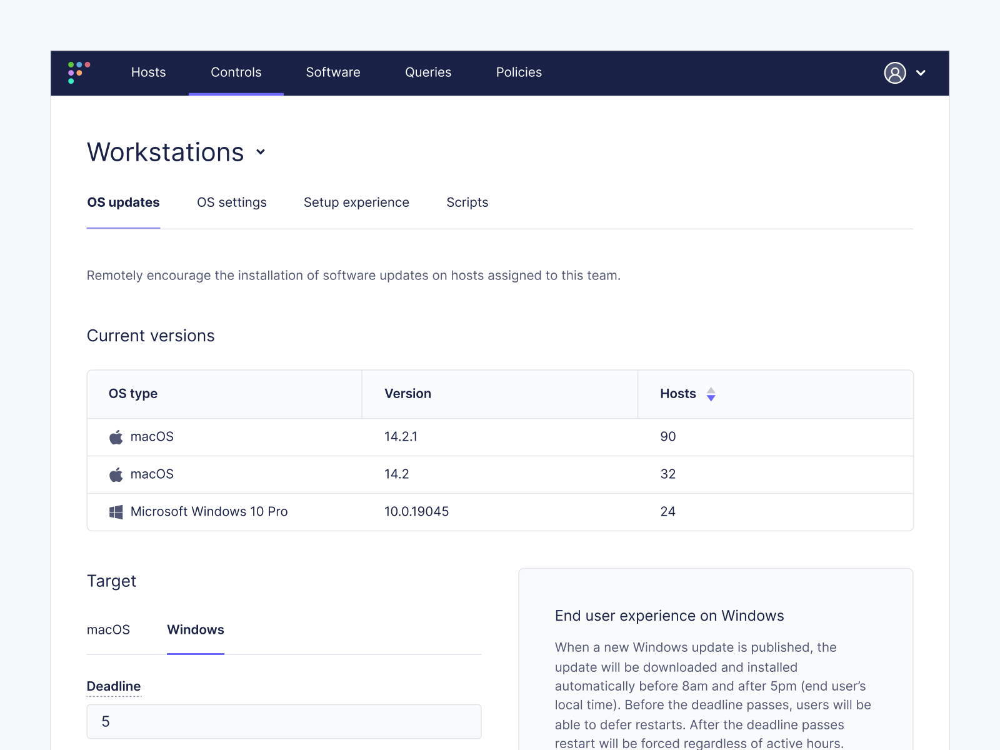
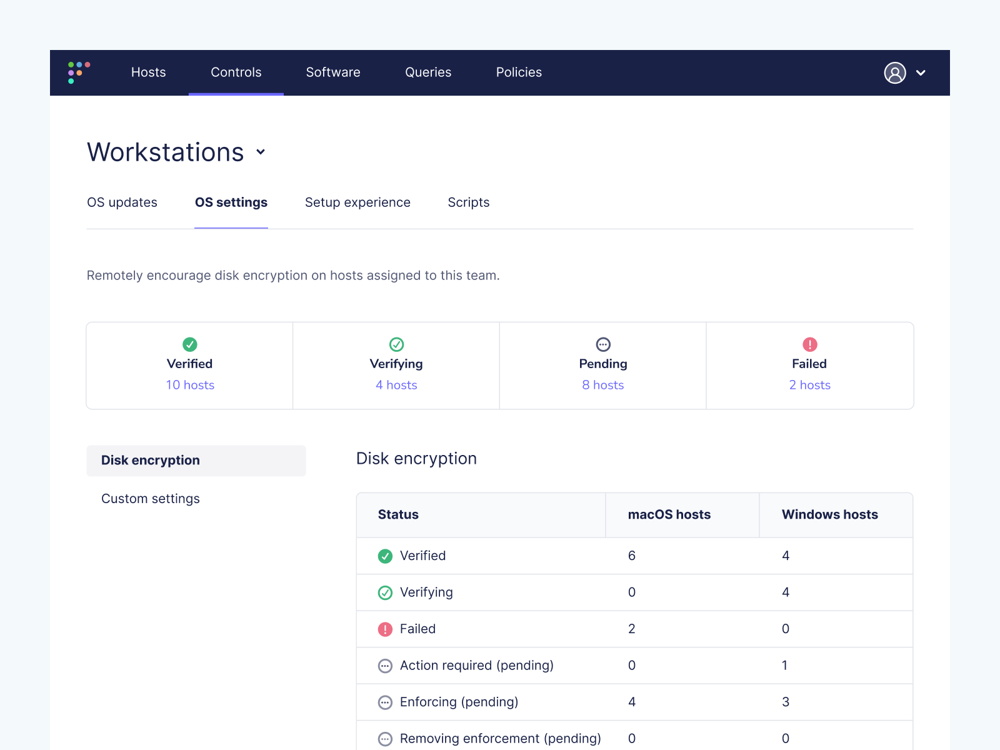
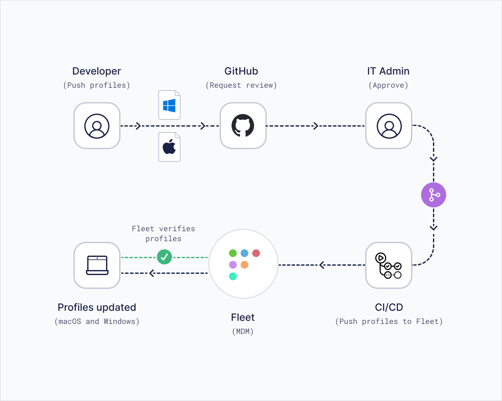

# Fleet introduces Windows MDM 

When we introduced Fleet's device management (MDM) capabilities in 2023, we embarked on a journey to simplify device management across multiple platforms. Our mission was to provide a seamless, efficient, and secure MDM solution that caters to the diverse needs of modern organizations. Today, we're thrilled to announce a significant milestone in this journey: Fleet's MDM extends its features to include support for Windows devices. This integration allows organizations to manage their Windows fleet from a single platform.

## A versatile MDM in a Windows-dominant environment

As we expand Fleet's MDM capabilities to include Windows support, it's essential to address a critical question: Is there a genuine need for another MDM solution in a landscape where Intune predominantly serves Windows environments and alternatives like Jamf are dedicated to macOS?

Our journey in developing Fleet revealed a clear demand for a more adaptable and inclusive MDM solution. In our discussions with leaders from innovative, forward-thinking organizations, we recognized a gap in the market: a need for an MDM solution that seamlessly integrates with Windows without neglecting other platforms. These organizations expressed a desire for a tool that offers:

* Greater control over profile modifications in a mixed-device environment.
* Enhanced cross-functional visibility for both security and IT teams.
* Reduced learning curves for team members adapting to diverse platforms.
* Advanced APIs for custom workflow integration across various operating systems.

Existing solutions often fall into two categories: Windows-centric MDMs like Intune, which offer robust support for Windows but less flexibility for other platforms, and macOS-focused MDMs like Jamf, which are not designed for Windows integration. This segmentation in the MDM landscape leaves a significant gap for organizations that use a mix of Windows, macOS, and other operating systems. Fleet is purpose-built to bridge this divide and stands out as a comprehensive, cross-platform MDM solution that works cohesively across all major operating systems.

Expanding Fleet's MDM capabilities to encompass Windows significantly broadens the scope of device management for organizations operating in mixed OS environments. With this development, the deployment and management of configuration profiles, settings, and policies become universally accessible, regardless of the operating system. This inclusivity means IT admins can efficiently manage all devices in one place. Moreover, the near real-time verification of MDM profiles using osquery, a feature highlighted for macOS, is now equally applicable to Windows devices.

Likewise, Fleet's MDM provides the tools for teams to stay compliant with organizational policies, from encryption standards to operating system updates, and offers capabilities like remote locking or wiping lost devices.

 

## Accelerating zero trust implementation

Integrating the concept of "zero trust" is made more efficient and effective with Fleet's capabilities. Fleet's open API for every endpoint significantly accelerates the implementation of zero trust, an approach vital for IT administrators tasked with managing endpoint security initiatives. By offering features that top security teams value and maintaining a consistent interface across all operating systems, Fleet enables enterprises to move away from unreliable processes and makeshift solutions. These often hinder the progress of new projects and complicate troubleshooting and incident response.

Fleet's functionality extends to enforcing conditional access checks at login, a key aspect of the zero trust model. This control over the login experience ensures that only devices in a healthy and updated state can access company data and resources, reinforcing your security posture. Conditional access is crucial in maintaining a secure IT environment, ensuring every device is evaluated for compliance and risk before being granted access to sensitive resources.

Fleet simplifies the management of device posture and offers flexibility in conducting health checks. It enables the identification of vulnerable software and tracking progress for security remediation projects. With Fleet, setting and enforcing deadlines for security updates becomes more manageable through automation and ticketing systems. Organizations can use common health checks developed by industry peers, built directly into Fleet, or create customized checks using Fleet's low-level access to system data and events. This adaptability makes Fleet a powerful tool for rapidly implementing and maintaining an organization's zero trust security model.

## Unified GitOps workflow

<blockquote purpose="quote">
I don't want one bad actor to brick my fleet; I want them to make a pull request first.

Matt Carr, CPE manager
</blockquote>

Fleet's adoption of the GitOps workflow represents a significant advancement in managing device configuration profiles. This modern approach to continuous deployment (CD) uses Git as the central source of truth for declarative infrastructure and application configurations and, now, with our latest update, for MDM configuration profiles across both macOS and Windows platforms.

Integrating Windows support into Fleet's MDM adds a new layer of efficiency and cohesion to this workflow. IT administrators can now manage and synchronize MDM configuration profiles for macOS and Windows devices within the same Git repository. This unified approach allows for significant time savings and reduces the complexity of managing multiple platforms.

Key to this enhanced workflow is the ability to merge macOS and Windows MDM configuration profiles in a single Git commit. This capability streamlines updating or modifying device profiles across different operating systems. Instead of handling each platform separately, administrators can now consolidate changes, ensuring consistency and reducing potential errors.

This unified GitOps workflow also facilitates better collaboration among team members. Changes to MDM profiles, whether for macOS or Windows, can be reviewed, discussed, and approved through the same Git-based processes that software development teams are already familiar with. This approach fosters a transparent, collaborative environment where configuration changes are visible, traceable, and auditable.

Moreover, by leveraging Git's robust version control capabilities, Fleet ensures that any changes to MDM profiles are tracked systematically. Administrators can easily roll back to previous configurations if needed, providing a safety net against unintended consequences of changes.

Fleet's enhanced GitOps workflow, with its support for merging macOS and Windows MDM configuration profiles in a single commit, represents a significant stride towards simplifying and unifying the management of diverse device environments. This approach streamlines operations and aligns with best software development and deployment practices, enhancing overall IT efficiency and collaboration.

## Enhance user experience with programmability and automation in Windows MDM

Adding Windows MDM support to Fleet further enriches the programmability and automation aspects of the platform. Fleet's API and Command Line Interface (CLI) offer a lot of flexibility for teams to program Fleet according to their specific needs. This flexibility is now extended to Windows environments, ensuring Fleet's capabilities are as effective on Windows as on macOS.

Fleet integrates with leading configuration management platforms such as Chef, Ansible, and Puppet. While [Munki](https://github.com/munki/munki) is widely used for macOS, its equivalent in Windows is [Chocolatey](https://chocolatey.org/). Fleet's MDM solution supports both, meaning that from disk encryption with recovery key escrow to configuration profiles for various computer settings, Fleet enables complete curation of the device onboarding experience, irrespective of the operating system.

## User-first transparency

In our commitment to a transparent, user-first model, Fleet upholds the principles of clarity and openness, especially by including Windows in our MDM capabilities. As with macOS, Linux, and Chromebooks, Windows users within Fleet's framework can be assured of our steadfast commitment to transparency. Fleet is open source, so users are fully informed about how their employers monitor their work devices. This transparency extends to Windows devices. Fleet software does not intrude on private data such as keystrokes, emails, or webcams but focuses on essential information like user accounts, device health, installed software, and security configurations. Our approach to scope transparency ensures that users understand and can trust how their devices are managed and secured within Fleet's ecosystem, regardless of the operating system.

## In summary

Fleet's expansion to include Windows support in its device management capabilities marks a significant milestone in our mission to simplify and secure MDM across diverse platforms. This integration caters to modern organizations operating in a Windows-dominant environment, filling a crucial gap in the market for a versatile, cross-platform MDM solution. By combining the strengths of MDM with its analytical capabilities, Fleet offers a comprehensive approach to device security and management. The unified GitOps workflow and enhanced programmability and automation features further streamline the management of both macOS and Windows devices, offering a cohesive experience that aligns with modern IT needs. Above all, Fleet maintains its commitment to transparency and a user-first model, ensuring users across all platforms, including Windows, know and trust how their devices are managed within our ecosystem. This update reinforces Fleet's position as a versatile, efficient, and trustworthy device management solution that organizations can rely on in today's varied and dynamic IT landscapes.

<meta name="category" value="announcements">
<meta name="authorFullName" value="JD Strong">
<meta name="authorGitHubUsername" value="spokanemac">
<meta name="publishedOn" value="2024-01-24">
<meta name="articleTitle" value="Fleet introduces Windows MDM">
<meta name="articleImageUrl" value="../website/assets/images/articles/fleet-win-mdm-launch-cover-800x450@2x.png">
