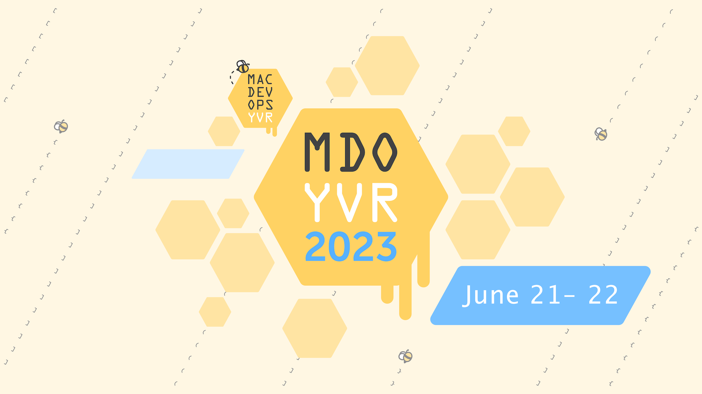

# Fleet is abuzz 🐝 for MacDevOps:YVR 

_Pun Warning: If puns give you the heebie-jeebies, we apologize. MacDevOps:YVR has a bee 🐝 theme this year, and we frankly couldn't help ourselves. That's all._

The MacDevOps:YVR Conference (MDOYVR) is humming back to life in the hive of downtown Vancouver, British Columbia, Canada, June 21-22, 2023. This unique, hive-minded event spans two days, specifically tailored for Mac Admins eager to infuse DevOps into their honeycomb of services. MDOYVR is the place where 100 Mac worker bees - admins, security engineers, and developers - swarm together to share the nectar of knowledge, emphasizing the sweetness of open-source software. Fleet Device Management is buzzing with excitement to sponsor MDOYVR, as well as the pre-conference mixer. Fleet is also hosting a honey of a pre-conference workshop. Tune in to catch what's creating all the buzz.

This conference hosts a killer swarm of speakers, including the brightest drones from Meta, Airbnb, Disney, Block, and more. Expect to hear talks on topics such as:

* How to infuse DevOps in a Mac hive
* Top nectar for managing Mac devices in the cloud
* Automating Mac deployments and updates without losing your buzz
* Securing Mac devices without getting stung
* Monitoring and troubleshooting Mac devices without losing your hive

The conference also sweetens the pot with a few pre-conference workshops and networking opportunities, flying under the alias of the 'hallway track.' The workshops offer attendees hands-on experiences with tools and technologies that could help them implement DevOps in their own hives. The hallway track, my personal favorite, is a chance to meet other Mac Admins and learn from each other.

## Pre-conference workshop

As the busy bees we are, finding time to explore open-source software like Fleet can be a stinging challenge. Join us for our pre-conference workshop with Fleet, where we'll walk you through setting up your very own Fleet hive while we wax on about Fleet's GitOps-driven workflow and see that the future of MDM is indeed open-source. Join our swarm Tuesday, June 20, 2023, at 1 pm at Simon Fraser University's downtown campus. Apiary space is limited, and MDOYVR conference attendance is required to attend the workshop—fly through to the end to find out how to attend.

## Pre-conference social hour

Fleet is buzzing with excitement to fill Steamworks with attendees as we welcome everyone back to the hive of Vancouver for an in-person MDOYVR. Catch up on all the latest buzz from your hive mates and make new connections while nibbling on sweet canapes and sipping your favorite nectar from the no-host bar.

The MacDevOps:YVR Conference is an un-bee-lievable opportunity for Mac Admins to learn about the latest trends in DevOps and how to apply them to their own hives. This conference is also a chance to network with other Mac Admins and learn from each other's hive minds.

If you are interested in attending the [MacDevOps:YVR Conference](https://mdoyvr.com), you can register on the conference website, but hurry, as only a few tickets remain as of this writing. Get ready to create a real buzz!

<meta name="category" value="announcements">
<meta name="authorGitHubUsername" value="spokanemac">
<meta name="authorFullName" value="JD Strong">
<meta name="publishedOn" value="2023-06-07">
<meta name="articleTitle" value="Fleet is abuzz 🐝 for MacDevOps:YVR">
<meta name="articleImageUrl" value="../website/assets/images/articles/fleet-is-abuzz-for-macdevops-yvr-2023@2x.png">
<meta name="description" value="Fleet is a proud sponsor of MacDevOps:YVR which is back in person in Vancouver, B.C. June 21-22, 2023">